# Sibyl — Il Componente **Agente**

> Guida approfondita all'architettura dell'agente. Pensata per essere letta in
> Obsidian (i diagrammi sono in formato **Mermaid**) e per chi **non è pratico di
> Python**: ogni concetto tecnico è spiegato a parole. Documento gemello di
> `documentazione/Server_MCP_Architettura.md`: là il **server** che *espone* CodeQL
> come tool, qui l'**agente** che li *consuma* guidando un LLM.

---

## Indice
1. [A cosa serve l'agente (in una frase)](#1-a-cosa-serve-lagente)
2. [Dove sta l'agente nel quadro generale](#2-dove-sta-lagente-nel-quadro-generale)
3. [Il problema: function calling con un LLM piccolo](#3-il-problema)
4. [Vocabolario minimo](#4-vocabolario-minimo)
5. [Architettura a componenti](#5-architettura-a-componenti)
6. [Mappa dei file](#6-mappa-dei-file)
7. [I componenti, uno per uno](#7-i-componenti-uno-per-uno)
8. [Il loop: come l'agente guida il modello](#8-il-loop)
9. [I "trucchi" di robustezza (il cuore)](#9-i-trucchi-di-robustezza)
10. [Configurazione](#10-configurazione)
11. [Come si avvia](#11-come-si-avvia)
12. [Flusso completo di un'analisi](#12-flusso-completo-di-unanalisi)
13. [Il flusso in dettaglio: Agent ↔ LLM ↔ Server e i prompt](#13-il-flusso-in-dettaglio)
14. [Il report prodotto](#14-il-report-prodotto)
15. [Test](#15-test)
16. [Storia del refactoring](#16-storia-del-refactoring)

---

## 1. A cosa serve l'agente

L'**agente** è il **regista** dell'analisi. Da solo non sa fare nulla di sicurezza:
mette in comunicazione due pezzi che invece sanno fare tanto —

- un **LLM** (un modello di intelligenza artificiale, qui `qwen` via **Ollama**),
  che *ragiona* su quale vulnerabilità cercare;
- il **Server MCP**, che *esegue* le analisi vere con CodeQL.

L'agente espone i tool del server al modello, gli chiede *"cosa vuoi fare?"*, e
quando il modello dice *"chiama questo tool con questi parametri"*, l'agente lo
esegue sul server e gli riporta il risultato. Si va avanti così, a turni, finché il
modello scrive il **report di sicurezza** finale.

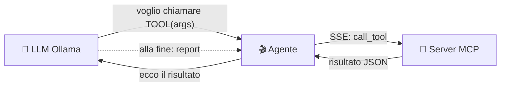

> **In una frase:** l'agente è il *tramite* che fa "parlare" l'LLM con CodeQL. Il
> modello decide **cosa**, l'agente fa **eseguire** al server, e raccoglie la prova.

---

## 2. Dove sta l'agente nel quadro generale

Sibyl ha tre processi che collaborano. Nel deploy tipico stanno tutti sul server di
calcolo; il PC locale fa solo da *trigger*.

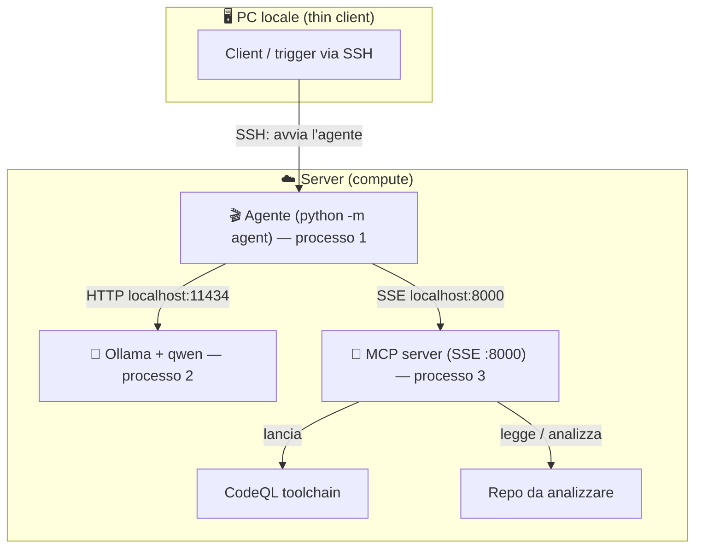

Punto chiave: **a chiamare il server è l'AGENTE, non l'LLM.** L'agente è un
**client**: si connette a un server MCP **già in esecuzione** via SSE (rete). Se
agente e server sono sulla stessa macchina, "rete" significa semplicemente
`localhost` — nessuna porta esposta all'esterno.

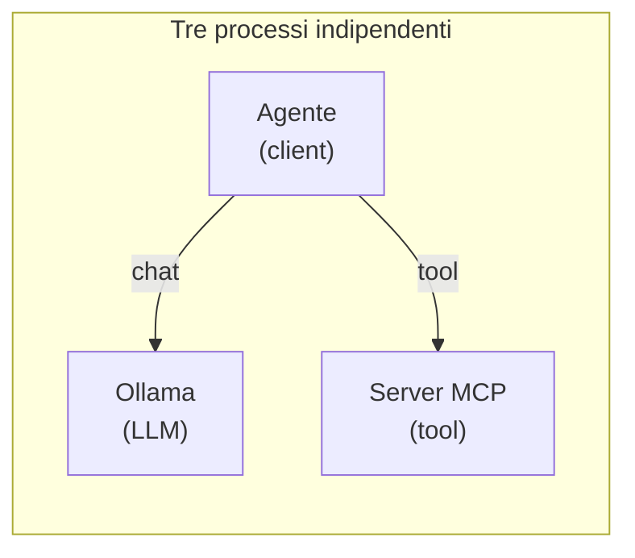

---

## 3. Il problema

Il modello AI non esegue codice: produce solo **testo**. Il meccanismo che gli
permette di "usare strumenti" si chiama **function calling**:

1. L'agente presenta al modello la lista dei tool disponibili (nome, descrizione,
   parametri), in un formato che il modello capisce.
2. Il modello, invece di rispondere a parole, risponde *"chiama `run_taint_query`
   con questi argomenti"*.
3. L'agente esegue davvero quel tool (sul server) e restituisce il risultato.
4. Si ripete finché il modello smette di chiedere tool e scrive il report.

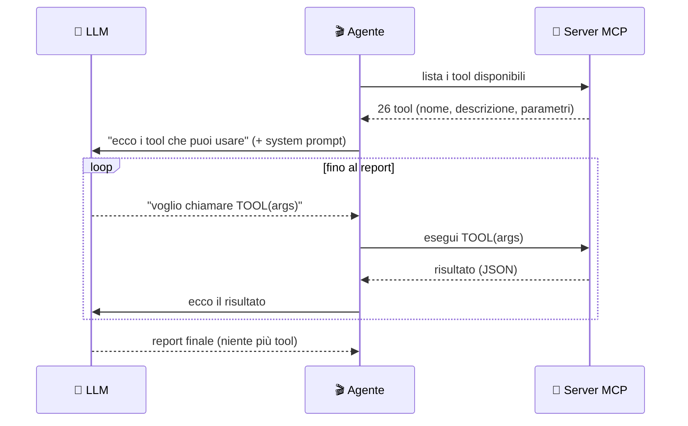

**La difficoltà vera:** Sibyl usa un **LLM locale piccolo**, meno affidabile dei
grandi modelli cloud. Sbaglia in modi prevedibili: a volte stampa la chiamata come
*testo* invece di usare il canale strutturato, ripete la stessa chiamata all'infinito,
passa un *segnaposto* al posto del percorso del database. Gran parte dell'agente
esiste proprio per **assorbire questi errori** e portare comunque a casa l'analisi
(vedi §9).

---

## 4. Vocabolario minimo

| Termine | Spiegazione semplice |
|---|---|
| **LLM** | Il modello di intelligenza artificiale che "ragiona" (qui `qwen`). |
| **Ollama** | Il programma che fa girare l'LLM in locale ed espone un'API HTTP. |
| **Function calling** | Il modo standard con cui un modello "chiede" di usare un tool. |
| **Tool call** | Una singola richiesta del modello: nome del tool + argomenti. |
| **MCP** | Lo standard con cui server e client si scambiano i tool (vedi doc server). |
| **Client / Server** | Il **server** offre i tool; il **client** (l'agente) li usa. |
| **SSE** | "Server-Sent Events": un canale di rete su cui l'agente parla col server. |
| **Checkpoint** | Una "fotografia" dello stato salvata su disco, per riprendere dopo un crash. |
| **System prompt** | Le istruzioni iniziali che dicono al modello *come* lavorare. |
| **JSON** | Formato di testo per dati strutturati. Tool e risultati viaggiano in JSON. |
| **Decoratore / `async`** | Vedi la doc del server, §4 (stessi concetti). |

---

## 5. Architettura a componenti

Come il server, l'agente è diviso in **strati separati** con una regola d'oro: **le
dipendenze vanno solo verso il basso**. Il "motore" (orchestrator) sta in alto e usa
i moduli sotto; i moduli puri (report, robustness, source) non sanno nulla di chi li
usa e si possono testare da soli.

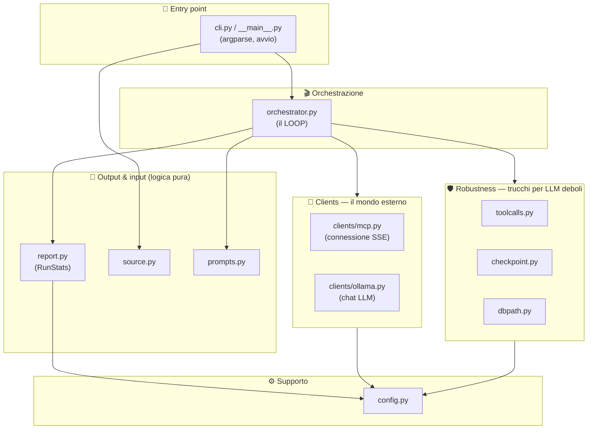

Direzione delle dipendenze (mai verso l'alto):
`cli ← orchestrator ← clients, robustness, report, source, prompts ← config`

Perché questa separazione? Così ogni pezzo:
- si capisce da solo;
- si testa isolato (i moduli puri girano **senza** Ollama né il server);
- si modifica senza rompere il resto.

---

## 6. Mappa dei file

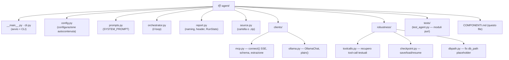

---

## 7. I componenti, uno per uno

### 7.1 🚪 `cli.py` + `__main__.py` — l'avvio
- **`cli.py`** contiene `main()`: legge gli argomenti da riga di comando
  (`repo_path`, `--model`, `--report`, `--max-steps`, `--resume`), risolve l'input
  (cartella o zip), calcola il percorso del report, avvisa se esiste già un
  checkpoint, e lancia il loop con `asyncio.run(run_agent(...))`.
- **`__main__.py`** è una riga: permette di avviare tutto con `python -m agent`,
  esattamente come `python -m server`.

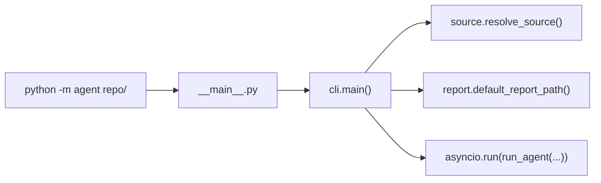

### 7.2 ⚙️ `config.py` — la configurazione (autocontenuta)
Tiene **solo** ciò che serve all'agente, niente CodeQL (quello sta nel server). Legge
le variabili d'ambiente / un file `.env`. I default puntano **dentro** `agent/`
(`agent/_work`, `agent/reports`), così il pacchetto è portabile.

| Voce | Default | A cosa serve |
|---|---|---|
| `OLLAMA_HOST` | `http://localhost:11434` | dove risponde l'LLM |
| `AGENT_MODEL` | `qwen2.5-coder:14b` | quale modello usare |
| `MCP_SERVER_URL` | `http://127.0.0.1:8000/sse` | dove sta il server MCP |
| `WORK_DIR` | `agent/_work` | dove salvare i checkpoint |
| `REPORTS_DIR` | `agent/reports` | dove salvare i report |

### 7.3 📜 `prompts.py` — il `SYSTEM_PROMPT`
Le istruzioni iniziali che insegnano al modello **come** lavorare: leggere prima
tutti i file, costruire la lista delle classi *sospette*, verificarle una per una
col tool giusto, e attribuire i CWE **solo** dall'evidenza di CodeQL (mai a
intuito). È il "manuale operativo" del modello, tenuto separato dal codice.

### 7.4 📡 `clients/` — gli adattatori verso il mondo esterno
Due "spine" verso i due servizi esterni. Isolano i dettagli di rete/libreria così
l'orchestrator non li vede.

- **`mcp.py`** — adattatore verso il Server MCP:
  - `connect(url)` → un *context manager* che apre la connessione SSE, la inizializza
    e scarica la lista dei tool, restituendo `(session, mcp_tools)` in un colpo solo;
  - `mcp_tools_to_ollama(tools)` → traduce le definizioni dei tool nel formato
    function-calling che Ollama capisce;
  - `tool_result_text(result)` → estrae il testo pulito dal risultato di un tool.
- **`ollama.py`** — adattatore verso l'LLM:
  - `OllamaChat.chat(messages, tools)` → manda un turno di conversazione e
    restituisce il messaggio già **normalizzato** a dict semplice;
  - `plain(msg)` → la normalizzazione (serve a tenere i checkpoint salvabili).

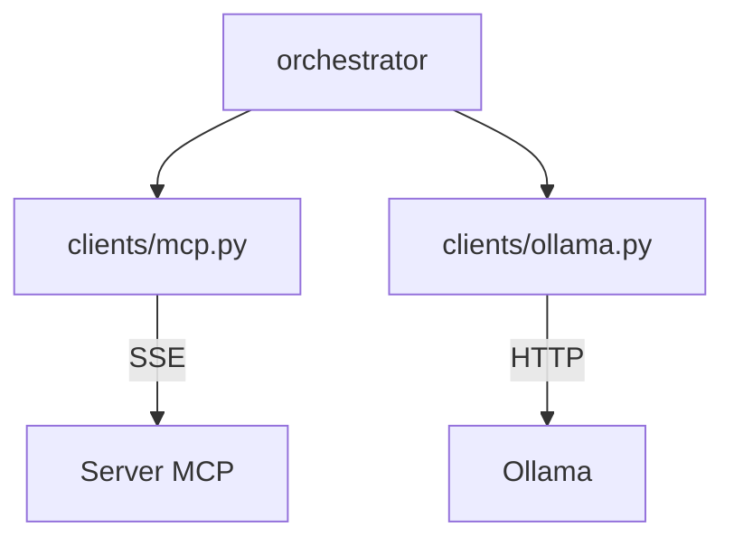

### 7.5 🛡️ `robustness/` — i trucchi per LLM deboli
Il **cuore di ricerca** del progetto: rendere affidabile un modello piccolo. Tre
moduli, ciascuno contro un errore tipico del modello. Dettaglio in §9.

### 7.6 📝 `report.py` — output e statistiche
Si occupa del **report** e delle **statistiche del run**:
- `slug` / `default_report_path` → calcolano il nome del file:
  `reports/<repo>/<modello>__<data-ora>.md`;
- la dataclass **`RunStats`** → accumula durante il run: quante volte è stato usato
  ogni tool, quali CWE sono emersi, quante vulnerabilità totali, l'ultimo `db_path`
  visto, i tempi. Espone `record_tool_result()` (aggiorna i contatori leggendo il
  risultato di un tool), `header()` (il front-matter YAML) e `finalize()` (scrive
  header + report su disco e cancella il checkpoint).

### 7.7 📥 `source.py` — l'input
`resolve_source(path)` accetta una **cartella** oppure un **`.zip`**. Lo zip viene
estratto sotto `WORK_DIR`; se contiene un'unica cartella radice, usa quella come
root del progetto.

### 7.8 🎬 `orchestrator.py` — il motore
`run_agent(...)`: la funzione che assembla tutto e fa girare il loop. Dopo il
refactoring è leggibile quasi come pseudo-codice (vedi §8). Non contiene "trucchi"
in linea: li delega ai moduli `robustness/`, `clients/`, `report.py`.

---

## 8. Il loop

Cuore dell'agente. In parole: *connetti → (riprendi o inizia) → ripeti
{ chiedi al modello → esegui i tool che chiede → salva } → finalizza*.

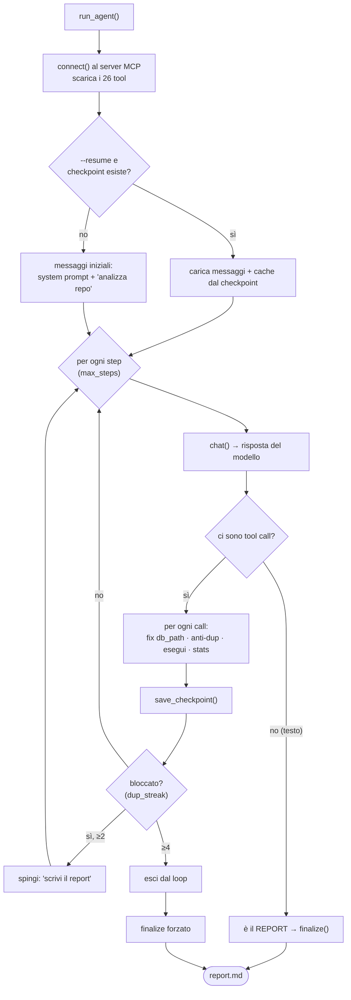

Dentro a "esegui i tool che chiede", per **ogni** singola tool call:

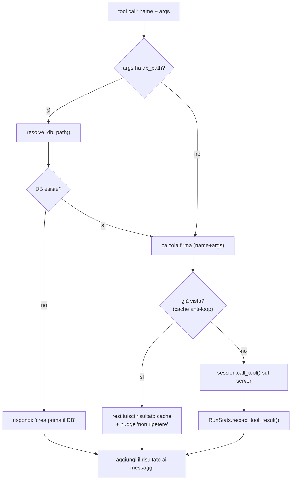

---

## 9. I trucchi di robustezza

Quattro meccanismi che assorbono gli errori tipici di un LLM piccolo. Sono ciò che
distingue un prototipo "da demo" da un agente che porta a termine l'analisi.

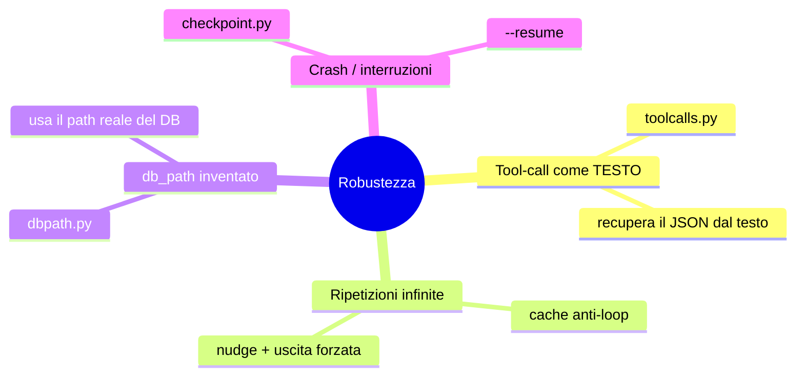

### 9.1 Tool-call emesse come testo — `robustness/toolcalls.py`
Molti modelli locali, invece di usare il canale strutturato `tool_calls`, **stampano**
la chiamata come testo, dentro un blocco ```` ```json ````. Senza correzione il loop
si fermerebbe (l'agente non vedrebbe nessuna chiamata) e tratterebbe quel testo come
"report finale".

`extract_text_tool_calls` recupera la chiamata cercando ogni oggetto JSON valido nel
testo (blocchi recintati, l'intero contenuto, e ogni `{...}` con parentesi
bilanciate via `_balanced_objects`). **Filtro di sicurezza:** accetta solo oggetti il
cui `name` è un tool reale — così un report che contiene JSON non viene scambiato per
una chiamata.

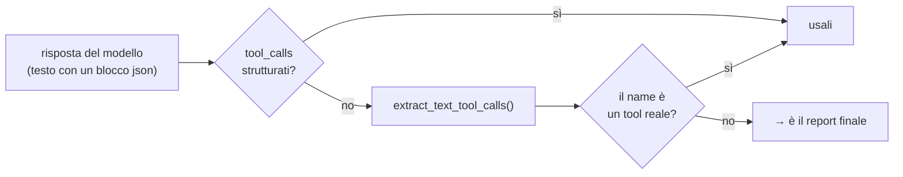

### 9.2 Cache anti-loop — dentro `orchestrator.py`
Il modello tende a **ripetere** la stessa identica chiamata. Per ogni chiamata si
calcola una *firma* (`nome + argomenti ordinati`). Se la firma è già stata vista, il
tool **non** viene rieseguito: si restituisce il risultato dalla cache più un *nudge*
("l'hai già chiamato, fai qualcos'altro o scrivi il report"). Se il modello continua
a ripetersi per più step di fila (`dup_streak`), viene spinto a concludere e, al
limite, il loop esce e si finalizza comunque.

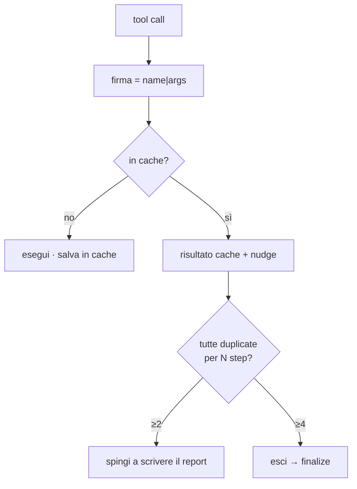

### 9.3 Fix del `db_path` — `robustness/dbpath.py`
Per analizzare serve il percorso del database CodeQL, restituito da
`create_codeql_database`. Il modello spesso passa un **segnaposto**
(`"<result of create_codeql_database>"`) invece del percorso vero.

`resolve_db_path(value, last_db_path)`: se `value` è una cartella valida la usa;
altrimenti usa **l'ultimo `db_path` reale** catturato dalla risposta di
`create_codeql_database`. Se quel percorso non esiste ancora (il modello chiede
un'analisi prima di creare il DB), l'orchestrator risponde con un **errore chiaro**
("crea prima il database") invece di un percorso inventato.

> **Nota architetturale:** la versione precedente *indovinava* il percorso del DB
> calcolandolo da `WORK_DIR`. Ma il DB lo crea il **server**, possibilmente su un
> **altro host**: l'agente non può conoscerne il filesystem. Per questo ora ci si
> affida **solo** al percorso che il server comunica. È una conseguenza diretta
> dell'architettura a processi separati (client SSE).

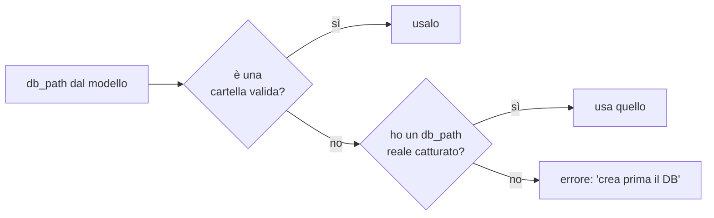

### 9.4 Checkpoint e resume — `robustness/checkpoint.py`
Dopo **ogni** step l'agente salva una fotografia dello stato (messaggi + cache +
prossimo step) in un file per-repo sotto `WORK_DIR`, con scrittura **atomica** (un
crash a metà scrittura non corrompe il file). Con `--resume` l'analisi riparte da
dove era rimasta, perdendo al massimo uno step. A fine analisi il checkpoint viene
cancellato.

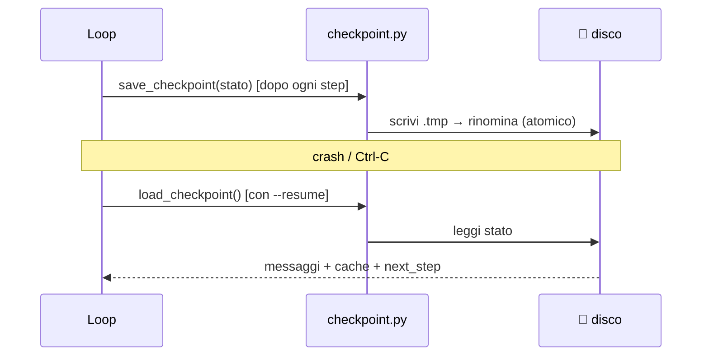

---

## 10. Configurazione

L'agente legge la configurazione dalle **variabili d'ambiente** (comode in un `.env`
nella radice del progetto, condiviso col server). Vedi la tabella in §7.2. Le voci
obbligatorie di CodeQL non riguardano l'agente: stanno nel server.

```bash
# esempio di .env (lato agente)
OLLAMA_HOST=http://localhost:11434
AGENT_MODEL=qwen2.5-coder:14b
MCP_SERVER_URL=http://127.0.0.1:8000/sse
```

---

## 11. Come si avvia

L'agente è un **client**: il server MCP deve essere **già in esecuzione**.

```bash
# 1) in un terminale: avvia il server (vedi doc del server)
MCP_TRANSPORT=sse python -m server

# 2) in un altro terminale: avvia l'agente
python -m agent /percorso/alla/repo
#   oppure su uno zip:        python -m agent progetto.zip
#   opzioni: --model qwen2.5-coder:7b  --max-steps 30  --resume  --report out.md
```

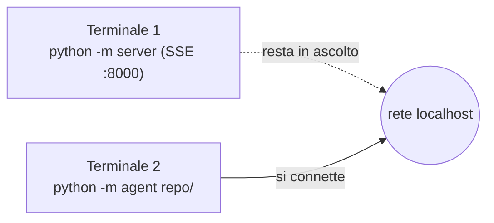

---

## 12. Flusso completo di un'analisi

Cosa succede, passo per passo, attraverso tutti i componenti — dall'avvio al report.

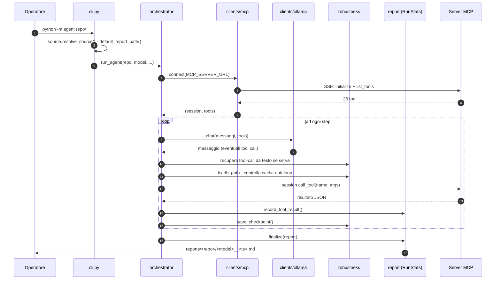

In parole semplici: **risolvi l'input → connetti al server → a turni fai ragionare
il modello ed esegui i suoi tool, assorbendone gli errori → scrivi il report
fondato sull'evidenza di CodeQL.**

---

## 13. Il flusso in dettaglio

Questa sezione "apre il cofano" e segue **cosa si scambiano davvero** Agent, LLM e
Server MCP. La chiave è capire che esistono **due conversazioni diverse**:

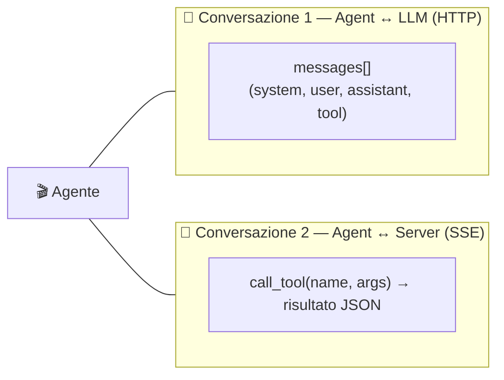

- Con l'**LLM** l'agente parla in termini di **messaggi** (`messages`): è una chat.
  Il modello produce *testo* o *richieste di tool*; non esegue nulla.
- Con il **Server** l'agente parla in termini di **chiamate a tool** (`call_tool`):
  esecuzioni reali che ritornano JSON.

L'agente è l'unico che vede entrambe: prende le richieste dalla conversazione 1, le
realizza nella conversazione 2, e **rimette il risultato** nella conversazione 1.

### 13.1 Dall'input al primo messaggio (passo-passo concreto)

Partiamo da ciò che **digitiamo davvero**. Supponiamo:

```bash
python -m agent _smoketest_repo
```

L'unico input "nostro" è il percorso del repo (`_smoketest_repo`). Tutto il resto
ha un default. Ecco, riga per riga, cosa accade **prima ancora** di sentire l'LLM:

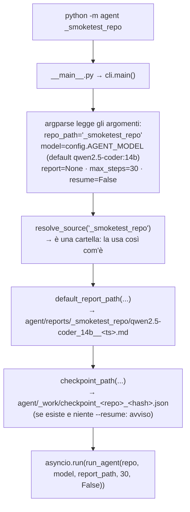

Cosa significano davvero questi passaggi:

1. **argparse** trasforma la riga di comando in valori. Se non passiamo `--model`,
   `--report`, `--max-steps`, valgono i default (modello da `config`, report
   auto-generato, 30 step massimi).
2. **`resolve_source`** decide *cosa* analizzeremo: qui è una cartella, quindi la
   restituisce intatta. Se fosse uno `.zip`, lo estrarrebbe e ci darebbe la cartella.
3. **`default_report_path`** decide *dove* salveremo il risultato: una cartella per
   repo, file nominato col modello e un timestamp.
4. **`checkpoint_path`** decide *dove* potremmo riprendere: se trova un checkpoint e
   non abbiamo messo `--resume`, ci avvisa che verrà sovrascritto.

A questo punto entra in scena `run_agent`, che prepara le **due connessioni** e
costruisce il **primo input per l'LLM**:

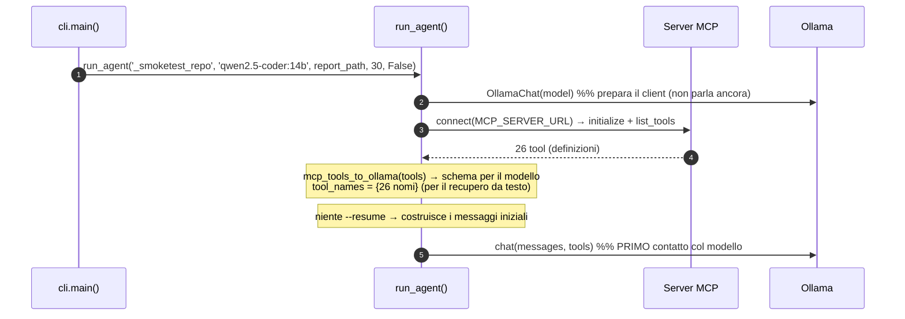

**Il primo input che diamo davvero all'LLM** sono esattamente due messaggi più lo
schema dei tool:

```python
messages = [
    {"role": "system", "content": SYSTEM_PROMPT},                    # la strategia
    {"role": "user",   "content": "Analyze the repository at: _smoketest_repo"},
]
# + tools = [26 definizioni in formato function-calling]
```

Quindi, concretamente: noi diamo **un percorso**; l'agente lo trasforma in una
**richiesta completa** per il modello = *"ecco come devi lavorare (system), analizza
questo repo (user), ed ecco i 26 strumenti che puoi usare (tools)"*. Da qui parte il
loop dei §13.4–13.6.

> ⚠️ Nota: il repo (`_smoketest_repo`) **non viene caricato nei messaggi**. Al
> modello passiamo solo il *percorso*: sarà lui a chiedere `list_python_files` e
> `read_file_snippet`, che l'agente eseguirà sul **server** (che ha accesso ai file).
> L'LLM non vede mai i file direttamente — li vede solo attraverso i risultati dei tool.

### 13.2 I quattro ruoli dei messaggi (la conversazione con l'LLM)

La lista `messages` cresce a ogni turno. Ogni messaggio ha un **ruolo**:

| Ruolo | Chi lo scrive | Contenuto |
|---|---|---|
| `system` | l'agente, all'inizio | il `SYSTEM_PROMPT`: *come* lavorare (§13.2) |
| `user` | l'agente | la richiesta iniziale e i "nudge" di correzione |
| `assistant` | il **modello** | il suo ragionamento + le eventuali tool-call |
| `tool` | l'agente | il **risultato** del tool eseguito sul server |

```mermaid
flowchart TB
    SYS["system: SYSTEM_PROMPT"] --> USR["user: 'Analyze the repository at: ...'"]
    USR --> AST1["assistant: 'chiamo list_python_files'"]
    AST1 --> TL1["tool: elenco dei file .py"]
    TL1 --> AST2["assistant: 'chiamo create_codeql_database'"]
    AST2 --> TL2["tool: db_path"]
    TL2 --> DOTS["... (altri turni) ..."]
    DOTS --> ASTN["assistant: REPORT finale (niente tool)"]
```

> Ad ogni `chat()` l'agente rimanda **l'intera lista** `messages` PIÙ lo schema dei
> tool. Il modello non ha memoria propria: il "contesto" è esattamente questa lista,
> che per questo viene anche salvata nel checkpoint.

### 13.3 Prompt #1 — il `SYSTEM_PROMPT` (la strategia)

È il messaggio più importante: definisce *come* il modello deve condurre l'analisi.
Vive in `prompts.py` ed è iniettato una sola volta, come primo messaggio. I suoi
punti cardine:

```mermaid
mindmap
  root((SYSTEM_PROMPT))
    Metodo
      "evidence-first"
      efficiente, non forza-bruta
    Procedura
      1 list_python_files
      2 leggi OGNI file
      3 create_codeql_database
      4 per classe sospetta: cwe_knowledge poi verifica
      5 conferma contesto
      6 scrivi il report
    Regole ferree
      CWE solo da evidenza CodeQL
      non scrivere CodeQL a mano
      non ripetere chiamate
      passa il db_path reale
    Formato report
      evidenza + classificazione + rimedio
      raggruppa per file + tabella finale
```

In sintesi insegna al modello: **prima investiga (leggi tutto), poi verifica solo i
sospetti col tool giusto, e attribuisci i CWE solo dall'output deterministico di
CodeQL** — mai a intuito. È qui che un LLM piccolo viene "incanalato" verso un
comportamento affidabile.

### 13.4 Prompt #2 — il messaggio utente iniziale (l'innesco)

Subito dopo il system prompt, l'agente aggiunge un solo messaggio `user`:

```
Analyze the repository at: <repo_path>
```

Minimale di proposito: la strategia sta già nel system prompt. Questo messaggio dà
solo il "via" e il bersaglio.

### 13.5 Un turno completo, messaggio per messaggio

```mermaid
sequenceDiagram
    autonumber
    participant LLM as 🧠 LLM (Ollama)
    participant AG as 🎬 Agente
    participant SRV as 🔧 Server MCP
    Note over AG: messages = [system, user, ...]
    AG->>LLM: chat(messages, tools)   %% manda TUTTA la storia + schema tool
    LLM-->>AG: assistant{ tool_calls:[run_taint_query(...)] }
    Note over AG: append(assistant)
    AG->>AG: tool-call vuota? → recupero da testo (toolcalls)
    AG->>AG: fix db_path · firma · cache anti-loop
    AG->>SRV: call_tool("run_taint_query", args)
    SRV-->>AG: { finding_count, findings[...] }  (JSON)
    AG->>AG: RunStats.record_tool_result()
    Note over AG: append(tool: risultato)
    AG->>AG: save_checkpoint()
    AG->>LLM: chat(messages, tools)   %% turno successivo, storia aggiornata
```

Da notare: tra "il modello chiede" e "il server esegue" si interpongono i **trucchi
di robustezza** (recupero da testo, fix db_path, cache). Il modello non se ne
accorge: riceve sempre e solo un messaggio `tool` con un risultato.

### 13.6 Prompt #3, #4, #5 — i messaggi di correzione

Oltre ai risultati, l'agente può iniettare messaggi per **rimettere in carreggiata**
il modello. Sono il modo con cui l'agente "negozia" con un LLM debole.

| # | Quando | Ruolo | Testo (sintesi) | Scopo |
|---|---|---|---|---|
| 3 | il modello ripete una chiamata già fatta | `tool` | risultato dalla cache **+** *"You already called this exact tool… run a DIFFERENT tool or write the report."* | non rieseguire; spingere avanti |
| 4 | nessun DB creato ma serve `db_path` | `tool` | *"No CodeQL database exists yet. Call create_codeql_database first…"* | correggere l'ordine delle operazioni |
| 5a | bloccato (≥2 step di sole ripetizioni) | `user` | *"You are repeating tool calls without new information. Stop using tools and write the final SECURITY REPORT now."* | forzare la conclusione |
| 5b | fine del loop (max step o ≥4 ripetizioni) | `user` | *"Write the final SECURITY REPORT now from the findings gathered. Do not call tools."* | ultima richiesta, senza tool |

```mermaid
flowchart TB
    R["risposta del modello"] --> Q1{"chiamata duplicata?"}
    Q1 -->|sì| P3["tool: risultato cache + NUDGE #3"]
    Q1 -->|no| Q2{"serve db_path ma manca?"}
    Q2 -->|sì| P4["tool: ERRORE #4 'crea prima il DB'"]
    Q2 -->|no| EXE["esegui davvero"]
    P3 --> STK{"bloccato da ≥2 step?"}
    STK -->|sì| P5["user: NUDGE #5a 'scrivi il report'"]
    STK -->|≥4 o max step| P5b["user: #5b finalize forzato (senza tool)"]
```

Differenza importante di ruolo: i messaggi **#3/#4** arrivano come `tool` (sono "la
risposta allo strumento" che il modello ha invocato); i messaggi **#5** arrivano
come `user` (un'istruzione diretta dell'operatore-agente che cambia rotta).

### 13.7 La fine: come si chiude la conversazione

Il loop termina in uno di tre modi; in tutti il risultato passa per
`RunStats.finalize` (header YAML + corpo, salvataggio, pulizia checkpoint):

```mermaid
flowchart LR
    A["modello risponde<br/>SENZA tool-call"] -->|"è il report"| F["finalize()"]
    B["dup_streak ≥ 4"] -->|"esce dal loop"| FF["#5b + finalize()"]
    C["raggiunti max_steps"] -->|"esce dal loop"| FF
    F --> OUT(["report .md"])
    FF --> OUT
```

### 13.8 Il "filo" completo dei tre attori

```mermaid
flowchart LR
    subgraph LLMside["🧠 LLM — RAGIONA"]
        L1["legge messages + tool schema"]
        L2["decide il prossimo tool"]
        L3["alla fine: scrive il report"]
    end
    subgraph AGside["🎬 AGENTE — ORCHESTRA"]
        G1["inietta i prompt (system/user)"]
        G2["traduce richieste ↔ esecuzioni"]
        G3["assorbe gli errori (robustness)"]
        G4["raccoglie stats + report"]
    end
    subgraph SRVside["🔧 SERVER — ESEGUE"]
        S1["run_taint_query, create_db, ..."]
        S2["CodeQL → finding deterministici"]
    end
    G1 --> L1
    L2 --> G2 --> S1 --> S2 --> G2
    G2 --> L1
    L3 --> G4
    G3 -.->|nudge/cache/fix| L1
```

**La sintesi:** il **system prompt** detta la strategia, i **messaggi tool**
portano l'evidenza dal server, i **nudge** correggono il modello quando sbaglia, e
il modello — incanalato da tutto questo — produce un report dove **ogni CWE traccia
a un output reale di CodeQL**, non a un'intuizione.

---

## 14. Il report prodotto

Il file finale è in Markdown, con un **front-matter YAML** che rende ogni run
auto-descrivente (prodotto da `RunStats.header()`):

```yaml
---
model: qwen2.5-coder:14b
repository: /percorso/alla/repo
started: 2026-06-29T10:00:00
finished: 2026-06-29T10:08:31
duration_seconds: 511.0
steps_used: 12
max_steps: 30
tools_used: create_codeql_database:1, list_python_files:1, run_taint_query:3
cwes_found: CWE-89, CWE-327
total_findings: 4
generated_by: codeql-security-agent
---
```

Sotto, il corpo scritto dal modello: i finding raggruppati per file, ognuno con
l'**evidenza deterministica** (regola CodeQL + percorso del dato sorgente→sink), la
**classificazione** (CWE + gravità) e il **rimedio**, più una tabella riassuntiva e
un verdetto di rischio. Regola ferrea: **ogni CWE deve tracciare a un output di
CodeQL**, mai a un'intuizione del modello.

---

## 15. Test

I test dell'agente (`agent/tests/test_agent.py`) coprono i **moduli puri** e girano
**senza** Ollama né il server — è proprio ciò che il refactoring ha reso possibile.

```bash
python -m pytest agent/tests/test_agent.py -q     # solo agente (veloce)
python -m pytest -m "not codeql and not llm" -q   # agente + server (veloci)
```

```mermaid
flowchart LR
    T["test_agent.py"] --> A["toolcalls<br/>(recupero testo)"]
    T --> B["dbpath<br/>(fix segnaposto)"]
    T --> C["checkpoint<br/>(roundtrip)"]
    T --> D["report / RunStats<br/>(naming, header, stats)"]
    T --> E["source<br/>(zip)"]
    T --> F["ollama.plain<br/>(normalizzazione)"]
```

Per testare senza il pacchetto `ollama` installato in locale (l'LLM gira sul server
remoto), due accorgimenti tengono i moduli puri importabili: `run_agent` è esposto
**lazy** in `agent/__init__.py`, e `ollama.AsyncClient` è importato **dentro** il
costruttore di `OllamaChat`, non a livello di modulo.

---

## 16. Storia del refactoring

L'agente era un **unico file** (`agent.py`, 451 righe) che mescolava prompt,
adattatori, trucchi di robustezza, report e CLI: difficile da leggere, impossibile
da testare a pezzi. Il refactoring lo ha portato alla stessa qualità del server.

```mermaid
flowchart LR
    subgraph prima["PRIMA"]
        MONO["agent.py<br/>(451 righe, tutto insieme)"]
    end
    subgraph dopo["DOPO"]
        PKG["pacchetto agent/<br/>(strati separati, testabili)"]
    end
    MONO -->|refactoring| PKG
```

**Mappatura** (da `agent.py` ai nuovi moduli):

| Blocco originale | Va in |
|---|---|
| `SYSTEM_PROMPT` | `prompts.py` |
| `mcp_tools_to_ollama`, `_tool_result_text` | `clients/mcp.py` |
| `_extract_text_tool_calls`, `_balanced_objects` | `robustness/toolcalls.py` |
| `_plain` | `clients/ollama.py` |
| `_checkpoint_path`, `_save_checkpoint` | `robustness/checkpoint.py` |
| `_resolve_db_path` | `robustness/dbpath.py` (semplificato) |
| `run_agent` | `orchestrator.py` |
| `_slug`, `_default_report_path`, `_metadata_header` | `report.py` (+ `RunStats`) |
| `_resolve_source` | `source.py` |
| `main` | `cli.py` |

**Decisioni prese durante il refactoring:**
1. **Struttura speculare al server** (`clients/`, `robustness/`) per coerenza.
2. **`config.py` dedicato** all'agente, autocontenuto, default dentro `agent/`.
3. **`connect()`** come context manager per non annidare tre `async with`.
4. **`RunStats`** come dataclass: statistiche raccolte in un posto solo.
5. **`db_path` semplificato**: solo l'ultimo path reale, niente più calcolo
   deterministico (inaffidabile tra host diversi in architettura SSE).
6. **Pulizia legacy**: eliminati `agent.py`, `config.py` e `tests_agent.py` (rotto)
   dalla radice; avvio uniforme `python -m agent`.

> **In una frase:** l'agente è un client SSE pulito e modulare che fa ragionare un
> LLM locale sui tool di CodeQL, ne assorbe gli errori tipici (testo, ripetizioni,
> segnaposto, crash) e produce un report di sicurezza fondato su evidenza
> deterministica.
