# Sibyl — Il Componente **Server MCP** (CodeQL)

> Guida approfondita all'architettura del server. Pensata per essere letta in
> Obsidian (i diagrammi sono in formato **Mermaid**) e per chi **non è pratico di
> Python**: ogni concetto tecnico è spiegato a parole.

---

## Indice
1. [A cosa serve il server (in una frase)](#1-a-cosa-serve-il-server)
2. [Dove sta il server nel quadro generale](#2-dove-sta-il-server-nel-quadro-generale)
3. [Cos'è MCP e cos'è un "tool"](#3-cosè-mcp-e-cosè-un-tool)
4. [Vocabolario Python minimo](#4-vocabolario-python-minimo)
5. [Architettura a componenti](#5-architettura-a-componenti)
6. [Mappa delle cartelle e dei file](#6-mappa-delle-cartelle-e-dei-file)
7. [I componenti, uno per uno](#7-i-componenti-uno-per-uno)
8. [Il catalogo dei tool (26)](#8-il-catalogo-dei-tool)
9. [Come si avvia e come "parla" (trasporto)](#9-come-si-avvia-e-come-parla-trasporto)
10. [Configurazione (le variabili d'ambiente)](#10-configurazione)
11. [Il logging di debug](#11-il-logging-di-debug)
12. [Flusso completo di un'analisi (passo-passo)](#12-flusso-completo-di-unanalisi)
13. [Perché è "autocontenuto" e deployabile](#13-perché-è-autocontenuto)
14. [Stato noto / cose da sapere](#14-stato-noto)

---

## 1. A cosa serve il server

Il **Server MCP** è un programma che **espone CodeQL come un insieme di "attrezzi"
(tool)** che un'intelligenza artificiale può usare. CodeQL è uno strumento di
GitHub che analizza il codice sorgente alla ricerca di vulnerabilità di sicurezza.

Da solo, CodeQL si usa da riga di comando ed è complicato. Il server lo
**incapsula**: offre comandi semplici e ad alto livello tipo *"crea il database di
questo progetto"*, *"cerca SQL injection"*, *"leggimi le righe 10-40 di questo
file"*. Un agente AI chiama questi comandi e ottiene risultati già puliti (in
formato JSON).

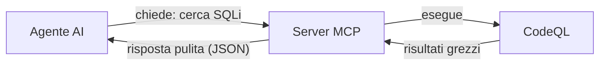

---

## 2. Dove sta il server nel quadro generale

Sibyl prevede due scenari di deployment. Il server è **lo stesso** in entrambi;
cambia solo *dove gira* e *come ci si parla*.

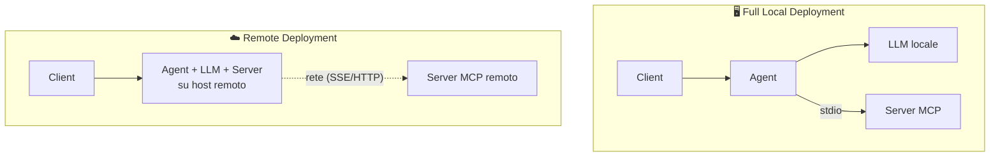

- **Locale**: l'agente lancia il server come *sottoprocesso* e gli parla tramite
  **stdio** (lo standard input/output, vedi §9).
- **Remoto**: il server gira su un'altra macchina e l'agente lo raggiunge via
  **rete**.

> Nota: oggi abbiamo reso il **server** capace di entrambe le modalità. Il
> ricollegamento dell'**agente** è un lavoro successivo.

---

## 3. Cos'è MCP e cos'è un "tool"

**MCP** (Model Context Protocol) è uno standard che permette a un modello AI di
**usare strumenti esterni** in modo uniforme. È come una presa elettrica
standard: qualsiasi modello "compatibile MCP" può collegarsi a qualsiasi server
MCP e scoprirne gli strumenti.

Un **tool** è semplicemente una funzione con un nome, una descrizione e dei
parametri. Esempio concettuale:

> **Nome:** `create_codeql_database`
> **Descrizione:** "Crea un database CodeQL da un repository."
> **Parametri:** `repo_path` (il percorso del progetto)

Il modello AI legge la descrizione, decide di chiamare il tool con certi
parametri, e il server esegue il lavoro vero (lanciare CodeQL) e restituisce il
risultato.

La libreria che usiamo si chiama **FastMCP**: trasforma una normale funzione
Python in un tool MCP semplicemente "marcandola" (vedi *decoratore* in §4).

---

## 4. Vocabolario Python minimo

Pochi concetti bastano per capire tutta l'architettura:

| Termine | Spiegazione semplice |
|---|---|
| **Modulo** | Un singolo file `.py`. Es. `runner.py` è un modulo. |
| **Package** | Una cartella di moduli. Si riconosce dal file `__init__.py` (anche vuoto) che la rende "importabile". |
| **Import** | Quando un file usa il codice di un altro: `from server.core import runner`. |
| **Funzione** | Un blocco di codice con un nome che fa una cosa e restituisce un risultato. |
| **Decoratore** | Una "etichetta" sopra una funzione, scritta con `@`. Es. `@mcp.tool()` dice "questa funzione è un tool MCP". Non cambi la funzione: la **registri**. |
| **`async` / `await`** | Modo di scrivere funzioni che possono "aspettare" senza bloccare tutto (utile per la rete). |
| **Variabile d'ambiente** | Un valore impostato *fuori* dal programma (nel sistema o nel file `.env`), che il programma legge all'avvio. Serve per i percorsi che cambiano da macchina a macchina. |
| **JSON** | Un formato di testo per scambiare dati strutturati (liste, chiavi-valori). Tutte le risposte dei tool sono JSON. |
| **stdout / stderr** | Due "canali" di uscita di un programma: `stdout` (output normale) e `stderr` (messaggi di errore/log). Distinguerli è importante (§9, §11). |

---

## 5. Architettura a componenti

Il server è diviso in **strati ben separati**, ognuno con una responsabilità
precisa. La regola d'oro: **le dipendenze vanno solo verso il basso**, mai verso
l'alto.

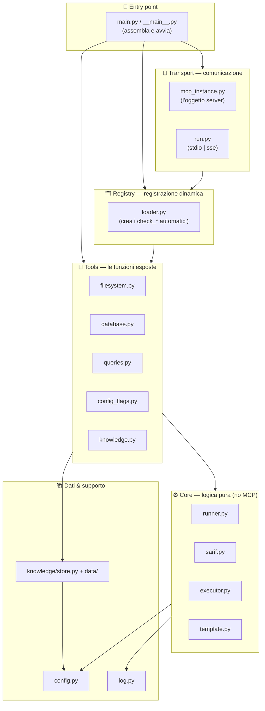

Perché questa separazione? Così ogni pezzo:
- si capisce da solo,
- si può testare isolato,
- si può modificare senza rompere il resto,
- e il **core** (la logica vera) non sa nemmeno cosa sia MCP — potresti riusarlo
  altrove.

---

## 6. Mappa delle cartelle e dei file

```mermaid
flowchart TD
    SRV["📦 server/"]
    SRV --> ENTRY["__main__.py · main.py<br/>(avvio)"]
    SRV --> CONF["config.py<br/>(configurazione)"]
    SRV --> LOGF["log.py<br/>(debug logging)"]
    SRV --> REQ["requirements.txt · README.md"]

    SRV --> CORE["core/"]
    CORE --> CORE1["runner.py — lancia comandi CodeQL"]
    CORE --> CORE2["sarif.py — legge i risultati"]
    CORE --> CORE3["executor.py — esegue una query"]
    CORE --> CORE4["template.py — riempie i template"]

    SRV --> KN["knowledge/"]
    KN --> KN1["store.py — knowledge base + seam lookup_cwe()"]
    KN --> KN2["data/ — cwe_wiki.json, cwe_catalog.json"]

    SRV --> QT["query_templates/<br/>(12 modelli .ql.tmpl)<br/>incl. flow_inventory, sensitive_ops"]
    SRV --> GQ["generated_queries/<br/>(qlpack.yml, query generate)"]

    SRV --> TR["transport/"]
    TR --> TR1["mcp_instance.py — l'oggetto server"]
    TR --> TR2["run.py — sceglie stdio/sse"]

    SRV --> TL["tools/"]
    TL --> TL1["filesystem · database · queries"]
    TL --> TL2["config_flags · knowledge"]

    SRV --> RG["registry/"]
    RG --> RG1["loader.py — crea i tool check_*"]

    SRV --> TS["tests/<br/>(test_server.py)"]
```

---

## 7. I componenti, uno per uno

### 7.1 ⚙️ `core/` — la logica pura
Il cuore tecnico. **Non sa niente di MCP**: sono solo funzioni Python che fanno il
lavoro vero. Quattro moduli:

- **`runner.py`** → esegue un comando CodeQL nel sistema operativo e restituisce
  (codice di uscita, output, errori). È l'unico punto che "lancia" CodeQL.
- **`sarif.py`** → CodeQL produce i risultati in un formato chiamato **SARIF**
  (un JSON molto verboso e standard). Questo modulo lo "appiattisce" in una lista
  di *finding* (vulnerabilità) semplici: regola, gravità, file, riga, e il
  **percorso del dato** dalla sorgente (input dell'utente) al punto pericoloso.
- **`executor.py`** → la routine condivisa che, data una query, la esegue su un
  database e restituisce i finding già puliti. Calcola anche il percorso del
  database in modo deterministico (stesso progetto → stesso database).
- **`template.py`** → funzioni che riempiono i "modelli" di query (vedi §7.4) e
  validano i nomi (per evitare che testo malevolo finisca dentro una query —
  protezione da *injection*).

### 7.2 📚 `knowledge/` — la base di conoscenza sulle vulnerabilità
- **`data/cwe_wiki.json`** → una "wiki" curata delle classi di vulnerabilità
  (i **CWE**, es. *CWE-89 = SQL injection*) che il server sa rilevare: nome,
  spiegazione, nomi tipici di funzioni "pericolose", rimedi.
- **`data/cwe_catalog.json`** → il catalogo ufficiale completo (~969 CWE) di
  MITRE, usato come dizionario di consultazione.
- **`store.py`** → carica questi due file in memoria all'avvio ed espone la
  **cucitura** `lookup_cwe()` / `lookup_catalog()` / `all_cwes()`: è **l'unico punto
  d'accesso** alla conoscenza usato dai tool (`cwe_knowledge`, `run_taint_query`,
  `find_sensitive_operations`, …). Oggi legge la wiki JSON; domani un backend a
  **knowledge graph** può sostituirla dietro la stessa firma, senza toccare i tool.

> Un **CWE** (Common Weakness Enumeration) è un codice standard internazionale
> per identificare un tipo di debolezza del software. Es. *CWE-78 = OS Command
> Injection*.

### 7.3 📡 `transport/` — come il server comunica
- **`mcp_instance.py`** → crea **l'unico oggetto server** (`mcp = FastMCP(...)`).
  Tutti i tool si "attaccano" a questo oggetto condiviso.
- **`run.py`** → decide **come** il server parla col mondo: `stdio` (locale) o
  `sse`/`streamable-http` (rete). Legge la scelta dalle variabili d'ambiente.

### 7.4 🔧 `tools/` — le funzioni esposte all'AI
Qui vivono i tool "statici" (sempre presenti), raggruppati per tema:

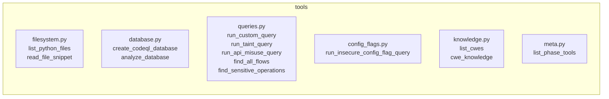

> **Mappa tool→fase sul server.** `meta.py` espone `list_phase_tools`: è **il server**
> a dichiarare quali tool vanno in Detection e quali in Validation. L'agente la chiede e
> filtra, senza hardcodare alcun nome di tool.

Tre "modi" di rilevamento:
- **Inventari CWE-agnostici** (usati dall'agente in **Detection**): `find_all_flows`
  elenca **tutti** i flussi (input non fidato → argomento di chiamata);
  `find_sensitive_operations` elenca le **operazioni pericolose senza flusso** (crypto/
  hash/random deboli, exec, config-flag). Non "timbrano" alcun CWE: danno solo il
  segnale grezzo su cui il modello ragionerà.
- **Taint analysis parametrico** (verifica, in **Validation**): `run_taint_query` segue
  il dato dall'input fino a un punto pericoloso, con nomi di source/sink/**sanitizer**
  forniti dal modello, e *timbra* il CWE nell'evidenza.
- **Point detection** (verifica, in **Validation**): `run_api_misuse_query` /
  `run_insecure_config_flag_query` cercano un uso pericoloso in sé (MD5, `verify=False`),
  senza seguire un flusso.

> Approfondimento su cosa fanno le due query di inventario, con il codice `.ql`, nel
> documento gemello [agent.md](agent.md) §9 e §11.

### 7.5 🗂️ `registry/` — i tool generati automaticamente
Oltre ai tool statici, esistono tanti tool `check_*` "preconfezionati" (es.
`check_sql_injection`). Invece di scriverli a mano uno per uno, `loader.py` li
**genera in automatico** da una lista, all'avvio. È una "fabbrica di tool".

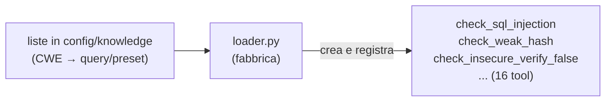

### 7.6 🧩 `config.py`, `log.py`, entry point
- **`config.py`** → tutta la configurazione (percorsi CodeQL, timeout, posizione
  dei dati). Legge le variabili d'ambiente / il file `.env`.
- **`log.py`** → i messaggi di debug (§11).
- **`main.py`** → il "direttore d'orchestra": importa i tool (che si registrano),
  importa il registry (che genera i `check_*`), stampa il banner di avvio, attiva
  il logging delle chiamate, e avvia il trasporto.
- **`__main__.py`** → permette di lanciare il tutto con `python -m server`.

---

## 8. Il catalogo dei tool

All'avvio vengono registrati **29 tool**: 13 "statici" + 16 "generati".

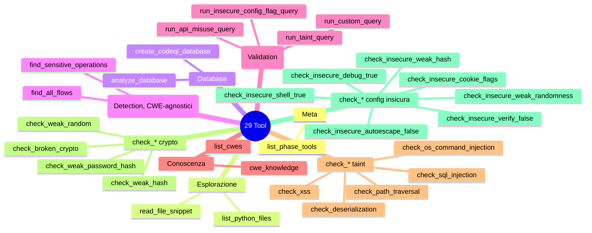

Descrizione dei principali:

| Tool | Cosa fa |
|---|---|
| `list_python_files` | Elenca i file `.py` di un progetto (salta venv, .git, ecc.). |
| `read_file_snippet` | Legge alcune righe di un file per ispezionare il contesto. |
| `create_codeql_database` | Costruisce il database CodeQL del progetto (passo obbligato prima di analizzare). |
| `analyze_database` | Esegue l'intera suite di sicurezza standard e restituisce i finding. |
| `find_all_flows` | **(Detection)** Inventario CWE-agnostico di **tutti** i flussi: input non fidato (`ThreatModelSource`) → argomento di una chiamata. Deduplicato e troncato. |
| `find_sensitive_operations` | **(Detection)** Inventario CWE-agnostico delle **operazioni sensibili senza flusso** (crypto/hash/random deboli, exec, deserializzazione, config-flag), ognuna con un `kind`. |
| `run_taint_query` | **(Validation)** Verifica un'ipotesi di *flusso* (input → punto pericoloso) dando i nomi delle funzioni sospette; *timbra* il CWE. |
| `run_api_misuse_query` | Cerca l'uso di API deboli (es. md5, sha1, DES). |
| `run_insecure_config_flag_query` | Cerca configurazioni insicure (es. `verify=False`). |
| `run_custom_query` | Esegue un file `.ql` arbitrario. |
| `list_cwes` / `cwe_knowledge` | Esplorano la base di conoscenza sui CWE. |
| `list_phase_tools` | **Meta.** Dice all'agente quali tool esporre in ciascuna fase (Detection/Validation): la mappa tool→fase sta **sul server**, non è hardcoded nell'agente. |
| `check_*` | Scorciatoie preconfezionate per i casi noti (in **Validation**). |

---

## 9. Come si avvia e come "parla" (trasporto)

Comando base (dalla cartella del progetto, con l'ambiente Python attivo):

```bash
python -m server
```

Il "trasporto" è il **canale di comunicazione**. Si sceglie con la variabile
`MCP_TRANSPORT`:

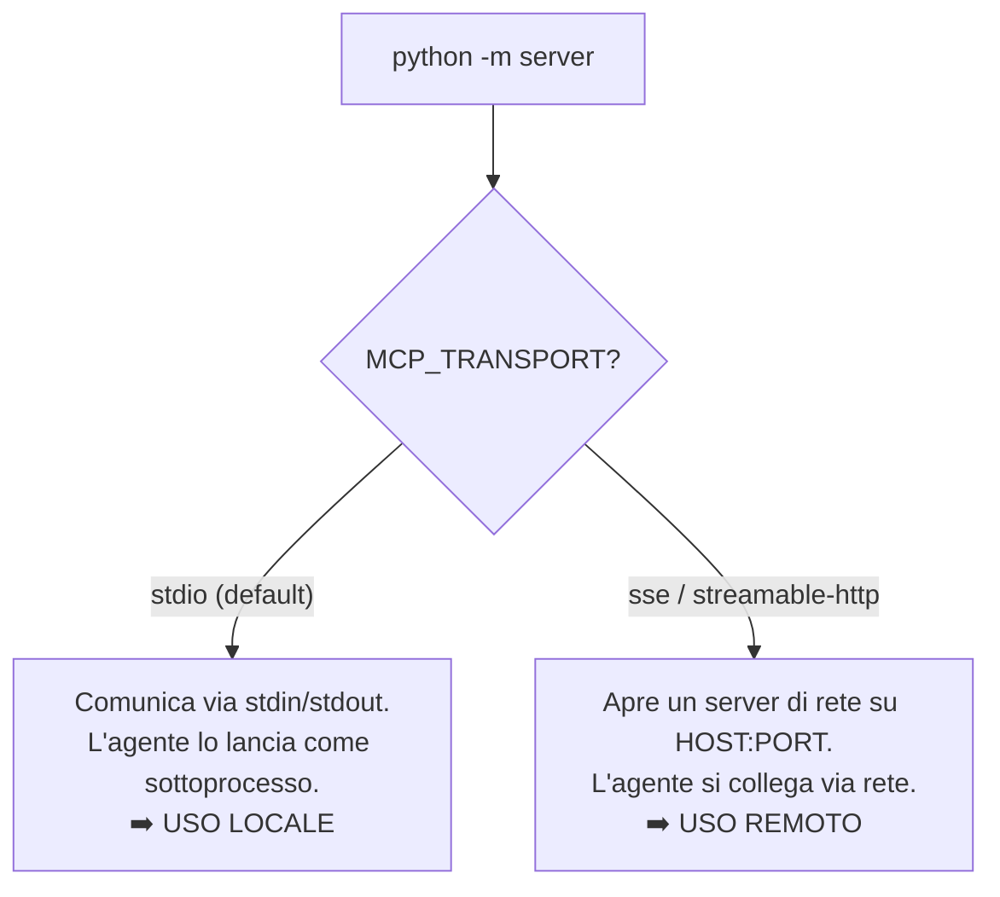

- **stdio** (default): immagina un "tubo" diretto tra agente e server sullo stesso
  computer. Non vedi nessuna interfaccia: il server resta in attesa di messaggi.
  ⚠️ Per questo i **log vanno su stderr** e non su stdout — lo stdout è il "tubo"
  riservato ai messaggi MCP.
- **sse / streamable-http**: il server diventa raggiungibile via rete:
  ```bash
  MCP_TRANSPORT=sse MCP_HOST=0.0.0.0 MCP_PORT=8000 python -m server
  ```

Per provare i tool a mano c'è uno strumento grafico:
```bash
npx @modelcontextprotocol/inspector python -m server
```

---

## 10. Configurazione

Il server legge la configurazione dalle **variabili d'ambiente**, comode da
mettere in un file `.env` nella radice del progetto (caricato in automatico).

### Obbligatorie (toolchain CodeQL — prerequisiti della macchina)
| Variabile | Significato |
|---|---|
| `CODEQL_SEARCH_PATH` | Cartella `ql` della libreria standard CodeQL (il checkout di GitHub). |
| `CODEQL_SUITE` | Il file `.qls` con la suite di sicurezza da eseguire. |
| `CUSTOM_QUERY_DIR` | Cartella con le query custom `*Broad.ql`. |

### Opzionali (hanno già un default)
| Variabile | Default | Significato |
|---|---|---|
| `CODEQL_BIN` | `codeql` | Il binario CodeQL (path completo se non è sul PATH). |
| `MCP_TRANSPORT` | `stdio` | Canale: `stdio` / `sse` / `streamable-http`. |
| `MCP_HOST` / `MCP_PORT` | `0.0.0.0` / `8000` | Indirizzo e porta (solo rete). |
| `SIBYL_LOG_LEVEL` | `INFO` | Verbosità log: `DEBUG`/`INFO`/`WARNING`/`ERROR`. |
| `WORK_DIR` | `server/_work` | Dove finiscono database e risultati. |
| `CODEQL_TIMEOUT` | `1800` | Timeout (secondi) per comando CodeQL. |

> I dati interni (template, knowledge, qlpack) hanno default **dentro `server/`**:
> non serve configurarli.

---

## 11. Il logging di debug

Tutti i log vanno su **stderr** (per non disturbare il protocollo su stdout).
Cosa vedi:

- **All'avvio** — un banner con la configurazione e il numero di tool:
  ```
  CodeQL MCP server starting
    codeql binary : /.../codeql
    search path   : /.../ql
    tools registered: 26
  ```
- **A ogni chiamata di tool**:
  ```
  → tool call: run_taint_query args={'sink_names': ['queryDB'], 'cwe': 'CWE-89'}
  ✓ tool done: run_taint_query (3.21s)
  ✗ tool error: <nome>: <messaggio>   (in caso di errore, con dettagli)
  ```
- **In modalità `DEBUG`** — anche ogni comando CodeQL eseguito, con esito e durata.

```bash
SIBYL_LOG_LEVEL=DEBUG python -m server
```

**Come funziona tecnicamente** (per curiosità): invece di aggiungere un log dentro
ogni singolo tool, "avvolgiamo" in un punto solo la funzione centrale che esegue
qualsiasi tool (`call_tool`). Così **ogni** chiamata viene loggata
automaticamente.

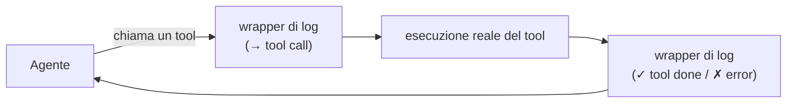

---

## 12. Flusso completo di un'analisi

Il server è **agnostico rispetto alle fasi**: espone i tool, l'agente li orchestra.
Nel flusso reale l'agente lavora in **due fasi** (vedi [agent.md](agent.md) §2): in
**Detection** costruisce il DB e chiama gli **inventari** (`find_all_flows`,
`find_sensitive_operations`); in **Validation** consulta la conoscenza e lancia le
query di **verifica** (`run_taint_query`, `run_api_misuse_query`, …). Ecco l'esempio
end-to-end per una SQL injection:

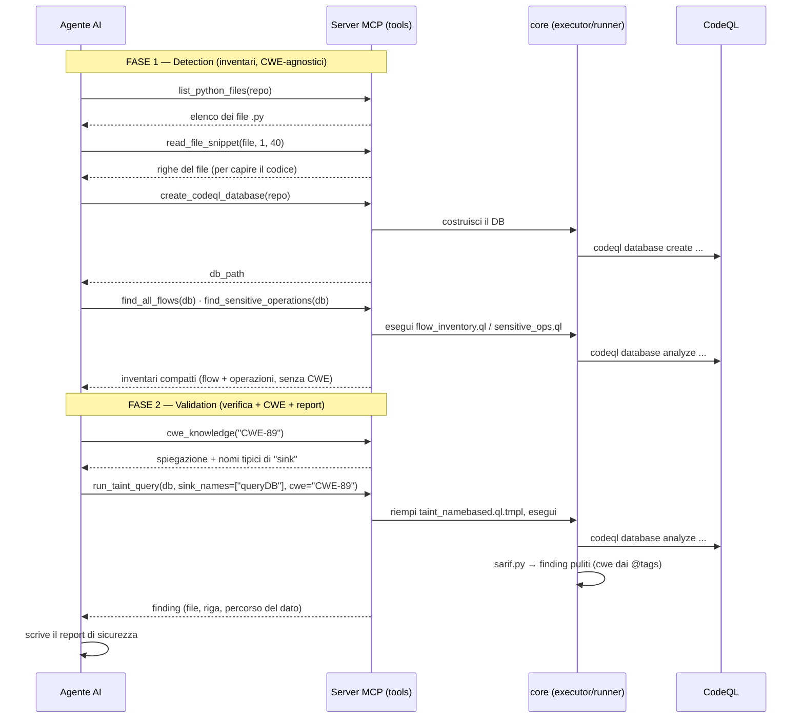

In parole semplici: **Detection** = esplora i file → costruisci il database →
**inventaria** flussi e operazioni (senza CWE); **Validation** = consulta la
conoscenza → **verifica** l'ipotesi → ottieni la prova (il percorso del dato) e il CWE
→ scrivi il report.

---

## 13. Perché è "autocontenuto"

Tutta la cartella `server/` è **portabile**: la puoi copiare su un altro computer
e farla funzionare lì. Dentro ci sono già:
- la configurazione propria (`config.py`),
- i dati (knowledge, template, qlpack),
- il codice di tutti i componenti.

Le **uniche cose esterne** sono la *toolchain CodeQL* (il binario + la libreria
standard): sono come Python stesso — si installano sulla macchina, non si
"impacchettano" nell'app perché pesano centinaia di MB e sono di GitHub.

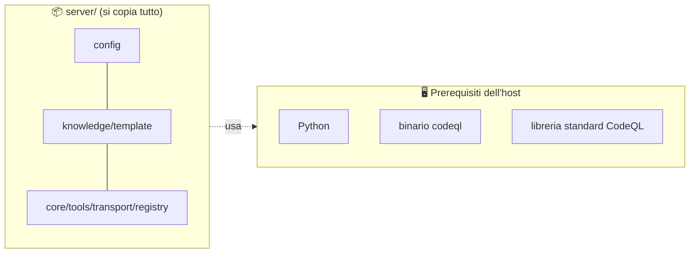

---

## 14. Stato noto

- I **5 tool custom** `check_sql_injection`, `check_os_command_injection`,
  `check_path_traversal`, `check_deserialization`, `check_xss` sono registrati ma
  **non funzionanti**: i file `.ql` corrispondenti non esistono (mai creati). La
  stessa copertura è comunque ottenibile con `run_taint_query`. Decisione attuale:
  lasciarli così, li scriveremo in futuro se servirà.
- L'**agente** è stato rifattorizzato nel pacchetto modulare `agent/` (vedi
  `documentazione/agent.md`) e ricollegato al nuovo server come **client SSE**: si
  avvia con `python -m agent <repo>` mentre il server gira separatamente
  (`MCP_TRANSPORT=sse python -m server`).

---

## Riepilogo in una mappa

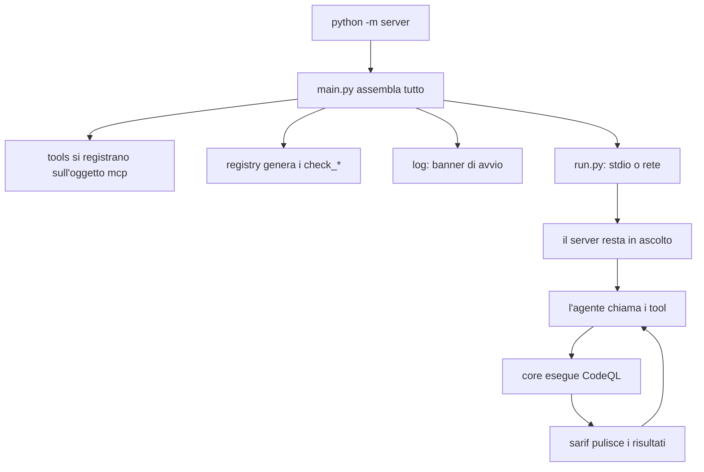

> **In una frase:** il Server MCP è un involucro pulito e modulare attorno a
> CodeQL, che espone l'analisi di sicurezza come tool semplici, è configurabile,
> portabile, e pronto a funzionare sia in locale (stdio) sia da remoto (rete).

---

# FAQ / Approfondimenti

> Sezione viva: qui raccolgo le domande poste man mano e le relative risposte
> approfondite, per non perderle.

## D: Con quali comandi avvio il server e cosa significano i parametri?

Comando base (dalla cartella del progetto, **con il venv attivo**):
```bash
python -m server                 # locale, trasporto stdio (default)
MCP_TRANSPORT=sse MCP_HOST=0.0.0.0 MCP_PORT=8000 python -m server   # remoto, di rete
```

Parametri principali (variabili d'ambiente — vedi anche §10):
- **Obbligatori** (toolchain CodeQL): `CODEQL_SEARCH_PATH`, `CODEQL_SUITE`,
  `CUSTOM_QUERY_DIR`. Senza, il server si ferma con un errore esplicito.
- **Trasporto**: `MCP_TRANSPORT` (`stdio`|`sse`|`streamable-http`), `MCP_HOST`,
  `MCP_PORT` (solo per i trasporti di rete).
- **Opzionali**: `CODEQL_BIN` (default `codeql`), `SIBYL_LOG_LEVEL` (default `INFO`),
  `WORK_DIR`, `CODEQL_TIMEOUT`.

## D: Perché `python3 -m server` mi dà errore "CODEQL_SEARCH_PATH is not set"?

Quasi sempre perché **non hai attivato il virtualenv**. Il `.env` viene caricato
**solo se è installato `python-dotenv`**, che sta nel venv del progetto, non nel
`python3` di sistema. Quindi col python di sistema il `.env` viene ignorato e le
variabili risultano vuote (e mancherebbe anche `mcp`).

Soluzione — attiva prima il venv:
```bash
cd /percorso/al/progetto
source .venv/bin/activate     # il prompt mostra (.venv); `which python` punta a .venv/bin/python
python -m server
```
Oppure usa direttamente il python del venv senza attivarlo:
```bash
.venv/bin/python -m server
```

> Regola pratica: **il `.env` non è "magico"**, lo legge `python-dotenv`. Niente
> venv → niente dotenv → niente `.env`.

## D: A cosa serve `loader.py` (il Registry)?

È la **"fabbrica di tool"**. Evita di scrivere a mano i 16 tool `check_*` (quasi
identici): li **genera automaticamente** all'avvio partendo da tre liste di
configurazione e li registra sull'oggetto `mcp`.

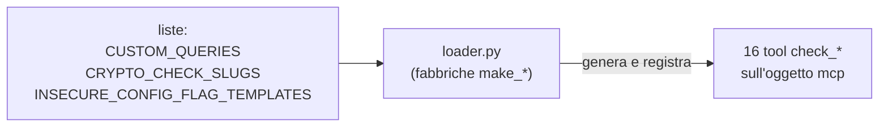

Tre fabbriche, una per famiglia:

| Fabbrica | Sorgente | Produce | Quanti |
|---|---|---|---|
| `make_cwe_tool` | `config.CUSTOM_QUERIES` | check_* che eseguono una query `.ql` preconfezionata | 5 |
| `make_crypto_check_tool` | `CRYPTO_CHECK_SLUGS` + wiki | check_* crypto (scorciatoie su `run_api_misuse_query`) | 4 |
| `make_insecure_config_tool` | `INSECURE_CONFIG_FLAG_TEMPLATES` | check_insecure_* (riempiono un template) | 7 |

Idea chiave (Python): una funzione è un oggetto. Ogni fabbrica **crea** una piccola
funzione interna `tool(db_path)`, le **assegna** nome e descrizione dinamici, e la
**consegna** al server con `mcp.add_tool(tool)`. I cicli `for` chiamano la fabbrica
una volta per voce della lista. Tutto avviene **al momento dell'import** di
`loader.py` (da `main.py`): per questo si parla di "registration side effects".

Conseguenza pratica: aggiungere un nuovo `check_*` domani = aggiungere **una riga**
alla lista giusta, senza scrivere codice nuovo.

## D: Nel contesto del progetto, a cosa servono i `check_*`?

Sibyl è guidato da un **LLM locale piccolo**, che non sa scrivere CodeQL né
parametrizzare bene i tool generici. I `check_*` sono **scorciatoie "a un clic"**
per le vulnerabilità comuni: il modello le chiama passando **solo `db_path`** e
ottiene un controllo corretto e già collaudato. Esistono quindi due "corsie":

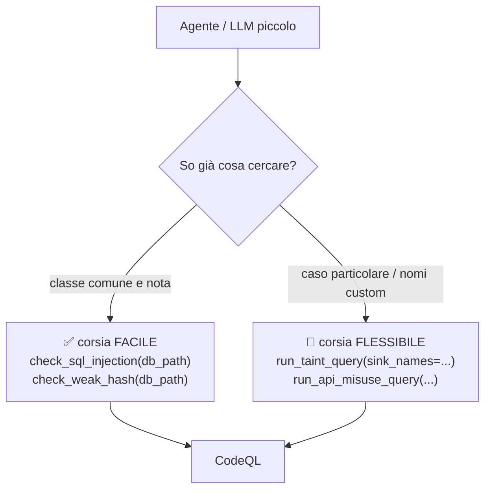

Cosa coprono (3 famiglie):

| Famiglia | Check | Cercano |
|---|---|---|
| Injection (taint) | sql_injection, os_command_injection, path_traversal, deserialization, xss | input utente che arriva a un punto pericoloso |
| Crittografia debole | weak_hash, broken_crypto, weak_random, weak_password_hash | MD5/SHA1/DES, random insicuro, hash password deboli |
| Config insicure | insecure_verify_false, shell_true, autoescape_false, debug_true, weak_hash, weak_randomness, cookie_flags | `verify=False`, `shell=True`, `debug=True`, ecc. |

Perché contano:
1. **Evidenza deterministica, non opinione dell'AI**: ogni check "timbra" il CWE nei
   metadati della query, quindi il finding porta una prova oggettiva (regola CodeQL +
   percorso del dato), non un CWE indovinato dal modello.
2. **Affidabilità ed efficienza**: una sola chiamata invece di un ragionamento
   complesso → meno errori, analisi più rapida.

Stato attuale: i check **crypto** e **insecure_config** funzionano; i 5 check
**injection** sono registrati ma **non operativi** (mancano i file `.ql`), e la loro
copertura si ottiene oggi con `run_taint_query`.

## D: A cosa serve la **knowledge** nel contesto del progetto?

L'LLM che guida l'analisi è **piccolo e non esperto** di sicurezza/CodeQL: da solo
"indovinerebbe" (CWE sbagliati, sink inventati). La knowledge base è il suo
**manuale di riferimento affidabile**, su due livelli:

| File | Contenuto | Ruolo |
|---|---|---|
| `cwe_wiki.json` (`CWE_REFERENCE`) | Wiki curata dei CWE rilevabili: nome, tipo di rilevamento, spiegazione, **nomi tipici di sink/source/sanitizer**, API deboli, rimedio, blocco **`actions`** (quale tool usare e come) | Guida operativa del modello |
| `cwe_catalog.json` (`CWE_CATALOG`) | Catalogo ufficiale MITRE completo (~969 CWE), sola consultazione | Fallback descrittivo |

Serve a tre cose:

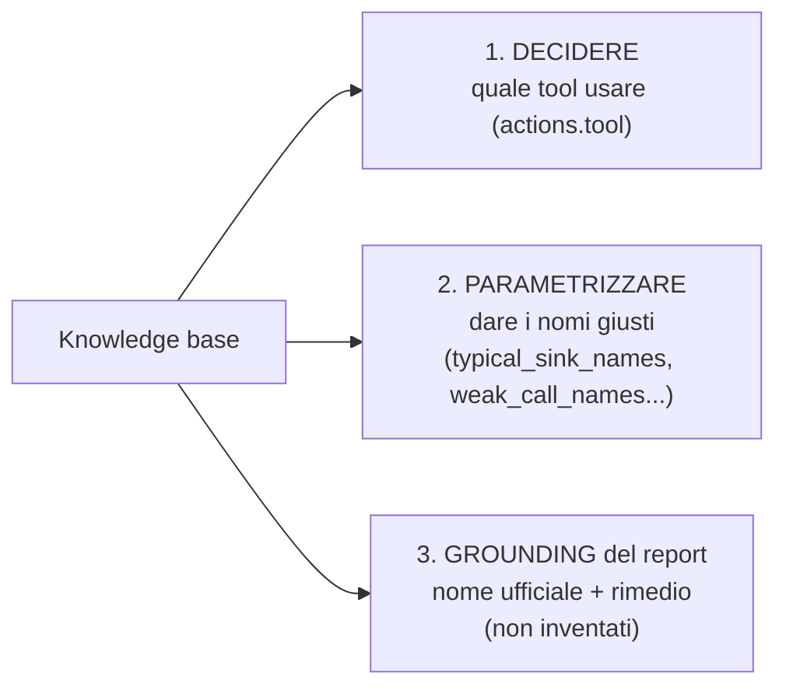

Trasforma un **sospetto vago** ("forse qui c'è una SQLi") in una **chiamata
corretta** (`run_taint_query(cwe="CWE-89", sink_names=[...])`) e in un **report
fondato**. È esposta al modello tramite i tool `list_cwes` e `cwe_knowledge(cwe)`.

## D: Come interagiscono Agente e LLM con i tool MCP (statici e check_*)?

### Meccanismo di base (function calling)

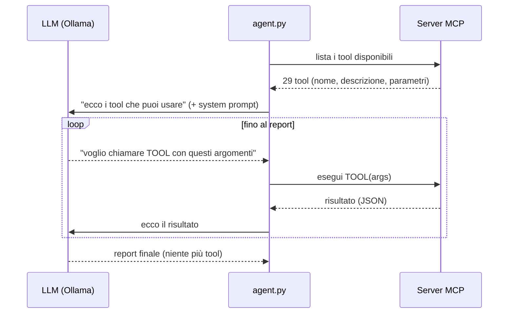

L'agente fa da **tramite**: espone i tool del server al modello in formato function
calling ed esegue ad ogni turno ciò che il modello chiede. Il modello **non esegue
nulla da solo**: dice solo *cosa* vuole. (Robustezza: recupero delle chiamate
emesse come testo, cache anti-loop, checkpoint, correzione del `db_path`.)

### Flusso guidato (dal system prompt dell'agente)

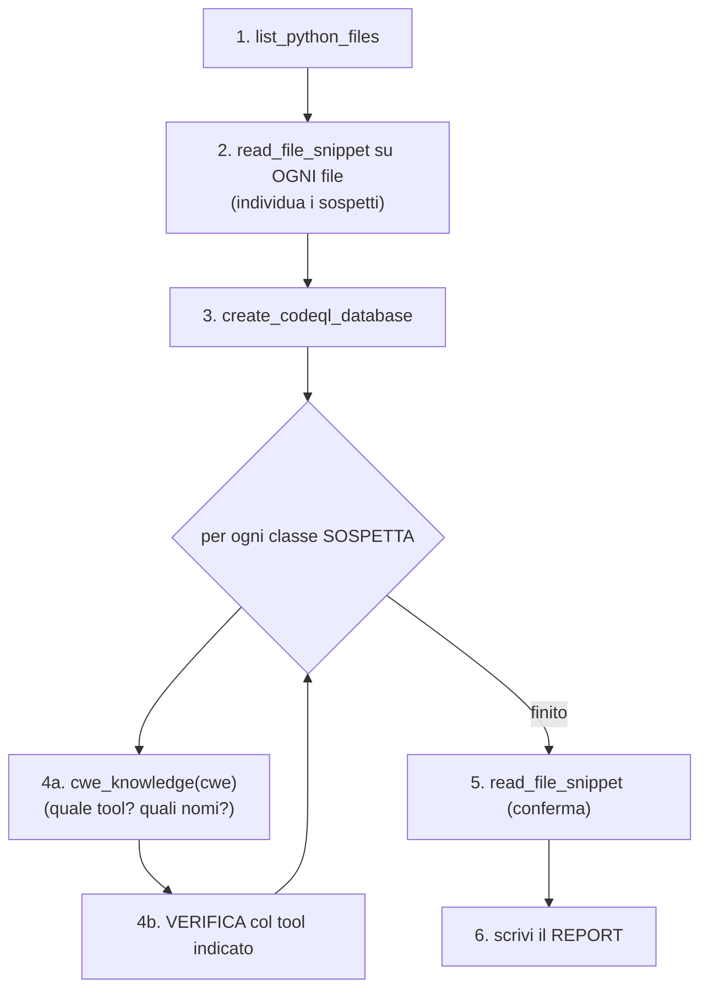

### Statici vs check_* (il passo di verifica 4b)

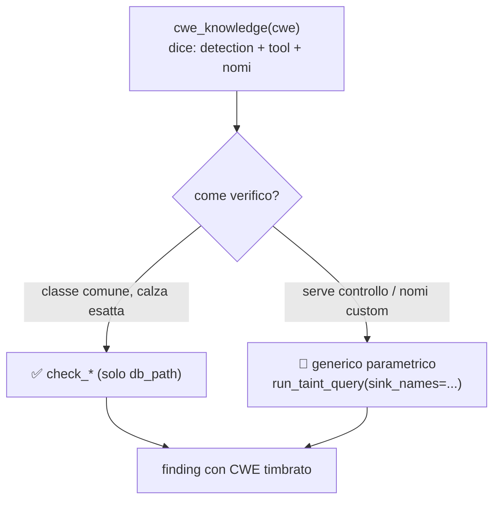

- **Tool statici generici** (`run_taint_query`, `run_api_misuse_query`,
  `run_insecure_config_flag_query`): potenti, ma il modello deve **fornire i
  parametri** (presi dalla knowledge).
- **`check_*`**: scorciatoie chiamate col **solo `db_path`** — più affidabili con
  modelli deboli.
- Altri statici (`list_python_files`, `read_file_snippet`,
  `create_codeql_database`, `analyze_database`): preparazione ed esplorazione.

### Il filo che lega tutto

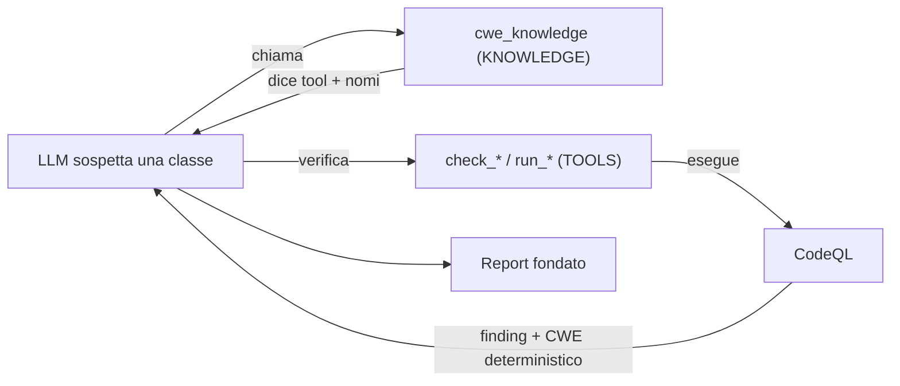

La **knowledge dice cosa fare**, i **tool lo fanno**, **CodeQL produce la prova**.
Il modello orchestra, ma ogni affermazione del report è ancorata a evidenza
deterministica (il CWE viene dai metadati della query, non dal modello).
## D: Spiegazione approfondita dei componenti del `core/`

Il `core/` è il **motore tecnico** del server: logica pura, **non sa nulla di MCP**.
Sono 4 moduli — 3 "mattoni" indipendenti + 1 "regista" che li combina.

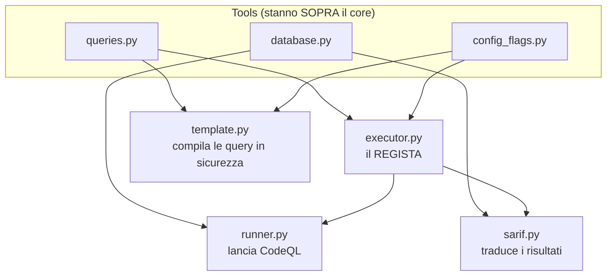

### 1. `runner.py` — il "telecomando" di CodeQL
- **A cosa serve:** l'**unico punto** che lancia davvero CodeQL come processo.
- **Cosa fa:** riceve un comando (lista), lo esegue con timeout, restituisce
  **codice di uscita**, **output**, **errori**.
- **Perché isolato:** un solo posto sa "come si avvia un processo" → facile da
  loggare (comandi in DEBUG), cambiare o testare.

### 2. `sarif.py` — il "traduttore" dei risultati
CodeQL produce un file **SARIF** (JSON standard ma enorme). Questo modulo lo
traduce in finding puliti.
- `parse_sarif` (principale): SARIF -> lista finding (regola, gravità, CWE, file, riga, messaggio).
- `extract_flow`: ricostruisce il **percorso del dato** sorgente->sink (la *prova* di un taint).
- `loc_brief`: estrae solo file + riga da una posizione.
- `cwe_from_tags`: ricava il CWE (es. `CWE-89`) dalle etichette della regola.

### 3. `template.py` — il "compilatore sicuro" delle query
Le query taint/api/config si generano al volo da modelli `.tmpl`, riempiendo i
buchi con i nomi forniti dall'AI. Questo modulo lo fa **in sicurezza**.
- `render_names` / `render_consts`: formattano i nomi per CodeQL **scartando ciò
  che non è un identificatore valido** -> scudo **anti-injection**.
- `normalize_cwe`: uniforma `CWE-89` / `cwe-89` / `89` nelle forme che servono.
- `is_valid_name`: dice se una stringa è un identificatore valido.

### 4. `executor.py` — il "regista" che combina tutto
- `db_path_for`: percorso **univoco e ripetibile** del database (stesso progetto -> stesso DB).
- `analyze_with_query`: la **routine condivisa** da quasi tutti i tool di query.
  Riceve DB + file `.ql`, lancia CodeQL (via `runner`), legge il SARIF (via
  `sarif`) e impacchetta i finding in JSON.

### Come collaborano (esempio: una query taint)

```mermaid
sequenceDiagram
    participant T as un tool (run_taint_query)
    participant TM as template.py
    participant EX as executor.py
    participant RUN as runner.py
    participant CQL as CodeQL
    participant SA as sarif.py
    T->>TM: riempi il template coi nomi (validati)
    T->>EX: analyze_with_query(db, query.ql)
    EX->>RUN: run(codeql database analyze ...)
    RUN->>CQL: esegue il processo
    CQL-->>RUN: SARIF + codice di uscita
    RUN-->>EX: codice, output, errori
    EX->>SA: parse_sarif(file)
    SA-->>EX: lista finding puliti
    EX-->>T: JSON finding_count + findings
```

### Riepilogo

| Modulo | Ruolo in una frase | Funzioni chiave |
|---|---|---|
| `runner.py` | Lancia CodeQL (unico punto) | `run` |
| `sarif.py` | Traduce l'output grezzo in finding | `parse_sarif`, `extract_flow`, `loc_brief`, `cwe_from_tags` |
| `template.py` | Compila query in modo sicuro | `render_names`, `render_consts`, `normalize_cwe`, `is_valid_name` |
| `executor.py` | Combina runner+sarif per eseguire una query; helper anti-duplicazione | `db_path_for`, `analyze_with_query`, `render_and_analyze` |
## D: Refactoring anti-duplicazione — l'helper `render_and_analyze`

**Problema individuato:** quattro funzioni che generano una query CodeQL ripetevano
lo stesso blocco (~8 righe): *leggi template -> riempi i buchi -> `mkdir` -> hash ->
scrivi il `.ql` -> esegui*. Si trovava in `run_taint_query`, `run_api_misuse_query`
(`tools/queries.py`), `run_insecure_config_flag_query` (`tools/config_flags.py`) e
nella factory `make_insecure_config_tool` (`registry/loader.py`).

> Nota: l'**esecuzione** della query NON era duplicata (già centralizzata in
> `analyze_with_query`). A essere duplicata era la **preparazione** della query.

**Soluzione:** un unico helper `render_and_analyze` in `core/executor.py`. Ogni
chiamante passa solo ciò che gli è specifico; l'helper aggiunge da solo i segnaposto
comuni del CWE, applica le sostituzioni, calcola l'hash, scrive il `.ql` ed esegue.

```mermaid
flowchart TB
    subgraph prima["PRIMA — blocco ripetuto 4 volte"]
        P1["run_taint_query"]
        P2["run_api_misuse_query"]
        P3["run_insecure_config_flag_query"]
        P4["make_insecure_config_tool"]
        P1 --> B1["leggi+riempi+hash+scrivi+esegui"]
        P2 --> B2["leggi+riempi+hash+scrivi+esegui"]
        P3 --> B3["leggi+riempi+hash+scrivi+esegui"]
        P4 --> B4["leggi+riempi+hash+scrivi+esegui"]
    end
```

```mermaid
flowchart TB
    subgraph dopo["DOPO — un solo helper condiviso"]
        Q1["run_taint_query"]
        Q2["run_api_misuse_query"]
        Q3["run_insecure_config_flag_query"]
        Q4["make_insecure_config_tool"]
        H["render_and_analyze<br/>(core/executor.py)"]
        Q1 --> H
        Q2 --> H
        Q3 --> H
        Q4 --> H
    end
```

**File toccati**

| File | Modifica |
|---|---|
| `core/executor.py` | Aggiunto `render_and_analyze` (+ import `normalize_cwe`) |
| `tools/queries.py` | I due tool usano l'helper; rimossi import `hashlib`, `config` |
| `tools/config_flags.py` | Il tool usa l'helper; rimossi `hashlib`, `config` |
| `registry/loader.py` | La factory usa l'helper; rimossi `hashlib`, `json` |

**Garanzie:** stessi 29 tool, test verdi (inclusi i CodeQL reali). Output
byte-identico: stesso template + stesse sostituzioni -> stesso contenuto -> stesso
hash -> stesso nome file generato. Il `core/` resta puro (l'helper usa solo `config`
e `template`, niente knowledge/MCP).

## D: Setup completo di un server "vergine" (da zero)

Procedura reale per installare e validare il MCP server su un server Ubuntu x86_64
appena creato. Prerequisiti già presenti nel nostro caso: **Ollama + qwen** e accesso
**SSH**. Sostituisci i path se usi cartelle diverse (`~/codeql-tools`, `~/Sibyl`).

**Note/attenzioni emerse sul campo:**
- Python molto recente (es. 3.14): se `pip install` fallisce per mancanza di wheel,
  usa un venv con Python 3.12/3.13.
- Il modello può essere una taglia piccola (es. `qwen2.5-coder:3b`): ok per far
  girare il server; rileva solo per il futuro aggancio dell'agent.
- Servono ~2 GB liberi per il toolchain CodeQL.

### Fase 1 — Pre-flight (sul server)
```bash
uname -m            # atteso: x86_64
python3 --version   # 3.10+
git --version
ollama list         # deve mostrare il modello qwen
df -h ~             # spazio libero (>= 2-3 GB)
```

### Fase 2 — Toolchain CodeQL (da zero)
```bash
sudo apt-get update -y && sudo apt-get install -y unzip wget git
mkdir -p ~/codeql-tools && cd ~/codeql-tools

# CLI CodeQL (fissa una versione nota, es. 2.25.2)
wget -q https://github.com/github/codeql-cli-binaries/releases/download/v2.25.2/codeql-linux64.zip
unzip -q codeql-linux64.zip && rm codeql-linux64.zip       # -> ~/codeql-tools/codeql/codeql
./codeql/codeql version

# Libreria standard + suite + cartella custom (shallow per risparmiare disco)
git clone --depth 1 --recursive --shallow-submodules https://github.com/github/vscode-codeql-starter.git
ls vscode-codeql-starter/ql/python/ql/src/codeql-suites/python-security-extended.qls
```

### Fase 3 — Codice dell'app (repo privato)
GitHub non accetta la password su HTTPS. Tre modi per autenticarsi (NON copiare la
chiave privata sul server):

- **SSH agent forwarding** (usa la chiave del tuo PC, niente da copiare): dal PC
  `ssh -A <user>@<host>`, poi sul server `ssh -T git@github.com` (accetta) e
  `git clone git@github.com:<owner>/<repo>.git ~/Sibyl`.
- **Chiave SSH dedicata sul server** (comoda per i pull futuri):
  `ssh-keygen -t ed25519 -f ~/.ssh/id_ed25519 -N ""`, aggiungi la `.pub` su GitHub
  (Settings -> SSH keys), poi clona con l'URL `git@github.com:...`.
- **Personal Access Token**: clone HTTPS usando il token come password.

```bash
cd ~/Sibyl && git checkout peppe
```

### Fase 4 — Ambiente Python
```bash
cd ~/Sibyl
python3 -m venv .venv && source .venv/bin/activate
pip install -U pip
pip install -r server/requirements.txt pytest
```

### Fase 5 — File `.env` (path del server)
```bash
cat > ~/Sibyl/.env <<EOF
CODEQL_BIN=$HOME/codeql-tools/codeql/codeql
CODEQL_SEARCH_PATH=$HOME/codeql-tools/vscode-codeql-starter/ql
CODEQL_SUITE=$HOME/codeql-tools/vscode-codeql-starter/ql/python/ql/src/codeql-suites/python-security-extended.qls
CUSTOM_QUERY_DIR=$HOME/codeql-tools/vscode-codeql-starter/codeql-custom-queries-python
EOF
```

### Fase 6 — Validazione
```bash
cd ~/Sibyl && source .venv/bin/activate
python -m server                                   # banner: "tools registered: 26" (Ctrl-C)
python -m pytest server/tests/test_server.py -q    # atteso: 34 passed (~2-3 min)
ollama list
```
Successo = banner ok + **34 test verdi** sul server.

## D: Quando ha senso esporre il MCP server in rete?

Principio chiave: **a chiamare il MCP server è l'AGENTE, non l'LLM.** Quindi non
conta "MCP sullo stesso nodo dell'LLM", ma **dove gira l'agente rispetto al MCP**.

| Dove gira l'Agent | Come raggiunge il MCP | Esporre il MCP? |
|---|---|---|
| Stesso nodo del MCP | `stdio` (sottoprocesso locale) | **No** |
| Nodo diverso dal MCP | `sse` / `streamable-http` (rete) | **Sì** (+ sicurezza) |

### Scenario A — Tutto sul server (nessuna esposizione) — il nostro caso
Agent + LLM + MCP co-locati. Il Client locale fa solo da trigger. L'agente lancia il
MCP via stdio. Niente porte aperte = superficie d'attacco minima.

```mermaid
flowchart TB
    subgraph PC["PC locale"]
        CL["Client thin (trigger)"]
    end
    subgraph SRV["Server (compute)"]
        AG["Agent"]
        LLM["LLM qwen via Ollama"]
        MCP["MCP server"]
        AG -->|"stdio (subprocess)"| MCP
        AG -->|"HTTP su localhost"| LLM
    end
    CL -->|"SSH / trigger"| AG
```

### Scenario B — Agent + Client sul PC, LLM + MCP sul server (esposizione necessaria)
Vuoi tenere il compute pesante (LLM + analisi CodeQL) sul server, ma orchestrare
dal tuo PC. L'agente, stando sul PC, raggiunge **via rete** sia l'LLM (API Ollama)
sia il MCP server (SSE). Qui il MCP server **va esposto**.

```mermaid
flowchart TB
    subgraph PC["PC locale"]
        CL["Client"]
        AG["Agent"]
        CL --> AG
    end
    subgraph SRV["Server (compute)"]
        LLM["LLM qwen via Ollama (porta 11434)"]
        MCP["MCP server SSE (porta 8000)"]
    end
    AG -->|"rete: API Ollama"| LLM
    AG -->|"rete: MCP SSE"| MCP
```

Avvio del MCP in modalità esposta (Scenario B), sul server:
```bash
MCP_TRANSPORT=sse MCP_HOST=0.0.0.0 MCP_PORT=8000 python -m server
```

### Sicurezza quando esponi (importante)
Il MCP server **non ha autenticazione**. Se lo esponi, proteggilo SEMPRE:
- **Preferibile:** non aprire porte pubbliche; usa un **tunnel SSH** dal PC
  (`ssh -L 8000:localhost:8000 <user>@<host>`) e tieni il server bindato su
  `127.0.0.1`. L'agente parla a `localhost:8000`, il traffico viaggia cifrato in SSH.
- In alternativa: **VPN** tra PC e server, oppure **firewall** che consente solo
  l'IP del PC, o un **reverse proxy con autenticazione** davanti al MCP.
- Mai esporre `0.0.0.0:8000` su Internet senza uno di questi accorgimenti.

> Regola pratica: esponi solo se l'agente è su una macchina diversa. Se puoi, tieni
> l'agente sul server (Scenario A) e non esporre nulla.

## D: Architettura attuale a 2 nodi + interazioni interne (avvio e query)

Stato dopo il refactoring dell'agente a **client SSE**: agente e MCP server sono
processi indipendenti. Nel deploy tipico tutto il compute sta sul server; il PC
locale fa solo da trigger.

### 1) Topologia: i 2 nodi e i processi
```mermaid
flowchart TB
    subgraph PC["PC locale (thin client)"]
        CL["Client / trigger via SSH"]
    end
    subgraph SRV["Server Ubuntu (compute)"]
        AG["Agent (agent.py) - processo 1"]
        OLL["Ollama + qwen2.5-coder - processo 2"]
        MCPP["MCP server (python -m server, SSE :8000) - processo 3"]
        TC["Toolchain CodeQL (binario + libreria standard)"]
        RP["Repo da analizzare"]
        AG -->|"HTTP localhost:11434 (chat)"| OLL
        AG -->|"SSE localhost:8000 (tool)"| MCPP
        MCPP -->|"lancia"| TC
        MCPP -->|"legge / analizza"| RP
    end
    CL -->|"SSH: avvia agente"| AG
```
Tre processi separati sul server; il PC fa solo da trigger. Tutto su `localhost`
-> niente esposto in rete.

### 2) Componenti interni del server (tutte le porzioni)
```mermaid
flowchart TB
    subgraph ENTRY["Entry point"]
        DUNDER["__main__.py"] --> MAIN["main.py"]
    end
    subgraph TRANS["transport/"]
        INST["mcp_instance.py (oggetto mcp FastMCP)"]
        RUN["run.py (stdio | sse)"]
    end
    subgraph REG["registry/"]
        LOAD["loader.py (genera 16 check_*)"]
    end
    subgraph TOOLS["tools/"]
        FS["filesystem.py"]
        DB["database.py"]
        QR["queries.py"]
        CF["config_flags.py"]
        KW["knowledge.py"]
    end
    subgraph CORE["core/ (logica pura)"]
        RUNNER["runner.py"]
        SARIF["sarif.py"]
        EXEC["executor.py"]
        TMPL["template.py"]
    end
    subgraph KNOW["knowledge/"]
        STORE["store.py"]
        DATA["data/ (cwe_wiki, cwe_catalog)"]
    end
    subgraph SUPP["supporto"]
        CFG["config.py"]
        LOG["log.py"]
    end
    subgraph DISK["dati su disco"]
        QT["query_templates/*.tmpl"]
        GQ["generated_queries/*.ql (runtime)"]
        WK["_work/ (DB + sarif)"]
    end
    MAIN --> TOOLS
    MAIN --> LOAD
    MAIN --> RUN
    RUN --> INST
    TOOLS --> INST
    LOAD --> INST
    TOOLS --> CORE
    TOOLS --> STORE
    LOAD --> CORE
    LOAD --> STORE
    EXEC --> RUNNER
    EXEC --> SARIF
    EXEC --> TMPL
    EXEC --> GQ
    EXEC --> WK
    STORE --> DATA
    QR --> QT
    CORE --> CFG
    CORE --> LOG
    STORE --> CFG
```

### 3) Avvio: cosa succede internamente
```mermaid
sequenceDiagram
    autonumber
    participant OP as Operatore
    participant MAIN as main.py
    participant TOOLS as tools
    participant REG as registry/loader
    participant MCP as mcp FastMCP
    participant RUN as transport/run
    OP->>MAIN: MCP_TRANSPORT=sse python -m server
    MAIN->>TOOLS: import moduli (side effect)
    TOOLS->>MCP: @mcp.tool() registra 10 tool statici
    MAIN->>REG: import loader (side effect)
    REG->>MCP: add_tool() x16 (check_*)
    MAIN->>MCP: log banner "tools registered: 26"
    MAIN->>RUN: run()
    RUN->>MCP: mcp.run(transport=sse)
    Note over MCP: listener SSE su :8000 in ascolto
    OP->>OP: (altro processo) python agent.py repo
    Note over OP,MCP: l'agente fa sse_client(URL) -> initialize -> list_tools (26)
```

### 4) Esecuzione di una query (end-to-end attraverso i componenti)
```mermaid
sequenceDiagram
    autonumber
    participant OLL as LLM qwen
    participant AG as Agent
    participant MCP as mcp FastMCP SSE
    participant T as tools/queries.py
    participant TM as core/template.py
    participant KS as knowledge/store.py
    participant EX as core/executor.py
    participant RN as core/runner.py
    participant CQ as CodeQL toolchain
    participant SA as core/sarif.py
    OLL-->>AG: tool_call run_taint_query(sink, cwe)
    AG->>MCP: call_tool via SSE
    MCP->>T: esegue la funzione del tool
    T->>TM: render_names / normalize_cwe (validazione anti-injection)
    T->>KS: lookup CWE (nome, remediation)
    T->>EX: render_and_analyze(template, sostituzioni, cwe, extra)
    EX->>EX: scrive la query in generated_queries/
    EX->>RN: run(codeql database analyze ...)
    RN->>CQ: esegue il processo
    CQ-->>RN: SARIF + exit code
    RN-->>EX: (rc, stdout, stderr)
    EX->>SA: parse_sarif()
    SA-->>EX: findings puliti (con flow_path = prova)
    EX-->>T: JSON dei finding
    T-->>MCP: risultato
    MCP-->>AG: risultato via SSE
    AG->>OLL: ecco i finding (prossima decisione)
```

> Nota trasversale: ogni `call_tool` passa per il wrapper di logging
> (`log.py` -> `instrument_tool_calls`), che stampa su stderr `-> tool call` e
> `tool done`/`error`. Non alterato dal trasporto (vale sia stdio sia SSE).
