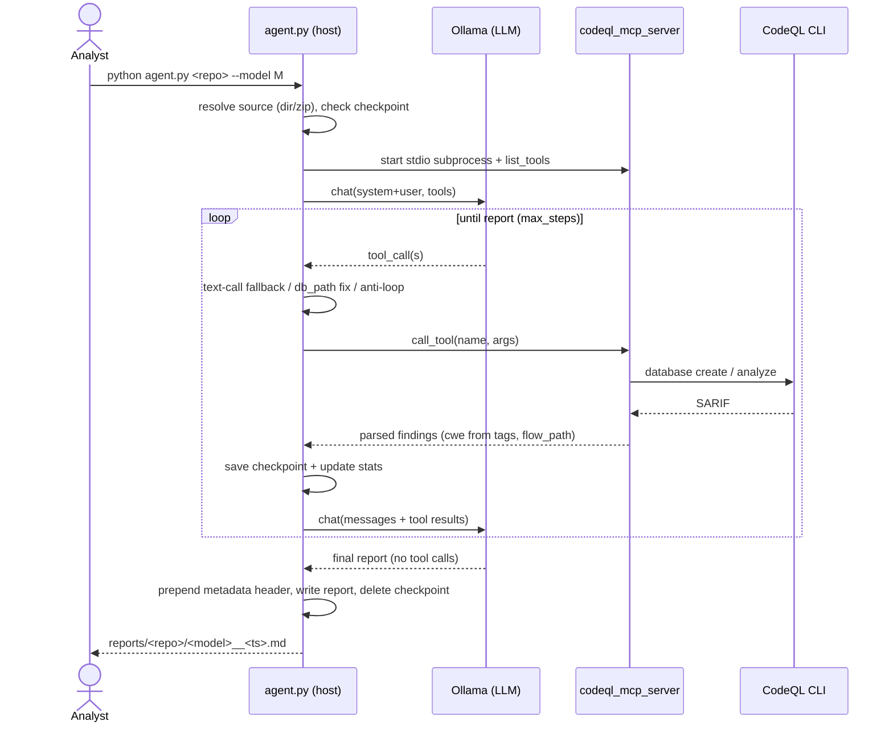
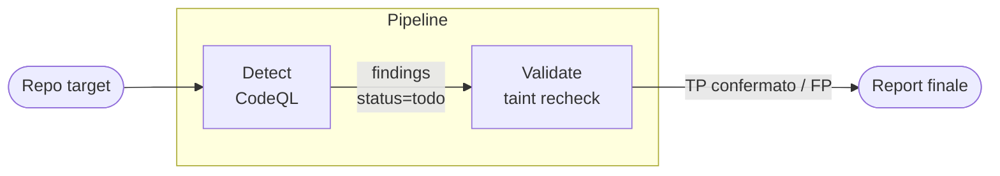
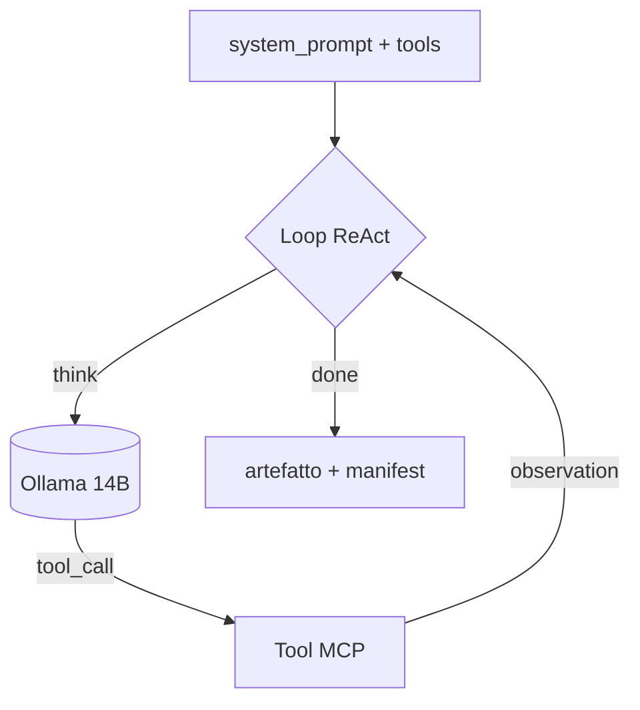
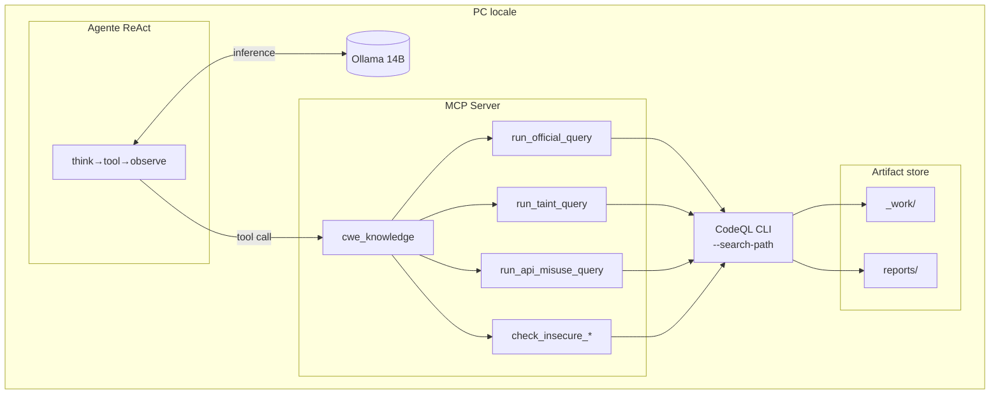
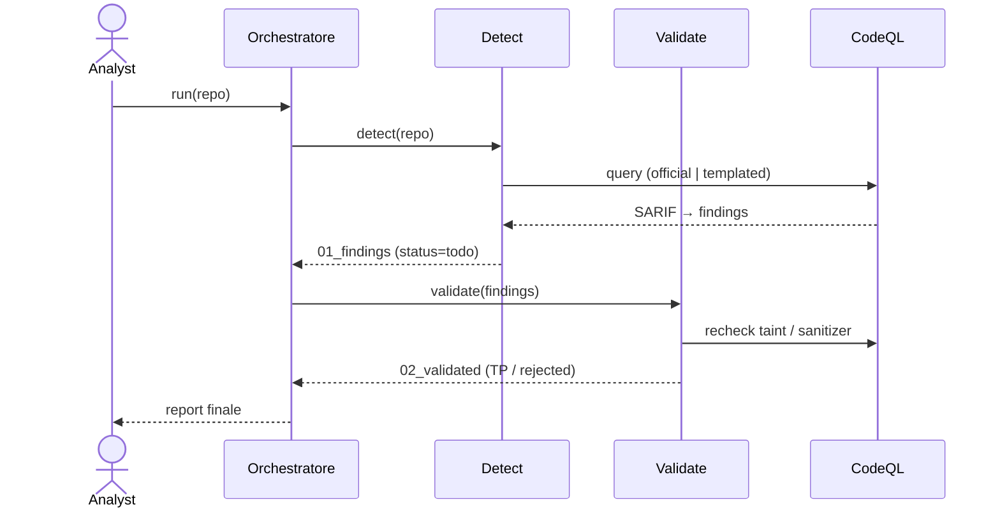
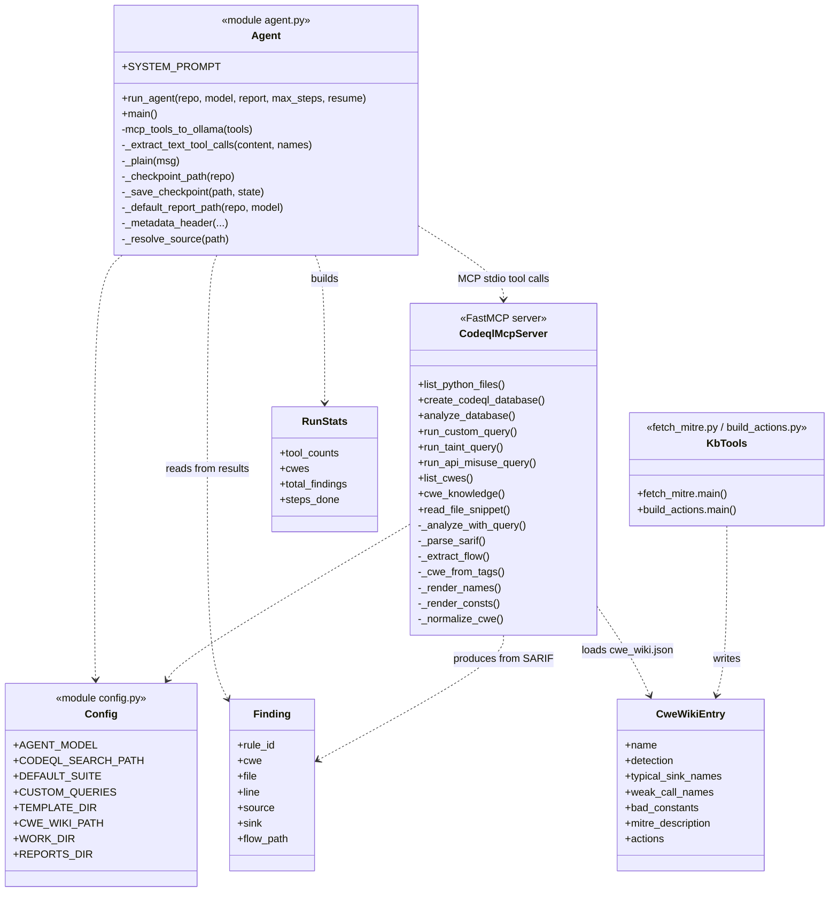

# Sibyl: Project Proposal

> Vulnerability detection framework, using a neurosymbolic approach, integrating static analysis tools (SAST) and large language models (LLM).
## Introduzione

Il rilevamento automatico di vulnerabilità nel codice sorgente è un problema aperto nella sicurezza del software. Gli strumenti di analisi statica come CodeQL permettono di specificare pattern di vulnerabilità come query su rappresentazioni strutturate del codice, e sono adottati su larga scala nell'industria. Tuttavia, la loro efficacia dipende in modo critico dalla qualità delle *specifiche di taint*: definizioni manuali di quali API costituiscono una sorgente di dati non attendibili, un punto di sink pericoloso o un sanitizer valido. Queste specifiche richiedono competenze trasversali in sicurezza, program analysis e richiede di conoscere le librerie specifiche del linguaggio, e la loro cura è un processo costoso e soggetto a errori (error-prone). Per linguaggi come Python e C, tali specifiche sono frammentarie o assenti, lasciando ampie classi di vulnerabilità sistematicamente scoperte dagli strumenti esistenti.

Un approccio naturale per ridurre questo onere è l'impiego di Large Language Model (LLM), che mostrano capacità promettenti nel ragionamento semantico sul codice. Lavori recenti come IRIS, QLPro e QLCoder esplorano l'integrazione tra LLM e analisi statica per inferire automaticamente specifiche di taint o generare query CodeQL. Questi sistemi ottengono risultati significativi, ma condividono tre limitazioni strutturali. In primo luogo, si rivolgono esclusivamente a Java, trascurando ecosistemi come Python e C per cui non esiste ancora un benchmark neuro-simbolico equivalente. In secondo luogo, richiedono LLM commerciali di grandi dimensioni (GPT-4o, Claude Sonnet, Claude-3.7-thinking) rendendo il costo computazionale e la dipendenza da servizi cloud una barriera all'adozione. In terzo luogo, trattano il risultato dell'analisi statica come verdetto finale oppure utilizzando solo paradigmi LLM-as-Judge, senza un meccanismo di conferma dinamica dell'effettiva sfruttabilità della vulnerabilità rilevata.

## Related works

Ziyang et al. [IRIS, 2024] propongono un approccio neuro-simbolico in cui il LLM inferisce specifiche di taint CWE-specifiche analizzando le API di librerie third-party, eliminando la necessità di definirle manualmente a priori. Le specifiche vengono poi utilizzate da CodeQL per eseguire la taint analysis, e i risultati delle query vengono restituiti al LLM insieme al contesto del codice per una valutazione finale dei findings. IRIS dimostra che l'integrazione LLM–analisi statica migliora significativamente la copertura rispetto a CodeQL standalone, rilevando 55 vulnerabilità su 120 contro le 27 di CodeQL su CWE-Bench-Java. 

Tuttavia, il sistema opera esclusivamente su Java, richiede un LLM commerciale (GPT-4), e tratta il risultato di CodeQL come verdetto finale, senza conferma dinamica della sfruttabilità.

Li et al. [MoCQ, 2025] propongono un framework in cui il LLM genera query CodeQL e Joern partendo da esempi di codice vulnerabile, guidato da un sottoinsieme estratto automaticamente del DSL dello strumento. Un validatore simbolico trace-driven esegue le query e fornisce feedback fine-grained al LLM per iterare fino alla correzione. MoCQ supporta PHP e JavaScript, richiede esempi di vulnerabilità noti come input, e usa LLM commerciali con un budget fino a 1000 iterazioni per query.

Gu et al. [QLPro, 2025] adottano un approccio a triplo voto per classificare source, sink e sanitizer, seguito da un ciclo Writer/Executor/Repairer in cui il LLM genera, esegue e corregge la query CodeQL. Applicato a Java con Claude-3.7-thinking, raggiunge il 66.1% di rilevamento contro il 38.7% di CodeQL standalone.

Wang et al. [QLCoder, 2025] costruiscono un framework agentico che sintetizza query CodeQL direttamente da metadati CVE, sfruttando un'interfaccia MCP con Language Server Protocol per la guida sintattica e un database RAG per il recupero semantico di query esistenti e documentazione. Valutato su 176 CVE Java, raggiunge un F1 di 0.70 contro 0.073 di CodeQL. Come IRIS, il sistema è Java-only e richiede LLM commerciali.

In tutti e tre i casi il LLM produce CodeQL direttamente, ma  la difficoltà del DSL è affrontata con più potenza computazionale o più iterazioni, non con una decomposizione che la elimini dal task del modello.

Sajadi et al. [AXE, 2026] presentano un framework multi-agente per la conferma dinamica di vulnerability report, operando in un regime grey-box: l'input è il minimo disponibile dall'output di un tool statico — una classificazione CWE e una posizione nel codice sorgente. Un agente Strategist formula ipotesi di sfruttabilità, un Explorer recupera contesto dal sorgente on-demand, e un Exploiter esegue tentativi concreti contro il servizio target in ambiente containerizzato. Il processo produce un PoC riproducibile con oracle di verifica. Valutato su CVE-Bench, raggiunge il 30% di success rate, tre volte superiore ai baseline black-box. 

AXE dimostra che integrare metadata dell'analisi statica nella fase di exploitation migliora significativamente l'efficacia rispetto all'approccio puramente black-box, ma si limita ad applicazioni web con superficie HTTP e richiede GPT-4o.

---

Da qui l’idea di **Sibyl**, un agente di sicurezza neuro-simbolico che affronta questi problemi attraverso una ridefinizione del ruolo di CodeQL nella pipeline. L'intuizione centrale è che CodeQL non debba essere un mero strumento di validazione, ma un *oracolo intermedio* integrato in un approccio agentico che permette di arricchire il contesto dell’analisi effettuata con i risultati di uno strumento deterministico: l’ LLM propone ipotesi sulla classificazione delle API osservate nel codice (source, sink, sanitizer), CodeQL verifica deterministicamente se il percorso di taint ipotizzato esiste, e l'esito arricchisce il contesto dell'agente per raffinare le ipotesi successive.

Questa decomposizione ha una conseguenza architetturale diretta: 

- il task assegnato al LLM si riduce a classificazione semantica di nomi API, un compito per cui modelli di medie e piccole dimensioni  (Qwen2.5-Coder da 14 miliardi di parametri, eseguibile localmente) si dimostrano adeguati.
- La complessità sintattica di CodeQL è interamente delegata a tool MCP deterministici, testabili indipendentemente dal modello.

Sibyl opera quindi in un regime completamente locale, senza dipendenze da API cloud, con garanzie di riproducibilità e tutela della riservatezza del codice analizzato.

**Pattern di sicurezza**

Sibyl non implementa il **Dual LLM Pattern** classico, ma il livello di indirezione introdotto dai tool MCP, che convertono codice sorgente non fidato in output strutturati prima che questi raggiungano gli agenti che eseguono azioni sul codice,  da una parte riduce la superficie di attacco per prompt injection in modo analogo, ma siamo consapevoli di quanto il tool calling per se sia vulnerabile, da qui la scelta di implementare noi stessi i tool e lasciare l’opzione di eseguire tutto in un solo nodo.

La separazione dei privilegio è quindi architetturale in questo caso: l'orchestratore ha visibilità completa (repo, findings, manifests), gli agenti Detect e Validate hanno ***accesso scoped*** solo agli artefatti che gli vengono passati. Soprattutto, il codice sorgente non fidato arriva al contesto LLM degli agenti che lo analizzano passando sempre attraverso CodeQL (deterministico) → SARIF → findings manifest. 

Una prompt injection nascosta in un commento nel codice deve sopravvivere al parsing di CodeQL e alla conversione in SARIF strutturato prima di raggiungere l'agente: in pratica è neutralizzata.

I contributi principali di questo lavoro sono: 

1.  una pipeline neuro-simbolica per il rilevamento di vulnerabilità su codice Python basata interamente su modello locale, senza dipendenze da API cloud;
2. un'architettura MCP basata su template che incapsula la complessità sintattica di CodeQL, riducendo il task del LLM a classificazione semantica di nomi API e rendendo i tool verificabili indipendentemente dal modello;
3. un ciclo agentico in cui CodeQL opera come oracolo intermedio per la conferma deterministica dei findings lungo le fasi Detect → Validate.

Inoltre la decomposizione proposta rende il task trattabile per un modello da 14B parametri o meno su hardware consumer, abbassando la barriera di adozione rispetto agli approcci esistenti basati su LLM commerciali.

## Metodologia

Sibyl organizza l'analisi in una pipeline a due fasi sequenziali, ciascuna eseguita da un agente autonomo che opera su un artefatto prodotto dalla fase precedente.

La prima fase, **Detect**, si occupa di individuare ipotesi di vulnerabilità. L'agente riceve il repository target e il database CodeQL precompilato, e utilizza i tool MCP per eseguire query — sia query ufficiali della libreria CodeQL che query generate on-the-fly a partire dalla superficie API del codice. L'output è una lista di findings con stato *todo*: percorsi di taint candidati, non ancora confermati.

La seconda fase, **Validate**, affina i risultati eliminando i falsi positivi. L'agente riceve i findings e ri-esegue l'analisi di taint con ipotesi più precise sulla classificazione delle API — source, sink, sanitizer — inferite dal LLM a partire dal contesto del codice. CodeQL non è qui un giudice, ma un oracolo che risponde a domande specifiche: *questo percorso esiste? viene bloccato da questo sanitizer?* I findings vengono promossi a *confermati* o scartati con motivazione.

Tra le fasi, gli agenti si scambiano solo manifest leggeri,  path e summary degli artefatti,  mentre i dati pesanti (SARIF, log) restano su disco. Il contesto LLM si azzera ad ogni handoff, mantenendo il carico cognitivo per agente controllato.

---

**Modello di sviluppo**

Sibyl adotta un ciclo di vita a spirale con prototipi incrementali: ogni iterazione aggiunge un componente funzionante e verificabile, mantenendo il sistema eseguibile in ogni momento. L'iterazione 0 (`v0.1-prototype`) costituisce la baseline — un singolo agente di detection con LLM locale e tool MCP — e funge da punto di riferimento per le iterazioni successive. Ogni nuova iterazione integra un agente o una capacità, estendendo il sistema per composizione senza modificare il core esistente.

---

## 1. Analisi dei Requisiti

### 1.1 Requisiti funzionali - iter 0

| ID | Requisito |
| --- | --- |
| FR1 | Enumerare i file sorgente di una repo target (cartella o `.zip`). |
| FR2 | Costruire un database CodeQL dalla target. |
| FR3 | Eseguire la suite di sicurezza standard CodeQL (copertura ampia). |
| FR4 | Offrire check curati per-CWE (taint + crypto) a singola chiamata. |
| FR5 | Offrire query taint **name-based a template** parametrizzate dall'agente (`run_taint_query`). |
| FR6 | Offrire query crypto/API-misuse **name-based a template** (`run_api_misuse_query`). |
| FR7 | Mantenere una knowledge base CWE (MITRE ufficiale + azioni) interrogabile (`list_cwes`, `cwe_knowledge`). |
| FR8 | Orchestrare via tool-calling MCP un LLM con provider configurabile — Ollama locale (default) o endpoint OpenAI-compatibile (es. Gemini) — in modalità evidence-first. |
| FR9 | Ancorare ogni CWE riportato ai tag SARIF deterministici (no CWE allucinati). |
| FR10 | Produrre un report Markdown con header di metadati (modello, durata, tool, CWE, findings), organizzato per repo. |
| FR11 | Riprendere un'analisi interrotta da checkpoint. |
| FR12 | Robustezza: recupero tool call scritte come testo; fix del `db_path` placeholder; anti-loop. |
| FR13 | Estendere la KB via downloader MITRE + generatore di azioni. |

### 1.2 Requisiti funzionali - iter 1–4

| ID    | Requisito                                                                                                                                                   |
| ----- | ----------------------------------------------------------------------------------------------------------------------------------------------------------- |
| FR14  | Detection con **query ufficiali** wrappate (`run_official_query`), selezione per-CWE dal wiki.                                                              |
| FR15  | Agente **Validate**: riconferma il taint-path e scarta falsi positivi (sanitizer).                                                                          |
| FR16  | Work-list con `status` per **ripresa**, **idempotenza** e handoff tra agenti.                                                                               |
| NFR9  | **Portabilità**: dipendenze d'ambiente isolate in config; **provider LLM intercambiabile** (Ollama locale / endpoint OpenAI-compatibile) cambiando un flag. |
| NFR10 | **Testabilità**: i tool sono validabili senza LLM (no GPU/RAM); l'e2e con modello è raro.                                                                   |

### 1.2 Requisiti non funzionali

| ID   | Requisito                                                                                                                                     |
| ---- | --------------------------------------------------------------------------------------------------------------------------------------------- |
| NFR1 | Local/offline: nessun download di pack; query dal checkout locale `vscode-codeql-starter`.                                                    |
| NFR2 | Verifica **deterministica** (CodeQL); l'LLM solo orchestra/interpreta.                                                                        |
| NFR3 | Iniezione sicura: validazione dei nomi (regex) impedisce rotture/injection in QL.                                                             |
| NFR4 | Resilienza allo spegnimento (checkpoint, scrittura atomica).                                                                                  |
| NFR5 | Model-agnostic: funziona con modelli locali deboli grazie ai meccanismi di robustezza; provider LLM intercambiabile (Ollama / OpenAI-compat). |
| NFR6 | Riproducibilità: metadati di run nel report.                                                                                                  |
| NFR7 | Estensibilità: tool da registry, template.                                                                                                    |
| NFR8 | Performance: evidence-first per minimizzare gli step; riuso del DB.                                                                           |

## 2. Use Case

**Attori**: Security Analyst, LLM (Ollama locale / endpoint OpenAI-compat), CodeQL CLI, MITRE CWE API.

| ID | Use case | Descrizione |
| --- | --- | --- |
| UC1 | Analizza repository | L'analista lancia l'agente su una repo → ottiene un report. |
| UC2 | Riprendi analisi | Riprende una run interrotta da checkpoint (`--resume`). |
| UC3 | Verifica ipotesi taint | Conferma un flusso source→sink con la query templated. |
| UC4 | Verifica misuse crypto | Rileva API crittografiche deboli (point detection). |
| UC5 | Consulta knowledge CWE | Legge la pagina wiki (ufficiale + azioni) di una classe. |
| UC6 | Estendi KB CWE | Scarica da MITRE + genera le azioni per nuovi CWE. |
| UC7 | Check curato per CWE | Esegue un check fisso via query ufficiale o template. |
| UC8 | Query .ql ad-hoc | Esegue un file `.ql` arbitrario. |
| UC9 | Valida findings | L'agente Validate riconferma il taint-path e scarta falsi positivi. |
| UC10 | Riprendi pipeline | Riprende da un checkpoint della work-list multi-agente (`status` parziale). |

---

## 3. Sequence Diagram — analisi di una repo (UC1)



---

# Architettura

La baseline (`v0.1-prototype`) è un singolo agente di detection: LLM Ollama locale che orchestra via tool-calling MCP un insieme di tool che incapsulano CodeQL, producendo un report di findings. Le iterazioni successive aggiungono un agente per volta mantenendo il core invariato ed estendendo per composizione.

---
### Pipeline a due agenti

Il sistema target organizza l'analisi in una pipeline sequenziale **Detect → Validate**, comunicante tramite work-list con campo `status`. Ogni agente consuma l'artefatto prodotto dalla fase precedente e ne aggiorna lo stato. Gli artefatti pesanti (SARIF, log) restano su disco; tra agenti transitano solo manifest leggeri con path e summary (**Claim Check pattern**). Il contesto LLM si azzera ad ogni handoff, mantenendo controllato il carico per agente.



---

### Loop agentico — ReAct

Un unico loop ReAct, parametrizzato da `system_prompt` + `tools[]`, viene riusato per entrambi gli agenti (**Template Method**). Ad ogni iterazione il LLM ragiona sul contesto corrente, emette una tool call, riceve l'observation e aggiorna il proprio stato fino a produrre l'artefatto finale. I tool MCP sono deterministici e testabili indipendentemente dal modello (NFR11).



---

### Tool MCP e template system

L'agente non scrive mai CodeQL direttamente. Ogni modalità di detection corrisponde a un tool MCP che incapsula un template parametrizzato:

| Tool | Categoria | Descrizione |
| --- | --- | --- |
| `list_python_files` | Repo | Enumera i file sorgente di una repo (cartella o `.zip`). |
| `create_codeql_database` | Analisi | Costruisce il database CodeQL dalla repo target. |
| `analyze_database` | Analisi | Esegue la suite di sicurezza standard CodeQL. |
| `run_custom_query` | Analisi | Esegue un file `.ql` arbitrario sul database. |
| `run_taint_query` | Template | Genera ed esegue una query taint name-based (source/sink/sanitizer parametrizzati). |
| `run_api_misuse_query` | Template | Genera ed esegue una query per API-misuse e crypto debole. |
| `run_insecure_config_flag_query` | Template | Rileva flag di configurazione insicuri. |
| `run_official_query` | Libreria | Esegue una query ufficiale del checkout `vscode-codeql-starter` via `--search-path`. |
| `list_official_queries` | Libreria | Elenca le query ufficiali disponibili per CWE. |
| `extract_api_surface` | Ipotesi | Estrae le API che ricevono dati non attendibili (stage 1 dell'inferenza). |
| `run_inspection_query` | Ipotesi | Lista source/sink/sanitizer che CodeQL riconosce per un dato CWE. |
| `run_hypothesis_query` | Ipotesi | Esegue una query taint con specifiche LLM-inferred e `isBarrier` come oracolo. |
| `list_cwes` | Knowledge base | Elenca tutti i CWE presenti nella KB. |
| `cwe_knowledge` | Knowledge base | Restituisce la pagina wiki (MITRE + azioni) per un CWE. |
| `read_file_snippet` | Utilità | Legge un frammento di file sorgente per linea. |

Il LLM fornisce i nomi delle API; i template costruiscono la query QL. I nomi vengono validati tramite regex prima dell'inserimento (NFR3), impedendo injection nel DSL. La selezione del tool per CWE è codificata in `cwe_wiki.json` e restituita da `cwe_knowledge` — il LLM non decide la strategia di analisi, la riceve già pronta.

---
### VulnFamilyProfile

Ogni famiglia CWE espone un profilo che astrae all'agente: quale tool usare, il prompt per step e i tool aggiuntivi. L'ereditarietà `base → classe → famiglia` evita duplicazione (**Facade + Strategy**).

---

### Component diagram



---

### Sequence diagram — pipeline 3 agenti



---

Passiamo alla strategia di test o hai altro da aggiungere qui?

### Class / Component Diagram

Il progetto è prevalentemente a moduli + funzioni; i moduli sono rappresentati come componenti e le strutture dati come classi.



---

# Stato attuale del prototipo

Al momento il prototipo è alla versione v1, di cui mostriamo gli artefatti (i risultati di un report). La fase di validazione è già implementata e, per la classificazione dei CWE, viene attualmente utilizzata una LLM-wiki; in prospettiva vorremmo però sostituirla con un knowledge graph, come fatto nel paper: https://ieeexplore.ieee.org/stamp/stamp.jsp?tp=&arnumber=11416114&tag=1 — se ci riusciamo, ovviamente.

Mostriamo qui sotto il risultato di un report allo stato attuale.

> Esempio reale prodotto su `_smoketest_repo` con `qwen2.5-coder:14b` (modello locale). Sibyl individua due vulnerabilità, ciascuna **ancorata all'evidenza deterministica di CodeQL** (regola + flow-path), non a un'intuizione del modello. L'header YAML rende la run auto-descrivente (modello, durata, step, tool usati, CWE, findings).

```markdown
---
model: qwen2.5-coder:14b
repository: _smoketest_repo
started: 2026-06-29T17:04:21
finished: 2026-06-29T17:31:11
duration_seconds: 1609.8
steps_used: 3
max_steps: 30
tools_used: create_codeql_database:1, list_python_files:1, read_file_snippet:2, run_api_misuse_query:1, run_taint_query:1
cwes_found: CWE-89, CWE-328
total_findings: 2
generated_by: codeql-security-agent
---

### Security Report

#### Findings:

**File: app.py**

- **CWE-89 (SQL Injection)**
  - **Deterministic evidence (CodeQL):** Rule ID `py/templated-taint-namebased-cwe-089`, Flow path from `file:app.py:16` to `file:app.py:18`.
    - Static analysis proved user-controlled data flows from `request.args.get("id")` to `db.queryDB(sql)`.
  - **Classification:** CWE-89 (SQL Injection), Severity: High
  - **Why it matters & remediation:** SQL injection allows an attacker to interfere with the queries that an application makes to its database. Use parameterized queries / prepared statements; never build SQL by string concatenation with user input.

**File: crypto_util.py**

- **CWE-328 (Use of Weak Hash)**
  - **Deterministic evidence (CodeQL):** Rule ID `py/templated-api-misuse-cwe-328`, Line 5.
    - Insecure cryptographic API usage: call to a weak/insecure API (`hashlib.md5`).
  - **Classification:** CWE-328 (Use of Weak Hash), Severity: Medium
  - **Why it matters & remediation:** Using weak hash functions like MD5 and SHA1 can be exploited in various security attacks. Use SHA-256 or stronger; for passwords use a KDF (bcrypt, scrypt, argon2, PBKDF2).

### Summary Table

| CWE     | Count | Severity |
|---------|-------|----------|
| CWE-89  | 1     | High     |
| CWE-328 | 1     | Medium   |

### Overall Risk Verdict

The repository contains one high-severity SQL injection vulnerability and one medium-severity use of weak hash function. It is recommended to address the SQL injection by using parameterized queries or prepared statements, and update the hashing method to a stronger algorithm for better security.
```