# Sibyl — Il Componente **Agente**

---

## Indice
1. [A cosa serve l'agente](#1-a-cosa-serve-lagente)
2. [La pipeline: Gathering → Detection → Validation](#2-la-pipeline-gathering--detection--validation)
3. [Perché "harness" di un modello piccolo](#3-perché-harness)
4. [Dove gira l'agente (3 processi) e il provider LLM](#4-dove-gira-lagente)
5. [Il problema del function calling](#5-il-problema-del-function-calling)
6. [Vocabolario minimo](#6-vocabolario-minimo)
7. [Architettura a componenti e mappa dei file](#7-architettura-a-componenti)
8. [Il loop: una fase deterministica + due fasi LLM](#8-il-loop)
9. [FASE 0 — Gathering in dettaglio (i 12 tool di inventario)](#9-fase-0--gathering)
10. [FASE 1 — Detection in dettaglio (giudizio, non scoperta)](#10-fase-1--detection)
11. [FASE 2 — Validation in dettaglio (verifica, CWE, report)](#11-fase-2--validation)
12. [Le query, famiglia per famiglia e per fase](#12-le-query-famiglia-per-famiglia)
13. [L'handoff tra fasi: la work-list](#13-lhandoff)
14. [Il report prodotto](#14-il-report-prodotto)
15. [La knowledge dei CWE (wiki oggi, knowledge graph domani)](#15-la-knowledge)
16. [I trucchi di robustezza](#16-i-trucchi-di-robustezza)
17. [L'avanzamento grafico (eventi + webview VSCode)](#17-lavanzamento-grafico)
18. [Configurazione e avvio](#18-configurazione-e-avvio)
19. [Test](#19-test)

---

<a id="1-a-cosa-serve-lagente"></a>
## 1. A cosa serve l'agente

L'**agente** è il **regista** dell'analisi. Da solo non sa fare nulla di sicurezza:
mette in comunicazione due pezzi che invece sanno fare tanto —

- un **LLM** (un modello di intelligenza artificiale) che *ragiona* su quali
  vulnerabilità cercare;
- il **Server MCP**, che *esegue* le analisi vere con CodeQL.

L'agente espone i tool del server al modello, gli chiede *"cosa vuoi fare?"*, e
quando il modello dice *"chiama questo tool con questi parametri"*, l'agente lo
esegue sul server e gli riporta il risultato. Si va avanti a turni, in **tre fasi**
(una deterministica + due guidate dal modello), finché non si produce il **report**.

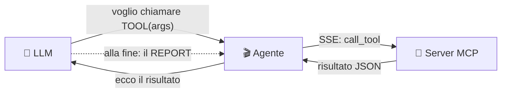

> **In una frase:** l'agente è il *tramite* che fa "parlare" l'LLM con CodeQL. Prima
> raccoglie da solo tutta l'evidenza grezza (nessun modello coinvolto), poi il
> modello **giudica** cosa conta, poi il modello **verifica** con query mirate e
> scrive il report.

---

<a id="2-la-pipeline-gathering--detection--validation"></a>
## 2. La pipeline: Gathering → Detection → Validation

Sibyl organizza l'analisi in **tre fasi sequenziali** dentro **un solo loop**
([agent/orchestrator.py](../agent/orchestrator.py)). Solo le ultime due sono
"fasi LLM" in senso proprio: ognuna ha il **suo system prompt** e vede un
**sottoinsieme diverso di tool** ([server/tools/meta.py](../server/tools/meta.py),
che è la fonte di verità della mappa tool→fase). Tra una fase e l'altra il
**contesto dell'LLM si azzera**: passa solo un manifest leggero — la **work-list**
([agent/worklist.py](../agent/worklist.py)) — mentre gli artefatti pesanti
(database CodeQL, SARIF) restano su disco.

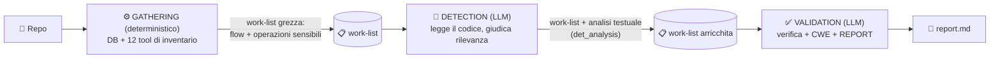

- **Gathering** *(nessun LLM)* — `_gather_evidence` in `orchestrator.py` costruisce
  il database CodeQL (`create_codeql_database`) e poi chiama **direttamente**, senza
  passare dal modello, `find_all_flows` + gli **11 tool categorizzati** di inventario
  (vedi §9): crypto/hash/random deboli, exec di comandi/codice, SQL, filesystem,
  decoding, config-flag insicuri, più tre segnali "non-CWE" (except troppo ampio,
  sanitizer/regex rotti, risorse non chiuse). Ogni tool viene chiamato **una sola
  volta**; i risultati popolano la work-list. Nessun giudizio richiesto qui, quindi
  nessun modello coinvolto: è puro I/O verso il server.
- **Detection** *(LLM)* — legge il **codice reale** (`list_python_files`,
  `read_file_snippet`) e **giudica la rilevanza** dell'evidenza già raccolta in
  Gathering: non la scopre da zero (è già sul tavolo), non assegna CWE. Scrive
  un'**analisi testuale** (`det_analysis`) che indica alla Validation cosa vale la
  pena verificare.
- **Validation** *(LLM)* — esegue le query mirate (i `check_*` a zero-parametro in
  primis, `run_taint_query`/`run_api_misuse_query`/`run_insecure_config_flag_query`
  come fallback), associa un CWE reale a ogni finding e scrive il report finale. **Non
  può più leggere codice sorgente**: `read_file_snippet` è Detection-only, bloccato
  lato server (§9-§10, §16).

> ⚠️ **La verifica con le query standard CodeQL (una eventuale "Evaluation"
> deterministica, es. `find_confirmed_vulnerabilities`) è FUORI dal framework
> automatico**: il tool esiste sul server ma oggi non è cablato in nessuna fase
> della pipeline — l'agente si ferma al report della Validation.

---
<a id="3-perché-harness"></a>
## 3. Perché "harness" di un modello piccolo

Sibyl punta a funzionare anche con **LLM piccoli/locali** (pochi parametri, poco
affidabili). Un modello debole, se lasciato solo, **non si accorge di tutto**: legge
il codice ma può non notare una `hashlib.md5` o un `verify=False` sepolto in un
helper. Per questo l'intero framework è un **harness**: non delega al modello il
"accorgersi", ma gli **mette davanti in modo strutturato** ogni segnale rilevante —
e lo fa **prima ancora che il modello entri in scena** (Gathering è deterministico).

### 3.1 Perché e come si **comprimono** i segnali

**Il vincolo.** Ogni LLM ragiona dentro una **finestra di contesto** finita: il testo
che riesce a "tenere in testa" tutto insieme (prompt + risultati dei tool + il suo
ragionamento). I modelli piccoli hanno finestre piccole e, soprattutto, **peggiorano
quando il contesto è pieno**: più roba grezza gli metti davanti, più perdono il filo,
si distraggono, saltano voci ("lost in the middle"). Dare *troppo* è dannoso quanto
dare *troppo poco*.

**Il problema.** Gli inventari grezzi sono enormi. `find_all_flows` parte da
`ThreatModelSource` verso **qualsiasi** argomento di chiamata: su un repo reale può
produrre centinaia/migliaia di risultati SARIF, ognuno con l'intero percorso (ogni
passo intermedio, file:line, note). Un dump grezzo (a) sfonda il contesto e (b)
annega il modello in quasi-duplicati.

**Le mosse (cosa fa ciascuna).**

| Mossa | Cosa fa | Esempio |
|---|---|---|
| **Dedup** | Collassa le voci "uguali" viste più volte | flussi: chiave `(source file:line, sink file:line)` → 20 percorsi tra A e B diventano **1**. operazioni: chiave `(kind, file, line)` → lo stesso `md5` visto due volte → **1**. |
| **Cap** | Un tetto rigido (`max_flows=200`, `max_ops=200` per ognuno degli 11 tool) | un repo patologico non può produrre una lista che esplode il contesto. L'inventario **completo resta nel SARIF su disco**; al modello va solo il riassunto. |
| **Raggruppamento** | Presenta le operazioni **contate per `kind`** | dà al modello la "forma" del problema (un istogramma) invece di un muro di righe, aiutandolo a **dare priorità**. |
| **Un solo giro a modello per item (Ollama)** | In Detection, coi provider locali, ogni flow/operazione viene presentato **uno alla volta** con pochi step dedicati, invece di un unico maxi-turno | evita che un contesto lungo saturi un modello piccolo (§10). |

A queste si aggiunge la **rappresentazione compatta**: al modello non passa il
percorso verboso di ogni flow (tutti i passi intermedi), ma solo gli **estremi**
`source file:line → sink file:line` (+ numero di passi e un breve `sink_hint`), con
il codice reale della riga già letto da disco dal tool stesso. Il percorso completo
resta su disco (Claim Check) e non serve al modello per *decidere cosa verificare*.

**Due stadi di compressione.**
1. **Lato tool** (server, in Gathering): ogni `find_*` deduplica, raggruppa e tronca
   il SARIF grezzo (§9).
2. **Lato handoff** (agente): `worklist.detection_summary()` **ri-comprime** ancora —
   limita a ~60 flussi + ~60 operazioni ciò che entra nel prompt, con le operazioni
   già raggruppate per `kind`. In Validation, inoltre, **il codice sorgente viene
   omesso** (`include_code=False`): passano solo posizioni e l'analisi testuale già
   scritta da Detection, mai testo grezzo del repo (che è contenuto non fidato).

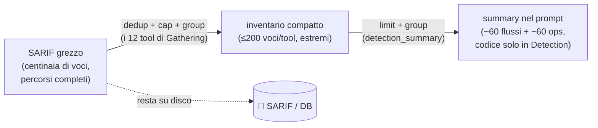

> **In una frase:** *coverage senza volume*. Non si nasconde **nessuna classe** di
> segnale, ma la si raccoglie **prima** che il modello entri in gioco e la si
> consegna in una forma che un modello piccolo riesce davvero a leggere e usare.

---
<a id="4-dove-gira-lagente"></a>
## 4. Dove gira l'agente

Tre processi che collaborano. Nel deploy tipico stanno tutti sulla stessa macchina e
dialogano su `localhost`.

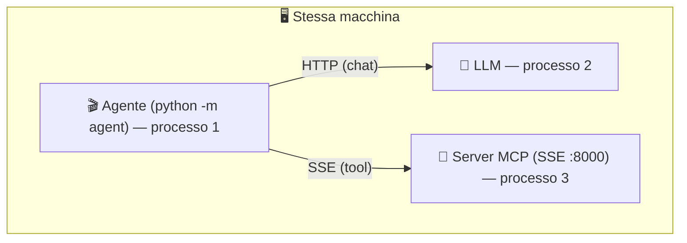

Punto chiave: **a chiamare il server è l'AGENTE, non l'LLM.** L'agente è un **client**
che si connette a un server MCP **già in esecuzione** via SSE.

### Il provider LLM è configurabile
L'LLM è **intercambiabile** ([agent/clients/factory.py](../agent/clients/factory.py)):
`ollama` (modello locale), `gemini` (Google), `openai` (qualsiasi endpoint
OpenAI-compatibile: Groq, Cerebras, …). L'adattatore OpenAI-compatibile è unico e
gestisce **throttle** e **retry** sul rate-limit. Il provider non cambia solo il
client HTTP: sceglie anche **quale set di prompt** usare (§7, §10) e i parametri di
generazione (§18).

---

<a id="5-il-problema-del-function-calling"></a>
## 5. Il problema del function calling

Il modello AI non esegue codice: produce solo **testo**. Il meccanismo che gli
permette di "usare strumenti" è il **function calling**: l'agente gli passa lo
schema dei tool, il modello risponde "voglio chiamare TOOL(args)", l'agente esegue e
gli ritorna il risultato.

**La difficoltà** con modelli piccoli: a volte stampano la chiamata come *testo* invece
di usare il canale strutturato, ripetono la stessa chiamata, passano un *segnaposto*
al posto del percorso del database o nomi di parametri sbagliati, e talvolta —
sotto pressione dei filtri anti-ripetizione — producono testo sintatticamente valido
ma privo di senso. Gran parte dell'agente esiste per **assorbire questi errori**
(vedi §16).

---

<a id="6-vocabolario-minimo"></a>
## 6. Vocabolario minimo

| Termine | Spiegazione |
|---|---|
| **Fase (phase)** | Un blocco del loop: `gathering` (deterministico), `detection` o `validation` (LLM, con un loro prompt e i loro tool). |
| **Flow / flusso** | Un percorso del dato da una *sorgente* (input) a un *sink* (punto pericoloso). |
| **flow inventory** | L'elenco di **tutti** i flussi trovati da `find_all_flows` (CWE-agnostico). |
| **operazione sensibile** | Un'operazione pericolosa **senza flusso** (crypto/random deboli, exec, config-flag, …), da uno degli **11 tool categorizzati** di Gathering. |
| **kind** | Etichetta *strutturale* di un'operazione (es. `crypto`, `config-flag`, `command-exec`) — **mai** un CWE. |
| **source / sink / sanitizer** | Da dove entra l'input (*source*), il punto pericoloso (*sink*), ciò che bonifica il dato (*sanitizer/barrier*). |
| **finding** | Una vulnerabilità candidata con CWE, gravità e il percorso del dato (`flow_path`). |
| **work-list** | Il manifest leggero che attraversa le fasi (i due inventari + l'analisi testuale di Detection). |
| **det_analysis** | Il testo che Detection scrive per indicare alla Validation cosa verificare (non è un finding, non contiene CWE). |
| **Claim Check** | Pattern di handoff: si passano manifest leggeri (path/summary), i dati pesanti restano su disco. |
| **CWE** | Codice standard di una classe di debolezza (es. `CWE-89` = SQL injection). |
| **ThreatModelSource** | Modello CodeQL di "dove entra input non fidato" (remote + local + env + cmd + file + db). |

---

<a id="7-architettura-a-componenti"></a>
## 7. Architettura a componenti e mappa dei file

L'agente è a **strati**; le dipendenze vanno solo verso il basso. Il "motore"
(orchestrator) sta in alto e usa i moduli sotto.

```mermaid
flowchart TD
    AGT["📦 agent/"]
    AGT --> ENTRY["__main__.py · cli.py — entry point"]
    AGT --> CONF["config.py — provider, URL, cartelle, tuning Ollama"]
    AGT --> ORCH["orchestrator.py — IL LOOP (Gathering + 2 fasi LLM)"]
    AGT --> PH["phases.py — tool ammessi per fase (detection/validation)"]
    AGT --> PR["prompts.py — prompt API-style (gemini/openai)"]
    AGT --> PRL["prompts_local.py — prompt procedurali (ollama)"]
    AGT --> PRT["prompt_router.py — sceglie il set di prompt per provider"]
    AGT --> WL["worklist.py — handoff (candidates + operations + summary)"]
    AGT --> PRG["progress.py — eventi per la webview"]
    AGT --> REP["report.py — RunStats + tabella finding + finalize"]
    AGT --> SRC["source.py — cartella / .zip"]
    AGT --> CLI["clients/ — factory, mcp(SSE), ollama, openai_compat"]
    AGT --> ROB["robustness/ — toolcalls, degenerate, readargs, checkpoint, dbpath"]
```

| File | Ruolo |
|---|---|
| [orchestrator.py](../agent/orchestrator.py) | `run_agent` (le 3 fasi) + `_gather_evidence` (Gathering) + `_run_phase` (sotto-loop generico per le fasi LLM). |
| [phases.py](../agent/phases.py) | `fetch_phase_tools` (chiede al server quali tool per fase) + `filter_tools`. |
| [prompts.py](../agent/prompts.py) | `DETECTION_PROMPT` / `VALIDATION_PROMPT` per i provider hosted (gemini, openai). |
| [prompts_local.py](../agent/prompts_local.py) | `LOCAL_PROMPT_SET`: variante procedurale ed esplicita per Ollama (esempi letterali di tool-call). |
| [prompt_router.py](../agent/prompt_router.py) | `prompt_set(provider)`: sceglie tra i due set sopra in base al provider attivo. |
| [worklist.py](../agent/worklist.py) | `WorkList`: `candidates` (flow) + `operations` (ops sensibili) + `detection_summary()`. |
| [progress.py](../agent/progress.py) | `Progress`: emette eventi JSON per la vista grafica (gated da env). |
| [report.py](../agent/report.py) | `RunStats` (statistiche, tabella finding deduplicata, intestazione YAML) e `finalize`. |
| [clients/mcp.py](../agent/clients/mcp.py) | `connect(url)` SSE, `mcp_tools_to_ollama`, `tool_result_text`. |
| [robustness/toolcalls.py](../agent/robustness/toolcalls.py) | Recupero tool-call emesse come testo (3 strategie in cascata). |
| [robustness/degenerate.py](../agent/robustness/degenerate.py) | Rileva testo "degenerato" (sintatticamente valido, semanticamente vuoto). |
| [robustness/readargs.py](../agent/robustness/readargs.py) | Tollera argomenti malformati di `read_file_snippet` (`file_path` invece di `repo_path`+`file`). |
| [robustness/checkpoint.py](../agent/robustness/checkpoint.py) | Salvataggio/ripristino stato (`--resume`), work-list inclusa. |
| [robustness/dbpath.py](../agent/robustness/dbpath.py) | Corregge un `db_path` inventato dal modello con l'ultimo path reale. |

---

<a id="8-il-loop"></a>
## 8. Il loop: una fase deterministica + due fasi LLM

`run_agent` ([agent/orchestrator.py](../agent/orchestrator.py)) esegue **Gathering**
(una funzione Python, `_gather_evidence`, senza alcuna chiamata a `llm.chat`) e poi
invoca **due volte** il sotto-loop generico `_run_phase`: una per Detection, una per
Validation.

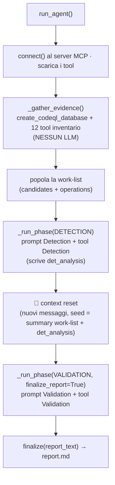

**Esposizione tool per fase — la mappa viene dal SERVER, non è hardcoded nell'agente.**
`server/tools/meta.py` dichiara **solo** i tool delle due fasi LLM:

```python
# lato SERVER (server/tools/meta.py): la verità sta qui
_DETECTION_TOOLS = ["list_python_files", "read_file_snippet"]
_VALIDATION_TOOLS = ["run_taint_query", "run_api_misuse_query",
                      "run_insecure_config_flag_query", "run_custom_query",
                      "cwe_knowledge", "list_cwes"]   # + tutti i check_* (auto)
```

`create_codeql_database` e i 12 tool di inventario (§9) **non compaiono in nessuna
delle due liste**: l'orchestrator li chiama direttamente in Gathering, prima che il
modello entri in scena. `list_phase_tools()` è **solo consultivo**: l'enforcement
vero (che `read_file_snippet` non giri più una volta iniziata la Validation) è un
controllo lato server indipendente (§10, §16), non solo l'assenza dalla lista.

**Il corpo di `_run_phase`** (invariato tra Detection e Validation): per ogni step
chiede al modello, recupera le tool-call (anche se emesse come testo), **corregge
gli argomenti** (`db_path` inventato, `read_file_snippet` con `file_path` invece di
`repo_path`+`file`), evita le ripetizioni (cache anti-loop + *nudge*), rileva testo
degenerato, esegue sul server, **registra le statistiche** (`RunStats`) e **cattura**
i risultati strutturati nella work-list, poi salva il checkpoint. La fase **termina**
quando il modello smette di chiamare tool e scrive testo: in Detection quel testo è
`det_analysis` (l'analisi che guida la Validation), in **Validation è il report**. Se
la fase-report esaurisce i passi senza concludere, `_run_phase` forza una scrittura
finale del report (una `chat` senza tool).

**Nota per i provider locali (Ollama).** In Detection, con `provider == "ollama"`,
l'orchestrator non dà tutto l'inventario in un colpo solo: itera **un item alla
volta** (ogni flow o operazione), invocando `_run_phase` con un tetto di step ridotto
per item. È la stessa logica di compressione del §3.1 applicata al *numero di turni*,
non solo al volume di testo: un modello piccolo regge meglio "guarda questa singola
cosa e dimmi se conta" ripetuto N volte, che "guarda questa lista di 60 cose e
ragionaci tutta insieme". I provider hosted (gemini/openai), più capienti, ricevono
invece l'intero `detection_summary()` in un'unica chiamata.

---

<a id="9-fase-0--gathering"></a>
## 9. FASE 0 — Gathering in dettaglio (i 12 tool di inventario)

**Obiettivo**: raccogliere **tutta** l'evidenza grezza, in forma compressa e **senza
CWE**, senza coinvolgere alcun modello. È puro I/O deterministico verso il server:
stesso repo → stessi tool → stesso risultato.

**Chi lo esegue**: `_gather_evidence` in `agent/orchestrator.py`, chiamando
`session.call_tool(...)` direttamente (nessun `llm.chat`).

**Procedura:**
1. `create_codeql_database(repo_path)` → costruisce il DB.
2. `find_all_flows(db_path, repo_path)` **una volta** → l'inventario dei flussi.
3. Gli **11 tool categorizzati** ([server/tools/queries.py](../server/tools/queries.py)),
   ognuno **una volta** con `{db_path, repo_path}`:

| Tool | Kind emesso | Template / fonte |
|---|---|---|
| `find_command_execution` | `command-exec` | `command_exec.ql.tmpl` (Concept `SystemCommandExecution`) |
| `find_code_execution` | `code-exec` | `code_exec.ql.tmpl` (Concept `CodeExecution`) |
| `find_sql_execution` | `sql-exec` | `sql_exec.ql.tmpl` (Concept `SqlExecution`) |
| `find_filesystem_access` | `filesystem` | `filesystem_access.ql.tmpl` (Concept `FileSystemAccess`) |
| `find_decoding_operations` | `decoding` | `decoding_ops.ql.tmpl` (Concept `Decoding`) |
| `find_crypto_operations` | `crypto` | `crypto_ops.ql.tmpl` (Concept `Cryptography::CryptographicOperation`) |
| `find_weak_randomness` | `weak-random` | `weak_randomness.ql.tmpl` (**per nome** — nessun Concept CodeQL per la randomness) |
| `find_insecure_config_flags` | `config-flag` | `insecure_config_flags.ql.tmpl` (**strutturale**: kwarg con valore letterale) |
| `find_exception_handling_issues` | except troppo ampio/vuoto | query CodeQL **ufficiali** (`EmptyExcept.ql`, `CatchingBaseException.ql`, `UnusedExceptionObject.ql`) |
| `find_broken_sanitizer_patterns` | regex-sanitizer rotta | query ufficiali in `Expressions/Regex/` |
| `find_resource_handling_issues` | risorse non chiuse / manca `with` | query ufficiali (`FileNotAlwaysClosed.ql`, `ShouldUseWithStatement.ql`) |

Ogni risultato passa dal callback `_capture_detection(worklist)`: quello di
`find_all_flows` va in `worklist.add_candidates`, tutti gli altri in
`worklist.add_operations` (entrambi deduplicano, §13).

> **Sostituisce il vecchio `find_sensitive_operations`.** Prima esisteva un solo
> tool monolitico che raggruppava tutte le classi non-flow in un'unica query. È stato
> **rimosso** e sostituito dagli 8 tool categorizzati sopra (uno per `kind`, ognuno col
> proprio template), più i 3 tool "non-CWE" da query ufficiali. Stesso principio del
> vecchio `sensitive_ops.ql.tmpl` (Concepts dove possibile, per-nome solo dove CodeQL
> non modella il concetto, struttura per i config-flag), ma con **granularità e
> template separati per famiglia** — più facile da estendere e da capire quale query
> ha prodotto cosa.

### 9.1 Le due "domande" (in parole semplici)

**Cos'è CodeQL.** Tratta il codice come un **database interrogabile**: prima lo
"scheda" (funzioni, chiamate, variabili, collegamenti — il *database CodeQL*, creato
da `create_codeql_database`), poi gli si fanno **domande** scritte in un linguaggio
apposito (una **query** `.ql`).

1. **"Dove arriva l'input non fidato?"** — `find_all_flows`. Domanda di
   *tracciamento* (**taint tracking**): segui un dato dall'inizio alla fine.
   - **source = `ThreatModelSource`**: il modello CodeQL più ampio di "input non
     fidato" — remote (HTTP) **+ local + environment + command-line + file +
     database**.
   - **sink = qualsiasi argomento di qualsiasi chiamata**: non ci interessa *quale*
     funzione, vogliamo **tutti** i posti in cui quell'input finisce.
   - Bastano gli **estremi** (da dove parte → dove arriva), non ogni curva della
     strada.
2. **"Quali operazioni pericolose ci sono, anche se nessun input le raggiunge?"** —
   gli 11 tool categorizzati. Qui **non** si segue un percorso: si cerca la
   *presenza* di certe operazioni, in tre "qualità" diverse:
   - **Concepts (il modo forte)**: la libreria di CodeQL sa già riconoscere "questa
     chiamata esegue un comando di sistema", "fa una query SQL", "è un'operazione
     crittografica"… **risolvendo import e alias** (es. capisce che `hashlib.md5(...)`
     è crypto anche se importata con un altro nome). Un `grep` non ci riuscirebbe.
     Usato da 6 degli 8 tool sopra.
   - **per nome (il modo debole — di fatto una regex)**: `find_weak_randomness`. Lo
     usiamo **solo** per ciò che CodeQL **non** modella come Concept (la randomness
     insicura): è una *rete di sicurezza*, non il metodo principale.
   - **struttura**: `find_insecure_config_flags` guarda la *forma* della chiamata (un
     keyword-argument con un valore letterale, es. `verify=False`), senza essere né
     Concept né nome.

**Il trucco dei `{{...}}` (i template).** I file si chiamano `.ql.tmpl` perché sono
query **con dei buchi** (`{{WEAK_CALL_NAMES}}`, i tag del CWE, …). Prima di eseguire,
il server **riempie i buchi** con i valori giusti e ottiene una query `.ql` vera.

**Come si esegue e cosa torna.** Il server lancia CodeQL sul database con quella
query; CodeQL produce un file **SARIF** (JSON verboso). Il server lo **traduce** in
risultati puliti (`parse_sarif`), poi i tool `find_*` **comprimono** (§3.1) e mandano
alla work-list solo l'essenziale, arricchito col codice reale letto da disco.

**La differenza chiave, in una riga:**
- `find_all_flows` risponde a *"un dato **si muove** da qui a lì?"*;
- gli 11 tool categorizzati rispondono a *"questa cosa pericolosa **esiste** nel
  codice?"* (basta la presenza, nessun movimento).

Ed entrambi, di proposito, **non dicono il CWE**: quello arriva dopo, in Validation.

---

<a id="10-fase-1--detection"></a>
## 10. FASE 1 — Detection in dettaglio (giudizio, non scoperta)

**Obiettivo**: dare al modello **il codice reale** attorno a ogni segnale già
raccolto in Gathering, e fargli **giudicare la rilevanza** — non scoprire nulla di
nuovo (l'inventario è già completo), non assegnare CWE.

**Prompt**: selezionato da `prompt_router.prompt_set(provider)` (§7) — `ollama` usa
`prompts_local.LOCAL_PROMPT_SET` (procedurale, con esempi letterali di tool-call, per
i modelli locali più deboli sul function calling); gli altri provider usano
`prompts.DETECTION_PROMPT` (stile "API", più conciso).

**Tool**: solo `list_python_files`, `read_file_snippet` — dichiarati in
`server/tools/meta.py._DETECTION_TOOLS`. Il modello **non può** lanciare query
mirate né rigenerare gli inventari: può solo osservare il codice.

**Procedura guidata dal prompt:**
1. `list_python_files` → vedere tutti i file.
2. `read_file_snippet` sui punti indicati dalla work-list (source/sink dei flow,
   file:line delle operazioni) → capire il contesto reale.
3. Scrivere `det_analysis`: una **breve analisi** che elenca cosa la Validation deve
   verificare e perché sembra rilevante. **Vietato** affermare un CWE.

**Con Ollama**, come detto in §8, questo si ripete **una volta per ogni item**
dell'inventario (con `max_steps` ridotto), invece che in un unico turno con tutta la
work-list davanti.

---

<a id="11-fase-2--validation"></a>
## 11. FASE 2 — Validation in dettaglio (verifica, CWE, report)

**Obiettivo**: **verificare** i due inventari con query mirate (risultati
*attendibili*), **associare il CWE** in modo deterministico, e **scrivere il report**.

**Prompt**: `VALIDATION_PROMPT` (via `prompt_router`, stessa logica del §10). Il
*seed* del contesto contiene il **riassunto compatto** dei due inventari (da
`worklist.detection_summary(include_code=False)`, **senza** codice sorgente grezzo) +
`det_analysis` (l'analisi scritta da Detection) + il `db_path`.

**Tool**: `run_taint_query`, `run_api_misuse_query`, `run_insecure_config_flag_query`,
`run_custom_query`, `cwe_knowledge`, `list_cwes`, più **tutti** i `check_*` (aggiunti
in automatico dal server, §9-§10 di
[Server_MCP_Architettura.md](Server_MCP_Architettura.md)). **`read_file_snippet` non
è disponibile**: è bloccato lato server (`get_current_phase() == VALIDATION` →
errore esplicito), a prescindere da cosa dichiari `list_phase_tools()` — un vero
controllo, non solo una lista.

**Procedura guidata dal prompt:**
1. Per ogni **flusso** sospetto: `cwe_knowledge(cwe)` per intuizione e nomi
   candidati → **verifica** con `run_taint_query(cwe, sink_names=…,
   source_names/sanitizer_names)`.
2. Per ogni **operazione sensibile**: verifica con `run_api_misuse_query`
   (crypto/hash/random) o `run_insecure_config_flag_query` (config-flag) o un `check_*`
   preconfezionato.
3. Se una query trova la prova → è un finding validato; se non trova nulla → si passa
   oltre (niente accanimento).
4. **Scrivere il testo libero del report** (analisi per finding, perché conta,
   rimedio). Smettere di chiamare tool.

### Come nasce un finding validato (catena deterministica)
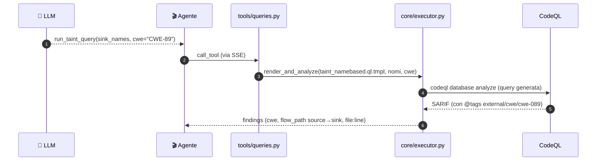

> **Regola d'oro (grounding):** il `cwe` di un finding **viene dai tag della query**
> CodeQL (che il tool *timbra* passando `cwe=`), non da un'opinione del modello. Il
> `VALIDATION_PROMPT` lo impone esplicitamente: se un flusso esiste ma non ha CWE, si
> riporta come *"taint flow (unclassified)"*, senza inventare un numero.

---

<a id="12-le-query-famiglia-per-famiglia"></a>
## 12. Le query, famiglia per famiglia e per fase

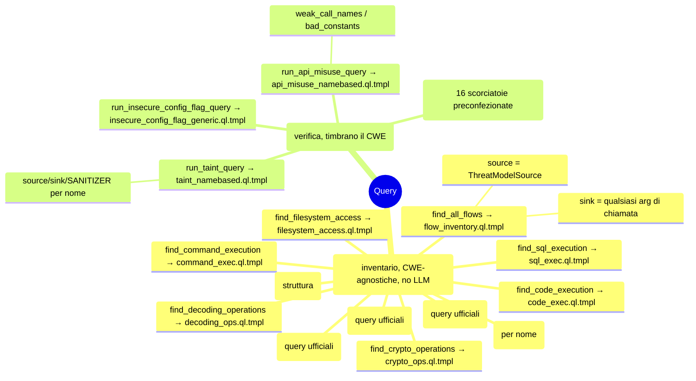

| Famiglia | Tool → Template | Tipo | Fase | Timbra CWE? |
|---|---|---|---|---|
| Inventario flussi | `find_all_flows` → `flow_inventory.ql.tmpl` | taint (path-problem) | **Gathering** | ❌ |
| Inventario operazioni (×8) | `find_command_execution` … `find_insecure_config_flags` → template dedicato | point (problem) | **Gathering** | ❌ |
| Inventario "non-CWE" (×3) | `find_exception_handling_issues`, `find_broken_sanitizer_patterns`, `find_resource_handling_issues` → query ufficiali | point | **Gathering** | ❌ |
| Taint parametrico | `run_taint_query` → `taint_namebased.ql.tmpl` | taint (source/sink/**sanitizer**) | **Validation** | ✅ |
| API-misuse | `run_api_misuse_query` → `api_misuse_namebased.ql.tmpl` | point | **Validation** | ✅ |
| Config-flag | `run_insecure_config_flag_query` → `insecure_config_flag_generic.ql.tmpl` | point | **Validation** | ✅ |
| Custom/preset | `run_custom_query`, `check_*` | vari | **Validation** | ✅ |

**La query-cardine della Validation** è il **taint parametrico**
([taint_namebased.ql.tmpl](../server/query_templates/taint_namebased.ql.tmpl)): ha tre
slot riempiti dai nomi che il modello fornisce — `{{SOURCE_NAMES}}`, `{{SINK_NAMES}}`,
`{{SANITIZER_NAMES}}` — più i segnaposto `{{CWE_ID_SUFFIX}}`/`{{CWE_TAG_LINE}}` che
*stampano* la classe nei metadati. `run_taint_query` accetta anche `sink_concept`, per
riusare direttamente uno dei Concept semantici già visti in Gathering
(`SqlExecution`, `SystemCommandExecution`, `FileSystemAccess`, `Decoding`) invece di
un elenco di nomi — più preciso quando la classe coincide con una di quelle.

> **Dettaglio esecuzione (comune a tutte).** Il server riempie il template, salva la
> query con un nome basato sull'hash dentro `generated_queries/` (un vero *pack*
> CodeQL), esegue `codeql database analyze --format=sarifv2.1.0`, e traduce il SARIF
> con `parse_sarif` in finding puliti. Vedi il gemello
> [Server_MCP_Architettura.md](Server_MCP_Architettura.md).

---

<a id="13-lhandoff"></a>
## 13. L'handoff tra fasi: la work-list

Attraverso le tre fasi viaggia **solo** la work-list
([agent/worklist.py](../agent/worklist.py)), un manifest leggero con due liste più un
testo:

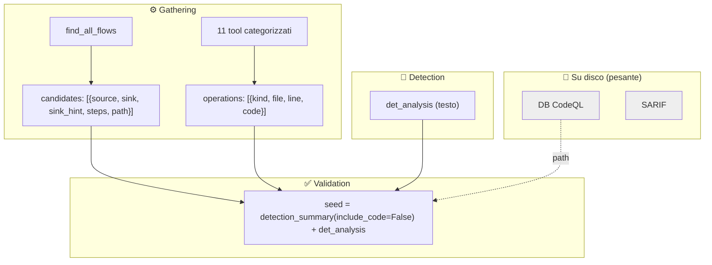

- **`WorkList`**: `repo_path`, `db_path`, `candidates` (flow, deduplicati per
  `(source.file, source.line, sink.file, sink.line)`), `operations` (ops sensibili,
  deduplicate per `(kind, file, line)`).
- L'orchestrator cattura i risultati dei 12 tool di Gathering con un callback
  (`_capture_detection`): `find_all_flows` → `add_candidates`, tutti gli altri →
  `add_operations`.
- `detection_summary(limit=60, ops_limit=60, path_limit=8, include_code=True)`
  produce il testo compatto iniettato nel prompt. Ha **due usi diversi**:
  1. seed di Detection con `include_code=True` — il codice reale è mostrato;
  2. seed di Validation con `include_code=False` — **niente codice sorgente grezzo
     (contenuto non fidato del repo) passa a Validation**, solo posizioni/metadati +
     `det_analysis` (il testo già filtrato scritto da Detection).
- **Claim Check + context reset**: SARIF e DB restano su disco; ogni fase LLM parte
  con un contesto pulito, così il carico per fase resta controllato. La work-list
  viaggia anche dentro il **checkpoint** (per `--resume`).

---

<a id="14-il-report-prodotto"></a>
## 14. Il report prodotto

Il report **non è scritto a mano dal modello dall'inizio alla fine**: la parte
strutturata (tabella dei finding: regola, CWE, file, riga, gravità) è costruita
**meccanicamente** da `RunStats` ([agent/report.py](../agent/report.py)) a partire
dai risultati reali dei tool, con **dedup per posizione fisica** — se lo stesso punto
del codice viene trovato prima senza CWE (query generica) e poi con CWE (`check_*`
dedicato), resta solo la versione classificata. Il modello contribuisce il
**commento libero**: perché conta, il rimedio, il verdetto complessivo — testo che
viene **sanificato** (`_sanitize_commentary`: spezza i link Markdown, rimuove tag
HTML) prima di finire nel file, come difesa da un'eventuale prompt injection indiretta
nascosta nel codice analizzato.

L'agente antepone un'**intestazione YAML** auto-descrittiva prodotta da
`RunStats.header()`:

```yaml
---
model: ...
repository: ...
duration_seconds: ...
steps_used: ...
tools_used: create_codeql_database:1, find_all_flows:1, run_taint_query:3, ...
cwes_found: CWE-89, CWE-327
total_findings: 4
generated_by: codeql-security-agent
---
```

Struttura del corpo: **tabella riassuntiva deterministica** (CWE, count, gravità,
file:riga) + **verdetto** (`RunStats.verdict()`) + il commento del modello, per
finding o generale secondo il `VALIDATION_PROMPT`.

`RunStats` accumula durante il run i contatori (tool usati, CWE emersi, numero di
finding, ultimo `db_path`) leggendo il JSON di ogni risultato di tool; `finalize`
scrive `header() + report_body(model_commentary)` su disco e cancella il checkpoint.

---

<a id="15-la-knowledge"></a>
## 15. La knowledge dei CWE (wiki oggi, knowledge graph domani)

In Validation il modello associa il CWE consultando `cwe_knowledge(cwe)`. Lato server,
l'accesso alla conoscenza passa da **un unico punto**, `lookup_cwe()`
([server/knowledge/store.py](../server/knowledge/store.py)), oggi implementato sulla
**wiki JSON** (`cwe_wiki.json`: nome, intuizione taint, nomi candidati di
sink/source/sanitizer, API deboli, rimedio, blocco `actions` mantenuto da
[build_actions.py](../build_actions.py)). Anche i tool di Gathering (es.
`find_weak_randomness`) pescano i nomi "deboli" da lì, sempre via `lookup_cwe`.

> **Perché una funzione unica?** È la **cucitura** per il futuro: domani un backend a
> **knowledge graph** può sostituire la wiki dietro la stessa firma, senza toccare i
> tool che la usano.

---

<a id="16-i-trucchi-di-robustezza"></a>
## 16. I trucchi di robustezza

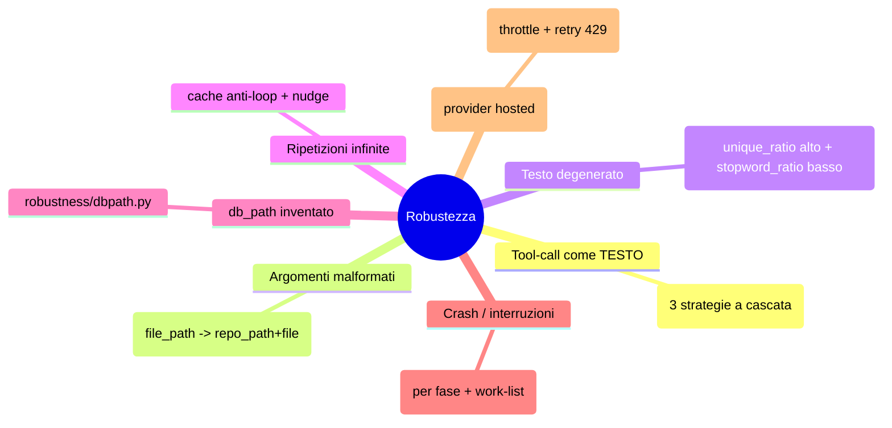

- **Tool-call emesse come testo** ([robustness/toolcalls.py](../agent/robustness/toolcalls.py)):
  tre strategie in cascata — blocchi ```` ```json ```` / oggetti bilanciati di primo
  livello; tolleranza a virgole finali e wrapper batch (`{"tool_calls": [...]}`,
  `{"calls": [...]}`); come ultima spiaggia, uno scanner che recupera coppie
  `name`/`arguments` anche se il contenitore è malformato (graffa mancante, fence
  troncata).
- **Argomenti malformati di `read_file_snippet`**
  ([robustness/readargs.py](../agent/robustness/readargs.py)): se il modello passa un
  unico `file_path` invece di `repo_path` + `file` separati, viene ricostruito
  ripulendo slash iniziali, `./` e un eventuale prefisso duplicato col nome della
  cartella del repo.
- **Testo degenerato** ([robustness/degenerate.py](../agent/robustness/degenerate.py)):
  un problema osservato con modelli locali piccoli/quantizzati sotto un
  `repeat_penalty` troppo aggressivo — invece di ripetersi (cosa che il filtro
  dovrebbe impedire), il modello evita **qualsiasi** token recente, comprese le
  stopword, e produce frammenti senza struttura di frase. Euristica a due soglie
  (`unique_ratio > 0.90` **e** `stopword_ratio < 0.08` su un minimo di 60 parole):
  se scatta, si chiede al modello di riscrivere (fino a 3 tentativi, poi si tratta
  il testo come vuoto). Ha guidato anche il ritocco dei default di generazione
  (§18).
- **Cache anti-loop**: se la stessa chiamata (firma `nome+args`) è già stata fatta, non
  la riesegue e aggiunge un *nudge* ("non ripetere; fai altro o **scrivi**").
- **Fix del `db_path`**: il modello passa spesso un segnaposto; si usa l'ultimo
  `db_path` reale (seminato dalla work-list a inizio Validation).
- **Checkpoint per fase**: dopo ogni step salva `phase`, `completed_phases`, i
  messaggi, la cache e la **work-list**; con `--resume` riparte dalla fase giusta.

---

<a id="17-lavanzamento-grafico"></a>
## 17. L'avanzamento grafico (eventi + webview VSCode)

Oltre ai log testuali su stderr, l'agente può emettere **eventi strutturati** per una
**vista grafica** ([agent/progress.py](../agent/progress.py)). Ogni evento è una riga
JSON preceduta dal marcatore `@@SIBYL@@`, emessa **solo** se
`SIBYL_PROGRESS_EVENTS=1` (così la CLI resta pulita; l'estensione VSCode imposta la
variabile da sola).

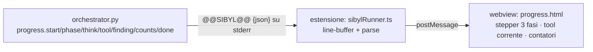

Gli eventi: `start` (repo/model/provider), `phase` (start/done, per tutte e tre le
fasi), `think` (il modello ragiona), `tool` (running/ok/error/cached/nodb con
durata), `finding` (un finding appena confermato — CWE, rule_id, file:riga, percorso
del dato — per disegnarlo **live**, senza aspettare il report finale), `counts` (flow
candidati / finding / CWE), `done`. La webview
([extension/views/progress.html](../extension/views/progress.html)) disegna lo
**stepper a tre fasi**, l'attività in corso con spinner, il log recente e i contatori
live. Il lato estensione è in
[extension/src/progressView.ts](../extension/src/progressView.ts) e
[extension/src/sibylRunner.ts](../extension/src/sibylRunner.ts).

---

<a id="18-configurazione-e-avvio"></a>
## 18. Configurazione e avvio

L'agente legge la config dal `.env` di progetto (condiviso col server). Avvio: **due
processi** (server in ascolto + agente).

```bash
# Terminale A — server MCP
MCP_TRANSPORT=sse python -m server

# Terminale B — agente (provider da .env o da --provider)
python -m agent <repo>
#   locale:   python -m agent <repo> --provider ollama --model qwen2.5-coder:14b
#   gemini:   python -m agent <repo> --provider gemini --model gemini-2.5-flash
#   openai:   python -m agent <repo> --provider openai --model llama-3.3-70b
```

Opzioni CLI ([agent/cli.py](../agent/cli.py)): `--provider`, `--model`, `--report`,
`--max-steps` (turni **per fase**), `--resume`.

Variabili principali ([agent/config.py](../agent/config.py); elenco completo con
default nel [README](../README.md)): `AGENT_LLM_PROVIDER`, `AGENT_MODEL`/
`OLLAMA_HOST`, `GEMINI_API_KEY`/`GEMINI_MODEL`, `OPENAI_API_KEY`/`OPENAI_BASE_URL`/
`OPENAI_MODEL`, `MCP_SERVER_URL`. Specifiche del tuning **anti-degenerazione** per
modelli locali (§16 — nate proprio dall'osservare il fallimento su modelli piccoli):
`OLLAMA_REPEAT_PENALTY` (default `1.1`), `OLLAMA_REPEAT_LAST_N` (`128`),
`OLLAMA_NUM_PREDICT` (`1536`, tetto più corto — `OLLAMA_NUM_PREDICT_TOOLS=512` —
quando sono esposti tool), `OLLAMA_TEMPERATURE` (`0.2`), `OLLAMA_TOP_P` (`0.85`),
`OLLAMA_TOP_K` (`40`). Durante il run l'agente stampa l'avanzamento live su stderr.

---

<a id="19-test"></a>
## 19. Test

I test dell'agente ([agent/tests/test_agent.py](../agent/tests/test_agent.py)) coprono i
**moduli puri**, senza LLM né server:

```bash
python -m pytest agent/tests/test_agent.py -q     # solo agente (veloce)
python -m pytest -m "not codeql and not llm" -q   # agente + server (veloci)
```

Coprono, tra l'altro: il filtraggio dei tool per fase (`filter_tools`), la work-list
(candidates + operations, dedup, riassunto con e senza codice, round-trip), il
recupero di tool-call testuali (le tre strategie), il rilevamento di testo
degenerato, il fix degli argomenti di `read_file_snippet`, il fix del `db_path`, il
checkpoint, la costruzione deterministica della tabella dei finding (dedup per
posizione), e la traduzione dei messaggi per i provider OpenAI-compatibili. Le query
di Gathering (`flow_inventory.ql.tmpl` e gli 8 template categorizzati) hanno test
**`codeql`** lato server (compilazione + un caso reale per famiglia).

> **In una frase:** l'agente è un client SSE pulito e modulare che fa **Gathering**
> (raccoglie da solo tutta l'evidenza, senza LLM), **Detection** (il modello legge il
> codice e giudica cosa conta) e **Validation** (il modello verifica con query
> mirate, associa il CWE deterministico e scrive il commento del report) — un harness
> pensato per far rendere anche un LLM piccolo.
