# Sibyl — Il Componente **Agente**

> Guida approfondita all'architettura e al flusso dell'agente. Pensata per essere
> letta in Obsidian (diagrammi **Mermaid**) e da chi **non è pratico di Python**:
> ogni concetto tecnico è spiegato a parole. Documento gemello di
> [Server_MCP_Architettura.md](Server_MCP_Architettura.md): là il **server** che
> *espone* CodeQL come tool, qui l'**agente** che li *consuma* guidando un LLM.

---

## Indice
1. [A cosa serve l'agente](#1-a-cosa-serve-lagente)
2. [La pipeline Sibyl: Detect → Validate](#2-la-pipeline-sibyl-detect--validate)
3. [Dove gira l'agente (3 processi) e il provider LLM](#3-dove-gira-lagente)
4. [Il problema: function calling con un LLM](#4-il-problema-function-calling)
5. [Vocabolario minimo](#5-vocabolario-minimo)
6. [Architettura a componenti](#6-architettura-a-componenti)
7. [Mappa dei file](#7-mappa-dei-file)
8. [I componenti, uno per uno](#8-i-componenti-uno-per-uno)
9. [Il loop dell'agente](#9-il-loop-dellagente)
10. [I trucchi di robustezza](#10-i-trucchi-di-robustezza)
11. [Il flusso end-to-end con i prompt](#11-il-flusso-end-to-end-con-i-prompt)
12. [La fase di Detection in dettaglio: come nasce un finding](#12-la-fase-di-detection-in-dettaglio)
13. [Le query: famiglie e fase d'uso (Detection vs Validation)](#13-le-query-famiglie-e-fase-duso)
14. [L'handoff Detect → Validate: gli artefatti](#14-lhandoff-detect--validate)
15. [Il report prodotto oggi](#15-il-report-prodotto-oggi)
16. [Capitolo futuro: l'agente di Validation separato](#16-capitolo-futuro-lagente-di-validation-separato)
17. [Configurazione e avvio](#17-configurazione-e-avvio)
18. [Test](#18-test)
19. [Storia del refactoring](#19-storia-del-refactoring)

---

## 1. A cosa serve l'agente

L'**agente** è il **regista** dell'analisi. Da solo non sa fare nulla di sicurezza:
mette in comunicazione due pezzi che invece sanno fare tanto —

- un **LLM** (un modello di intelligenza artificiale) che *ragiona* su quali
  vulnerabilità cercare;
- il **Server MCP**, che *esegue* le analisi vere con CodeQL.

L'agente espone i tool del server al modello, gli chiede *"cosa vuoi fare?"*, e
quando il modello dice *"chiama questo tool con questi parametri"*, l'agente lo
esegue sul server e gli riporta il risultato. Si va avanti a turni finché il modello
ha raccolto i **findings** (vulnerabilità candidate) e produce il **report**.

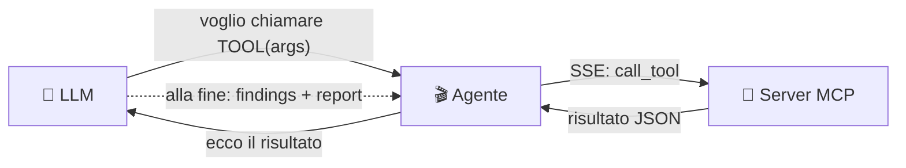

> **In una frase:** l'agente è il *tramite* che fa "parlare" l'LLM con CodeQL. Il
> modello decide **cosa**, l'agente fa **eseguire** al server, e raccoglie la prova.

---

## 2. La pipeline Sibyl: Detect → Validate

Sibyl organizza l'analisi in una **pipeline a due fasi sequenziali**, ciascuna
eseguita da un **agente autonomo** che opera su un **artefatto** prodotto dalla fase
precedente.

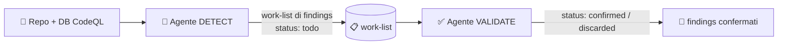

- **Detect** — *individua ipotesi di vulnerabilità.* L'agente riceve il repository e
  il database CodeQL, usa i tool MCP per eseguire query (sia ufficiali della libreria
  CodeQL, sia generate al volo dai nomi osservati nel codice). L'output è una **lista
  di findings con stato `todo`**: percorsi di taint **candidati**, non ancora confermati.
- **Validate** — *elimina i falsi positivi.* L'agente riceve i findings e **ri-esegue**
  l'analisi di taint con ipotesi più precise su source/sink/**sanitizer** inferite dal
  contesto del codice. CodeQL qui non è un giudice, ma un **oracolo** che risponde a
  domande specifiche: *questo percorso esiste? viene bloccato da questo sanitizer?* I
  findings vengono promossi a **`confirmed`** o scartati con motivazione (**`discarded`**).

Il passaggio tra le fasi segue due principi (vedi anche §14):
- **work-list con campo `status`**: l'unità di lavoro è il finding; ogni agente
  consuma la lista prodotta prima e **aggiorna lo stato** dei findings.
- **Claim Check pattern**: tra gli agenti transitano **manifest leggeri** (path +
  riassunto); gli artefatti pesanti (SARIF, database) **restano su disco**. Il
  **contesto dell'LLM si azzera a ogni handoff**, così il carico per agente resta
  controllato.

> ⚠️ **Stato attuale del codice.** Oggi esiste **un solo agente** (il pacchetto
> `agent/`): fa la fase **Detect** e ne scrive un **report Markdown**. L'agente
> **Validate è il prossimo passo** e **non è ancora implementato**: il §16 spiega
> come si aggancerà riusando lo stesso server MCP. Tutto il resto di questo
> documento descrive l'agente Detect reale.

---

## 3. Dove gira l'agente

Tre processi che collaborano. Nel deploy tipico stanno tutti sulla stessa macchina e
dialogano su `localhost`; nessuna porta è esposta all'esterno.

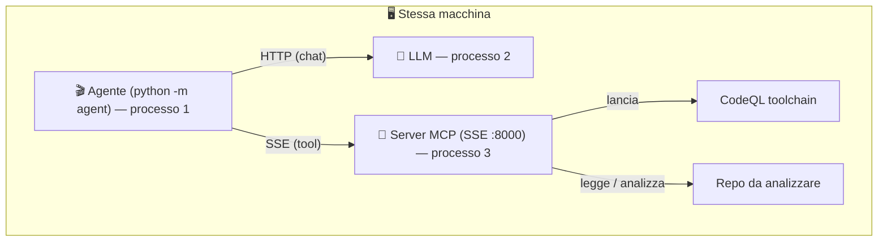

Punto chiave: **a chiamare il server è l'AGENTE, non l'LLM.** L'agente è un
**client** che si connette a un server MCP **già in esecuzione** via SSE.

### Il provider LLM è configurabile
L'LLM dietro l'agente è **intercambiabile** (vedi [agent/clients/factory.py](../agent/clients/factory.py)):

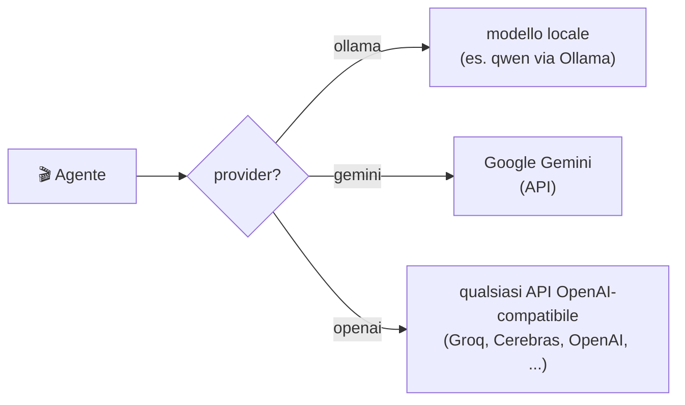

- `ollama` → modello locale (nessun limite di rete, ma serve potenza/GPU).
- `gemini` / `openai` → modello hosted (veloce, ma soggetto a quota/rate limit del
  provider). `openai` è un adattatore **generico** verso qualunque endpoint
  OpenAI-compatibile (basta cambiare `OPENAI_BASE_URL`).

---

## 4. Il problema: function calling

Il modello AI non esegue codice: produce solo **testo**. Il meccanismo che gli
permette di "usare strumenti" si chiama **function calling**:

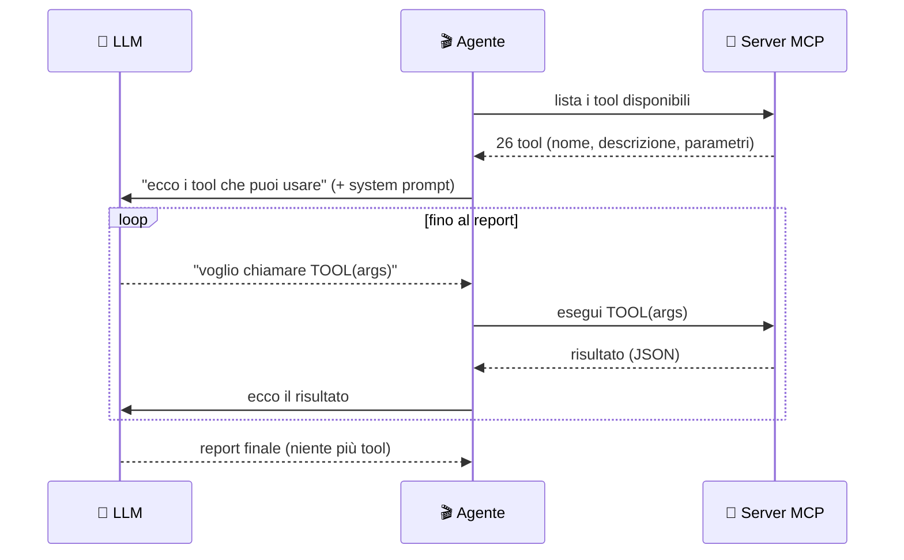

**La difficoltà:** Sibyl punta a funzionare anche con **LLM piccoli/locali**, meno
affidabili. Sbagliano in modi prevedibili: a volte stampano la chiamata come *testo*
invece di usare il canale strutturato, ripetono la stessa chiamata, passano un
*segnaposto* al posto del percorso del database. Gran parte dell'agente esiste per
**assorbire questi errori** (vedi §10).

---

## 5. Vocabolario minimo

| Termine | Spiegazione |
|---|---|
| **LLM / provider** | Il modello AI che ragiona (ollama/gemini/openai). |
| **Function calling / tool call** | Il modo con cui il modello "chiede" di usare un tool: nome + argomenti. |
| **MCP / SSE** | Lo standard (MCP) e il canale di rete (SSE) con cui agente e server si parlano. |
| **Finding** | Una vulnerabilità candidata, con CWE, gravità e il percorso del dato. |
| **source / sink / sanitizer** | Nel taint: da dove entra l'input (*source*), il punto pericoloso (*sink*), ciò che "bonifica" il dato (*sanitizer/barrier*). |
| **flow_path** | La sequenza di passi che prova che un dato va da source a sink (la *prova*). |
| **work-list / status** | La lista dei findings; ogni finding ha uno stato (`todo` → `confirmed`/`discarded`). |
| **Claim Check** | Pattern di handoff: si passano manifest leggeri (path), i dati pesanti restano su disco. |
| **CWE** | Codice standard di una classe di debolezza (es. `CWE-89` = SQL injection). |

---

## 6. Architettura a componenti

Come il server, l'agente è diviso in **strati separati**; **le dipendenze vanno solo
verso il basso**. Il "motore" (orchestrator) sta in alto e usa i moduli sotto; i
moduli puri (report, robustness, source) si testano da soli, **senza** LLM né server.

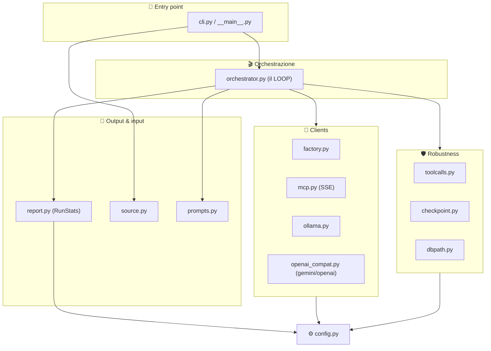

Direzione delle dipendenze: `cli ← orchestrator ← clients, robustness, report, source, prompts ← config`.

---

## 7. Mappa dei file

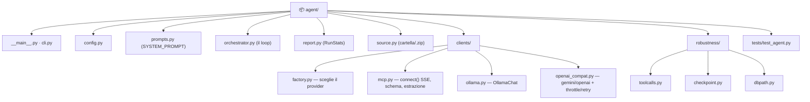

---

## 8. I componenti, uno per uno

### 8.1 🚪 `cli.py` + `__main__.py`
[agent/cli.py](../agent/cli.py) contiene `main()`: legge gli argomenti
(`repo_path`, `--provider`, `--model`, `--report`, `--max-steps`, `--resume`),
sceglie il modello di default in base al provider, risolve l'input (cartella o zip) e
avvia il loop. `__main__.py` permette `python -m agent`.

### 8.2 ⚙️ `config.py`
[agent/config.py](../agent/config.py) tiene **solo** la config dell'agente (niente
CodeQL, che sta nel server): provider e modello, host dell'LLM, `MCP_SERVER_URL`,
le chiavi/URL dei provider hosted, e le cartelle `WORK_DIR`/`REPORTS_DIR`.

### 8.3 📜 `prompts.py`
[agent/prompts.py](../agent/prompts.py) contiene il `SYSTEM_PROMPT`: la **strategia di
Detection** (vedi §12). È il "manuale operativo" del modello, tenuto separato dal codice.

### 8.4 📡 `clients/`
- `factory.py` → `make_llm(provider, model)` costruisce l'adattatore giusto.
- `mcp.py` → `connect(url)` (context manager SSE), `mcp_tools_to_ollama`,
  `tool_result_text`.
- `ollama.py` → `OllamaChat.chat()` per il modello locale.
- `openai_compat.py` → `OpenAICompatChat` per **gemini** e **openai** (Groq/Cerebras/…),
  con **throttle** anti rate-limit e **retry** sul 429.

### 8.5 🛡️ `robustness/`
I trucchi per LLM deboli: `toolcalls.py` (recupero tool-call testuali),
`checkpoint.py` (salva/riprende lo stato), `dbpath.py` (fix del `db_path`). Vedi §10.

### 8.6 📝 `report.py`
[agent/report.py](../agent/report.py): `default_report_path`, e la dataclass **`RunStats`**
che accumula durante il run quante volte è usato ogni tool, quali CWE emergono, quanti
findings, e l'ultimo `db_path` — i dati che alimenteranno la work-list (§14).

### 8.7 📥 `source.py`
[agent/source.py](../agent/source.py): `resolve_source(path)` accetta una **cartella** o
un **`.zip`** (estratto sotto `WORK_DIR`).

### 8.8 🎬 `orchestrator.py`
[agent/orchestrator.py](../agent/orchestrator.py): `run_agent(...)` assembla tutto e fa
girare il loop (§9).

---

## 9. Il loop dell'agente

In parole: *connetti → (riprendi o inizia) → ripeti { chiedi al modello → esegui i
tool che chiede → registra e salva } → finalizza*.

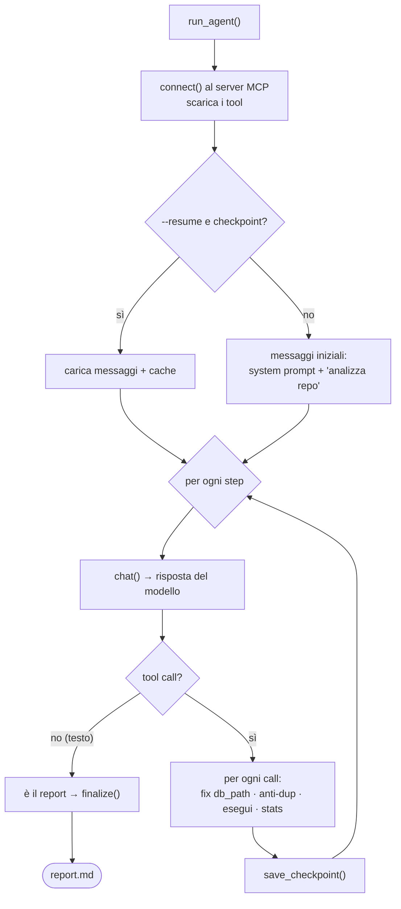

L'innesco del loop sono **due messaggi** ([agent/orchestrator.py:81-84](../agent/orchestrator.py#L81-L84)):

```python
messages = [
    {"role": "system", "content": SYSTEM_PROMPT},
    {"role": "user", "content": f"Analyze the repository at: {repo_path}"},
]
```

Il cuore del ciclo ([agent/orchestrator.py:94-108](../agent/orchestrator.py#L94-L108)):

```python
for step in range(start_step, max_steps):
    msg = await llm.chat(messages, tools=tools)      # il modello ragiona
    messages.append(msg)
    calls = msg.get("tool_calls") or []
    if not calls:                                    # niente tool = è il report
        calls = extract_text_tool_calls(msg.get("content", ""), tool_names)
    if not calls:
        return stats.finalize(msg.get("content", ""), report_path, ckpt)
    # ... altrimenti esegue ogni tool sul server (vedi sotto) ...
```

E l'esecuzione di ogni tool sul server, con cattura del risultato
([agent/orchestrator.py:135-147](../agent/orchestrator.py#L135-L147)):

```python
result = await session.call_tool(name, args)         # esegue sul server MCP
content = mcp.tool_result_text(result)
seen[sig] = content
stats.record_tool_result(name, content)              # aggiorna le statistiche
```

---

## 10. I trucchi di robustezza

Quattro meccanismi che assorbono gli errori tipici di un LLM debole.

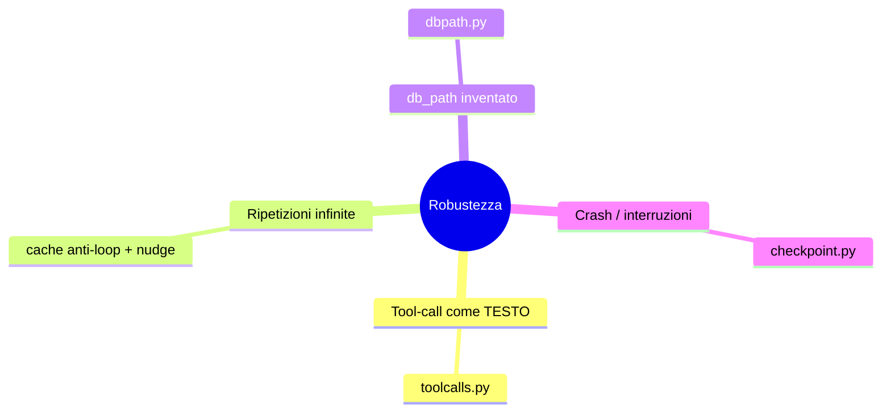

- **Tool-call emesse come testo** ([agent/robustness/toolcalls.py](../agent/robustness/toolcalls.py)):
  recupera la chiamata da un blocco ```` ```json ```` nel testo, solo se il `name` è un
  tool reale (un report non viene scambiato per una chiamata).
- **Cache anti-loop** (nell'orchestrator): se la stessa chiamata (firma `nome+args`) è
  già stata fatta, non la riesegue e aggiunge un *nudge* ("non ripetere, fai altro o
  scrivi il report").
- **Fix del `db_path`** ([agent/robustness/dbpath.py](../agent/robustness/dbpath.py)): il
  modello passa spesso un segnaposto; si usa l'ultimo `db_path` reale visto. Se non
  esiste ancora un DB, l'agente risponde *"crea prima il database"*.
- **Checkpoint** ([agent/robustness/checkpoint.py](../agent/robustness/checkpoint.py)):
  dopo ogni step salva lo stato; con `--resume` riparte da dove era.

Per i provider hosted c'è inoltre, in
[agent/clients/openai_compat.py](../agent/clients/openai_compat.py), un **throttle**
(distanzia le richieste per non superare il rate limit) e un **retry** sul 429 (con
fail-fast se la quota è giornaliera).

---

## 11. Il flusso end-to-end con i prompt

Partiamo da ciò che **digitiamo davvero**: `python -m agent _smoketest_repo`. L'unico
input "nostro" è il percorso del repo; tutto il resto ha un default.

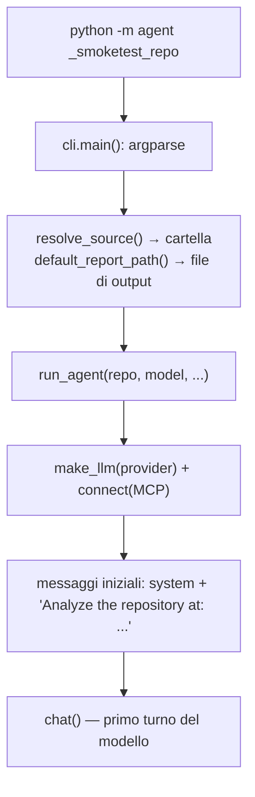

**Il primo input dato all'LLM** è: i due messaggi (`system` = `SYSTEM_PROMPT`, `user`
= *"Analyze the repository at: …"*) **più lo schema dei tool**. Da lì parte il loop.

> ⚠️ Il repo **non** viene caricato nei messaggi: all'LLM passiamo solo il *percorso*.
> Sarà lui a chiedere `list_python_files`/`read_file_snippet`, che il **server**
> esegue leggendo dal proprio disco. L'LLM vede i file solo via i risultati dei tool.

I messaggi hanno **quattro ruoli**: `system` (la strategia), `user` (la richiesta e i
"nudge" di correzione), `assistant` (il modello, con le tool-call), `tool` (il
risultato eseguito dall'agente). Ad ogni `chat()` l'agente rimanda **l'intera lista**
`messages` (per questo viene salvata nel checkpoint).

---

## 12. La fase di Detection in dettaglio

La Detection è guidata dal **`SYSTEM_PROMPT`** ([agent/prompts.py](../agent/prompts.py)),
che impone una procedura **evidence-first**:

1. `list_python_files` → vedere tutti i file.
2. `read_file_snippet` su **ogni** file → individuare le **classi sospette** (input non
   attendibili, operazioni pericolose, configurazioni insicure).
3. `create_codeql_database` → costruire il DB.
4. Per ogni classe sospetta: `cwe_knowledge(cwe)` → poi **interroga CodeQL** col tool
   indicato (`run_taint_query` / `run_api_misuse_query` / un `check_*`).
5. Eventuale `read_file_snippet` per confermare il contesto.
6. Scrivere il report.

I **tool** che il modello pilota (lato server):

| Passo | Tool | File |
|---|---|---|
| Esplora | `list_python_files`, `read_file_snippet` | [server/tools/filesystem.py](../server/tools/filesystem.py) |
| Costruisci/analizza | `create_codeql_database`, `analyze_database` | [server/tools/database.py](../server/tools/database.py) |
| Consulta | `cwe_knowledge`, `list_cwes` | [server/tools/knowledge.py](../server/tools/knowledge.py) |
| Interroga | `run_taint_query`, `run_api_misuse_query` | [server/tools/queries.py](../server/tools/queries.py) |

### Come nasce un finding (la catena deterministica)

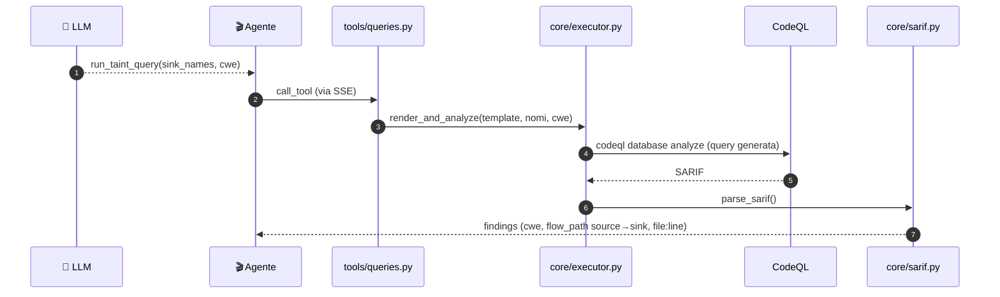

Lo **schema reale del finding** è prodotto da `parse_sarif`
([server/core/sarif.py:79-93](../server/core/sarif.py#L79-L93)):

```python
findings.append({
    "rule_id": rid, "rule_name": ..., "level": ...,
    "security_severity": ..., "tags": tags,
    "cwe": cwe_from_tags(tags),          # CWE deterministico (dai tag della query)
    "message": ..., "file": ..., "line": ...,
    "source": flow_path[0] if flow_path else None,   # {file, line, note}
    "sink":   flow_path[-1] if flow_path else None,  # {file, line, note}
    "flow_path": flow_path,              # la PROVA: source → ... → sink
    "flow_steps": len(flow_path),
})
```

Il tool che ha generato la query vi allega anche il "contesto"
([server/tools/queries.py:88-96](../server/tools/queries.py#L88-L96)): `cwe`, `cwe_name`,
`standard_remediation`, e i `sink_names`/`source_names`/`sanitizer_names` usati.

Lato agente, `RunStats.record_tool_result` ([agent/report.py](../agent/report.py))
**cattura** da ogni risultato il `db_path`, il `finding_count` e i `cwe`: è
l'aggregazione che, domani, alimenterà la **work-list** verso la Validation.

> **Regola d'oro (grounding):** il `cwe` di un finding viene **dai tag della query
> CodeQL**, non da un'opinione del modello. Ogni affermazione del report traccia a un
> output deterministico.

---

## 13. Le query: famiglie e fase d'uso

Domanda centrale: **quali query servono alla Detection e quali (ri)serviranno alla
Validation?** Ecco **tutte** le famiglie esistenti nel codice.

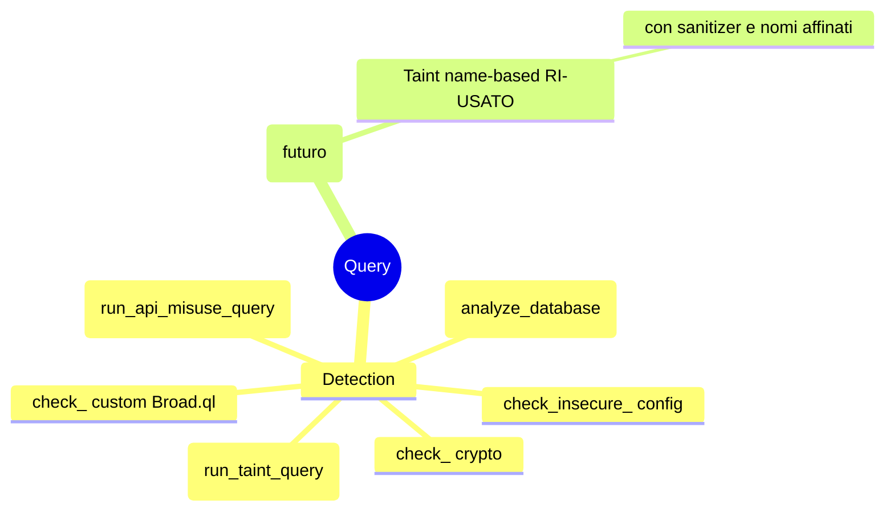

| Famiglia | Tool / file | Tipo | Fase |
|---|---|---|---|
| Suite ufficiale CodeQL | `analyze_database` → `python-security-extended.qls` | broad ufficiale | **Detection** (sweep ampio) |
| **Taint name-based (parametrico)** | `run_taint_query` → `taint_namebased.ql.tmpl` | taint (source/sink/**sanitizer**) | **Detection _e_ Validation** |
| API-misuse name-based | `run_api_misuse_query` → `api_misuse_namebased.ql.tmpl` | point detection | **Detection** |
| Custom `*Broad.ql` incapsulate | `check_sql_injection/...` (`CUSTOM_QUERIES`) | taint ready-made | **Detection** *(NB: i 5 `.ql` non esistono ancora → check_* non operativi)* |
| Crypto preset | `check_weak_hash/broken_crypto/weak_random/weak_password_hash` | point | **Detection** |
| Insecure config flag | `check_insecure_*` (7 template) + `run_insecure_config_flag_query` | point | **Detection** |

### La query-cardine: il taint parametrico
[server/query_templates/taint_namebased.ql.tmpl](../server/query_templates/taint_namebased.ql.tmpl)
ha **tre slot** riempiti dai nomi che l'agente fornisce — *source*, *sink* e
*sanitizer (barrier)*:

```ql
predicate isSource(DataFlow::Node node) {
    node instanceof RemoteFlowSource                 // input utente, sempre
    or exists(... callNameIn(call, [{{SOURCE_NAMES}}]) ...)
}
predicate isBarrier(DataFlow::Node node) {           // <-- il SANITIZER
    exists(... callNameIn(call, [{{SANITIZER_NAMES}}]) ...)
}
predicate isSink(DataFlow::Node node) {
    exists(... callNameIn(call, [{{SINK_NAMES}}]) ...)
}
...
from TaintFlow::PathNode source, TaintFlow::PathNode sink
where TaintFlow::flowPath(source, sink)              // <-- la PROVA source->sink
select sink.getNode(), source, sink, "...", source.getNode(), "this source"
```

### Detection vs Validation: stessa query, domanda più affilata
- In **Detection** girano **tutte** le famiglie per produrre findings **candidati**
  (`status: todo`): la suite ufficiale (ampia) + `run_taint_query` con ipotesi di
  **sink** ampie + i point-detection (api-misuse, crypto, insecure-config).
- La **Validation** (futuro) **ri-usa la STESSA** `taint_namebased.ql.tmpl`, ma:
  - **affina** `isSource`/`isSink` (nomi più precisi dal contesto del codice), e
  - soprattutto **valorizza lo slot sanitizer** `{{SANITIZER_NAMES}}` (il predicato
    `isBarrier`): *"il flusso candidato sopravvive se aggiungo questo sanitizer?"*
    → se **sparisce** ⇒ probabile **falso positivo** (il dato è bonificato) → finding
    `discarded` con motivazione; se **resta** ⇒ **vero positivo** → finding `confirmed`.

> **Quindi: nessuna nuova famiglia di query per la Validation.** Si usa lo stesso
> *oracolo* (il taint parametrico) ponendogli domande più precise grazie allo slot
> sanitizer. Gli altri tool (`read_file_snippet`, `run_custom_query`) servono alla
> Validation per ispezionare il contesto attorno a source/sink.

*(Nota: il `run_official_query` citato nel project proposal corrisponde oggi, nel
codice, ad `analyze_database`; un tool dedicato con quel nome non esiste ancora.)*

Per completezza, gli altri due tipi di template:
- **API-misuse** ([api_misuse_namebased.ql.tmpl](../server/query_templates/api_misuse_namebased.ql.tmpl)):
  segnala chiamate a API deboli per **nome** (`{{WEAK_CALL_NAMES}}`) o con **costante**
  debole (`{{BAD_CONSTANTS}}`, es. `hashlib.new("md5")`). Niente flusso: point detection.
- **Insecure config flag** (es. [insecure_verify_false.ql.tmpl](../server/query_templates/insecure_verify_false.ql.tmpl)):
  cerca una chiamata con un parametro a valore pericoloso (es. `requests.get(..., verify=False)`).

---

## 14. L'handoff Detect → Validate

È il fulcro per il **prossimo passo** (l'agente Validate separato): cosa, esattamente,
passa da una fase all'altra.

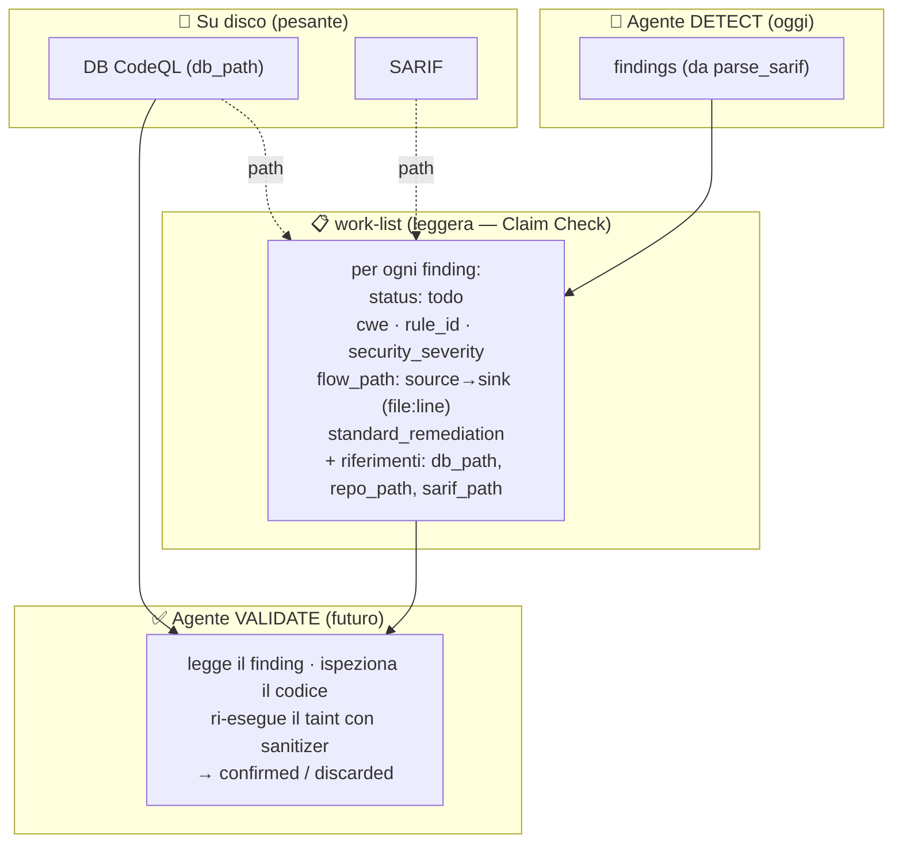

**Cosa contiene ogni voce della work-list** (tutti campi già prodotti oggi, vedi §12):
- `status` (inizialmente `todo`);
- l'**evidenza**: `cwe` (deterministico), `flow_path` con `source`→`sink` (`file:line`),
  `rule_id`, `security_severity`, `message`;
- il **contesto**: `cwe_name`, `standard_remediation`, e i nomi sink/source/sanitizer usati;
- i **riferimenti pesanti (Claim Check)**: `db_path` (per ri-eseguire query),
  `repo_path` e `sarif_path` (restano su disco, non si copiano nel contesto LLM).

**Cosa serve alla Validation per decidere true/false positive** (e che è già
disponibile grazie all'handoff):
- il **codice attorno a source e sink** → `read_file_snippet(file, line±k)`;
- il **database** (`db_path`) → per **ri-eseguire** `run_taint_query` con sanitizer e
  nomi affinati (§13);
- la **knowledge** del CWE → `cwe_knowledge(cwe)` per i candidati sanitizer tipici.

Principio **Claim Check + context reset**: tra Detect e Validate transita solo il
**manifest leggero** (la work-list con path e summary); SARIF e DB restano su disco; il
**contesto dell'LLM si azzera**, così l'agente Validate parte "pulito" e leggero.

> ⚠️ Oggi questa work-list non è ancora un file separato: l'agente Detect aggrega i
> dati in `RunStats` e scrive un **report Markdown** (§15). Trasformare quell'aggregato
> in una **work-list con `status`** è precisamente il primo lavoro del §16.

---

## 15. Il report prodotto oggi

L'output attuale dell'agente Detect è un file Markdown con un **front-matter YAML**
auto-descrittivo (da `RunStats.header()`), seguito dal corpo scritto dal modello:

```yaml
---
model: ...
repository: ...
duration_seconds: ...
tools_used: create_codeql_database:1, run_taint_query:3, ...
cwes_found: CWE-89, CWE-327
total_findings: 4
generated_by: codeql-security-agent
---
```

Nel corpo, i findings raggruppati per file, ciascuno con l'**evidenza** (regola + path
source→sink), la **classificazione** (CWE + gravità) e il **rimedio**. È, di fatto, la
forma "umana" della stessa informazione che la work-list passerà alla Validation.

---

## 16. Capitolo futuro: l'agente di Validation separato

> Questo capitolo descrive il **prossimo** sviluppo, **non ancora implementato**.

**Cosa farà.** Prende i findings prodotti dalla Detection e decide se sono **veri o
falsi positivi**, ispezionando il codice attorno a source/sink e **ri-eseguendo** il
taint con ipotesi più precise (in particolare provando **sanitizer** plausibili).
Promuove ogni finding a **`confirmed`** o lo **scarta** (`discarded`) con motivazione.
**Non** crea PoC né exploit.

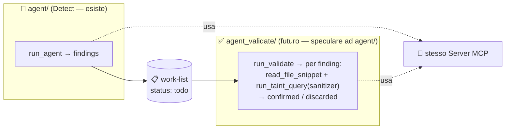

**Cosa riusa (senza modifiche).** Lo **stesso server MCP** e gli **stessi tool**:
`read_file_snippet`, `run_taint_query` (con lo slot **sanitizer**), `run_custom_query`,
`cwe_knowledge`, e il `db_path` già costruito. **Nessuna nuova query** (§13).

**Come si aggancia (idea).** Un nuovo package **speculare ad `agent/`** (stesso
`clients/`, `robustness/`, un suo `prompts.py` con la strategia di Validation, un suo
`orchestrator.py`), che **consuma la work-list** invece del solo `repo_path`. Vale il
**context reset**: l'agente Validate parte con un contesto pulito, un finding alla volta.

**Cosa cambia nell'attuale Detect.** Produrre, oltre al report, la **work-list con
`status: todo`** (l'aggregato di `RunStats` reso esplicito come manifest), così da
poter essere consumata dalla fase successiva.

---

## 17. Configurazione e avvio

L'agente legge la config dal `.env` di progetto (condiviso col server). Avvio: **due
processi** (server in ascolto + agente).

```bash
# Terminale A — server MCP
MCP_TRANSPORT=sse python -m server

# Terminale B — agente (provider scelto da .env o da --provider)
python -m agent _smoketest_repo
#   locale:   python -m agent <repo> --provider ollama --model qwen2.5-coder:3b
#   gemini:   python -m agent <repo> --provider gemini --model gemini-2.0-flash
#   openai:   python -m agent <repo> --provider openai --model llama-3.3-70b   (Groq/Cerebras via OPENAI_BASE_URL)
```

Variabili principali (lette da [agent/config.py](../agent/config.py)):
`AGENT_LLM_PROVIDER`, `AGENT_MODEL`/`OLLAMA_HOST`, `GEMINI_API_KEY`/`GEMINI_MODEL`,
`OPENAI_API_KEY`/`OPENAI_BASE_URL`/`OPENAI_MODEL`, `MCP_SERVER_URL`. Vedi
[.env.example](../.env.example) e il [README](../README.md) per i dettagli (compresi i
rate-limit dei provider hosted).

Durante l'esecuzione l'agente stampa l'avanzamento **live** su stderr
(`[step N] -> tool(...)`, tempi, esito), utile per capire dove si trova.

---

## 18. Test

I test dell'agente ([agent/tests/test_agent.py](../agent/tests/test_agent.py)) coprono i
**moduli puri** e girano **senza** LLM né server:

```bash
python -m pytest agent/tests/test_agent.py -q     # solo agente (veloce)
python -m pytest -m "not codeql and not llm" -q   # agente + server (veloci)
```

Coprono: recupero tool-call testuali, fix `db_path`, checkpoint, naming/header del
report, `RunStats`, traduzione messaggi per i provider OpenAI-compatibili, risoluzione
zip. Sono possibili perché il refactoring ha isolato ogni concern in un modulo.

---

## 19. Storia del refactoring

L'agente era un **unico file** (`agent.py`, 451 righe) che mescolava prompt,
adattatori, robustezza, report e CLI. È stato portato a **pacchetto modulare** `agent/`
(strati separati, testabili), con avvio uniforme `python -m agent`. In seguito sono
stati aggiunti: il **provider LLM configurabile** (ollama/gemini/openai con adattatore
OpenAI-compatibile unico), l'**output live** su stderr, e **throttle/retry** per i
rate-limit dei provider hosted.

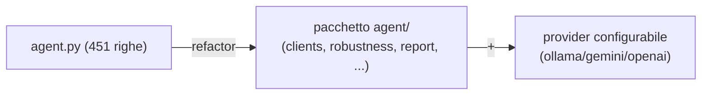

> **In una frase:** l'agente è un client SSE pulito e modulare che fa **Detection** —
> guida un LLM (locale o hosted) sui tool di CodeQL, ne assorbe gli errori, e produce
> findings con evidenza deterministica — pronto a passare il testimone, via work-list,
> al futuro agente di **Validation**.
