# Sibyl — Il Componente **Agente**

---

## Indice
1. [A cosa serve l'agente](#1-a-cosa-serve-lagente)
2. [La pipeline: Detection → Validation](#2-la-pipeline-detection--validation)
3. [Perché "harness" di un modello piccolo](#3-perché-harness)
4. [Dove gira l'agente (3 processi) e il provider LLM](#4-dove-gira-lagente)
5. [Il problema del function calling](#5-il-problema-del-function-calling)
6. [Vocabolario minimo](#6-vocabolario-minimo)
7. [Architettura a componenti e mappa dei file](#7-architettura-a-componenti)
8. [Il loop a fasi: `_run_phase` ed esposizione tool per fase](#8-il-loop-a-fasi)
9. [FASE 1 — Detection in dettaglio (codice + tutti i segnali)](#9-fase-1--detection)
10. [FASE 2 — Validation in dettaglio (verifica, CWE, report)](#10-fase-2--validation)
11. [Le query, famiglia per famiglia e per fase](#11-le-query-famiglia-per-famiglia)
12. [L'handoff Detection → Validation: la work-list](#12-lhandoff)
13. [Il report prodotto](#13-il-report-prodotto)
14. [La knowledge dei CWE (wiki oggi, knowledge graph domani)](#14-la-knowledge)
15. [I trucchi di robustezza](#15-i-trucchi-di-robustezza)
16. [L'avanzamento grafico (eventi + webview VSCode)](#16-lavanzamento-grafico)
17. [Configurazione e avvio](#17-configurazione-e-avvio)
18. [Test](#18-test)

---

<a id="1-a-cosa-serve-lagente"></a>
## 1. A cosa serve l'agente

L'**agente** è il **regista** dell'analisi. Da solo non sa fare nulla di sicurezza:
mette in comunicazione due pezzi che invece sanno fare tanto —

- un **LLM** (un modello di intelligenza artificiale) che *ragiona* su quali
  vulnerabilità cercare;
- il **Server MCP**, che *esegue* le analisi vere con CodeQL.

L'agente espone i tool del server al modello, gli chiede *"cosa vuoi fare?"*, e
quando il modello dice *"chiama questo tool con questi parametri"*, l'agente lo
esegue sul server e gli riporta il risultato. Si va avanti a turni, in **due fasi**,
finché il modello ha raccolto le prove e produce il **report**.

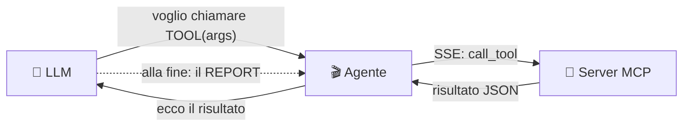

> **In una frase:** l'agente è il *tramite* che fa "parlare" l'LLM con CodeQL. Il
> modello decide **cosa**, l'agente fa **eseguire** al server, raccoglie la prova, e
> alla fine il modello scrive il report.

---

<a id="2-la-pipeline-detection--validation"></a>
## 2. La pipeline: Detection → Validation

Sibyl organizza l'analisi in **due fasi sequenziali** dentro **un solo loop**
([agent/orchestrator.py](../agent/orchestrator.py)). Ogni fase ha il **suo system
prompt** e vede un **sottoinsieme diverso di tool** ([agent/phases.py](../agent/phases.py)).
Tra una fase e l'altra il **contesto dell'LLM si azzera**: passa solo un manifest
leggero — la **work-list** ([agent/worklist.py](../agent/worklist.py)) — mentre gli
artefatti pesanti (database CodeQL, SARIF) restano su disco.

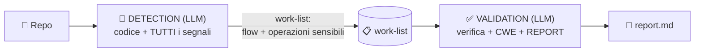

- **Detection** *(LLM)* — all'LLM arrivano il **codice** (letto via tool) **e due
  inventari CWE-agnostici**:
  1. **tutti i flow** disponibili nel codice (`find_all_flows`): ogni percorso da un
     input non fidato all'argomento di una chiamata;
  2. **tutte le operazioni sensibili** (`find_sensitive_operations`): crypto/hash/
     random deboli, exec di comandi/codice, deserializzazione, config-flag insicuri —
     **anche quando non c'è alcun flusso**.
  Nessuna etichetta CWE viene data al modello (per non introdurre *bias*).
- **Validation** *(LLM)* — il modello **compila ed esegue le query che si crea lui**
  (taint mirato, api-misuse, config-flag) per **verificare** flow e operazioni; i
  risultati sono **attendibili**. Poi **associa il CWE** a ogni finding usando la
  conoscenza CWE (`cwe_knowledge`, che timbra la classe *dentro* la query) e **scrive
  il REPORT finale**.

> ⚠️ **La verifica con le query standard CodeQL (una eventuale "Evaluation"
> deterministica) è FUORI dal framework**: è una cosa esterna, non fa parte di questa
> pipeline. L'agente si ferma al report della Validation.

---
<a id="3-perché-harness"></a>
## 3. Perché "harness" di un modello piccolo

Sibyl punta a funzionare anche con **LLM piccoli/locali** (pochi parametri, poco
affidabili). Un modello debole, se lasciato solo, **non si accorge di tutto**: legge
il codice ma può non notare una `hashlib.md5` o un `verify=False` sepolto in un
helper. Per questo l'intero framework è un **harness**: non delega al modello il
"accorgersi", ma gli **mette davanti in modo strutturato** ogni segnale rilevante.

Da qui la scelta dei **due inventari in Detection**: uno per i flussi, uno per le
operazioni sensibili *senza flusso*.

### 3.1 Perché e come si **comprimono** i segnali

**Il vincolo.** Ogni LLM ragiona dentro una **finestra di contesto** finita: il testo
che riesce a "tenere in testa" tutto insieme (prompt + risultati dei tool + il suo
ragionamento). I modelli piccoli hanno finestre piccole e, soprattutto, **peggiorano
quando il contesto è pieno**: più roba grezza gli metti davanti, più perdono il filo,
si distraggono, saltano voci ("lost in the middle"). Dare *troppo* è dannoso quanto
dare *troppo poco*.

**Il problema.** Gli inventari grezzi sono enormi. `find_all_flows` parte da
`ThreatModelSource` verso **qualsiasi** argomento di chiamata: su un repo reale può
produrre centinaia/migliaia di risultati SARIF, ognuno con l'intero `flow_path` (ogni
passo intermedio, file:line, note). E la **stessa** coppia source→sink compare spesso
molte volte (percorsi intermedi diversi). Un dump grezzo (a) sfonda il contesto e (b)
annega il modello in quasi-duplicati.

**Le tre mosse (cosa fa ciascuna).**

| Mossa | Cosa fa | Esempio |
|---|---|---|
| **Dedup** | Collassa le voci "uguali" viste più volte | flussi: chiave `(source file:line, sink file:line)` → 20 percorsi tra A e B diventano **1** ("input in A raggiunge la chiamata in B"). ops: chiave `(kind, file, line)` → lo stesso `md5` visto due volte → **1**. |
| **Cap** | Un tetto rigido (`max_flows=200`, `max_ops=200`) | un repo patologico non può produrre una lista da 5000 voci che esplode il contesto. L'inventario **completo resta nel SARIF su disco**; al modello va solo il riassunto. |
| **Raggruppamento** | Presenta le operazioni **contate per `kind`** | `weak-call:4, config-flag:2, command-exec:1` + l'elenco. Dà al modello la "forma" del problema (un istogramma) invece di un muro di righe, e lo aiuta a **dare priorità**. |

A queste si aggiunge la **rappresentazione compatta**: al modello non passa il
`flow_path` verboso (tutti i passi intermedi), ma solo gli **estremi**
`source file:line → sink file:line` (+ numero di passi e un breve `sink_hint`). Il
percorso completo resta su disco (Claim Check) e non serve al modello per *decidere
cosa verificare*.

**Due stadi di compressione.**
1. **Lato tool** (server): `find_all_flows` / `find_sensitive_operations` deduplicano,
   raggruppano e troncano il SARIF grezzo (§9.1–9.2).
2. **Lato handoff** (agente): `worklist.detection_summary()` **ri-comprime** ancora —
   limita a ~60 flussi + ~60 operazioni ciò che entra davvero nel prompt di Validation,
   con le operazioni già raggruppate per `kind`.

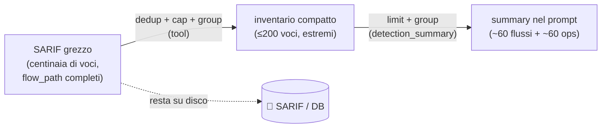

> **In una frase:** *coverage senza volume*. Non si nasconde **nessuna classe** di
> segnale (flussi **e** operazioni non-flow), ma la si consegna in una forma che un
> modello piccolo riesce davvero a leggere e usare.

---
<a id="4-dove-gira-lagente"></a>
## 4. Dove gira l'agente

Tre processi che collaborano. Nel deploy tipico stanno tutti sulla stessa macchina e
dialogano su `localhost`.

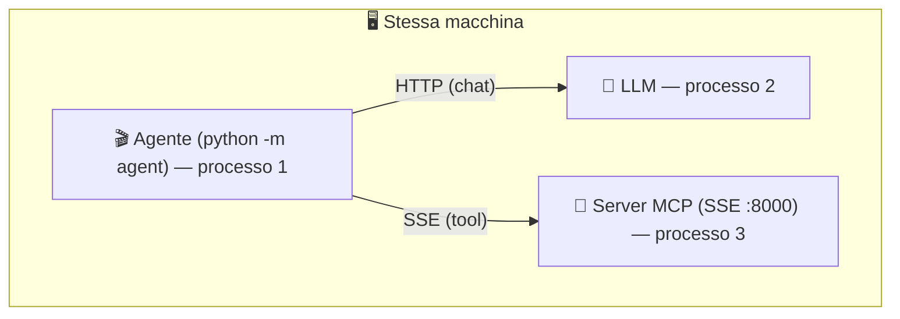

Punto chiave: **a chiamare il server è l'AGENTE, non l'LLM.** L'agente è un **client**
che si connette a un server MCP **già in esecuzione** via SSE.

### Il provider LLM è configurabile
L'LLM è **intercambiabile** ([agent/clients/factory.py](../agent/clients/factory.py)):
`ollama` (modello locale), `gemini` (Google), `openai` (qualsiasi endpoint
OpenAI-compatibile: Groq, Cerebras, …). L'adattatore OpenAI-compatibile è unico e
gestisce **throttle** e **retry** sul rate-limit.

---

<a id="5-il-problema-del-function-calling"></a>
## 5. Il problema del function calling

Il modello AI non esegue codice: produce solo **testo**. Il meccanismo che gli
permette di "usare strumenti" è il **function calling**: l'agente gli passa lo
schema dei tool, il modello risponde "voglio chiamare TOOL(args)", l'agente esegue e
gli ritorna il risultato.

**La difficoltà** con modelli piccoli: a volte stampano la chiamata come *testo* invece
di usare il canale strutturato, ripetono la stessa chiamata, passano un *segnaposto*
al posto del percorso del database. Gran parte dell'agente esiste per **assorbire
questi errori** (vedi §15).

---

<a id="6-vocabolario-minimo"></a>
## 6. Vocabolario minimo

| Termine | Spiegazione |
|---|---|
| **Fase (phase)** | Un blocco del loop con un suo prompt e i suoi tool: `detection` o `validation`. |
| **Flow / flusso** | Un percorso del dato da una *sorgente* (input) a un *sink* (punto pericoloso). |
| **flow inventory** | L'elenco di **tutti** i flussi trovati da `find_all_flows` (CWE-agnostico). |
| **operazione sensibile** | Un'operazione pericolosa **senza flusso** (crypto/random deboli, exec, config-flag), da `find_sensitive_operations`. |
| **kind** | Etichetta *strutturale* di un'operazione (es. `weak-call`, `config-flag`, `command-exec`) — **mai** un CWE. |
| **source / sink / sanitizer** | Da dove entra l'input (*source*), il punto pericoloso (*sink*), ciò che bonifica il dato (*sanitizer/barrier*). |
| **finding** | Una vulnerabilità candidata con CWE, gravità e il percorso del dato (`flow_path`). |
| **work-list** | Il manifest leggero passato da Detection a Validation (i due inventari). |
| **Claim Check** | Pattern di handoff: si passano manifest leggeri (path/summary), i dati pesanti restano su disco. |
| **CWE** | Codice standard di una classe di debolezza (es. `CWE-89` = SQL injection). |
| **ThreatModelSource** | Modello CodeQL di "dove entra input non fidato" (remote + local + env + cmd + file + db). |

---

<a id="7-architettura-a-componenti"></a>
## 7. Architettura a componenti e mappa dei file

L'agente è a **strati**; le dipendenze vanno solo verso il basso. Il "motore"
(orchestrator) sta in alto e usa i moduli sotto.

```mermaid
flowchart TD
    AGT["📦 agent/"]
    AGT --> ENTRY["__main__.py · cli.py — entry point"]
    AGT --> CONF["config.py — provider, URL, cartelle"]
    AGT --> ORCH["orchestrator.py — IL LOOP a fasi"]
    AGT --> PH["phases.py — tool ammessi per fase"]
    AGT --> PR["prompts.py — DETECTION_PROMPT, VALIDATION_PROMPT"]
    AGT --> WL["worklist.py — handoff (candidates + operations)"]
    AGT --> PRG["progress.py — eventi per la webview"]
    AGT --> REP["report.py — RunStats + finalize"]
    AGT --> SRC["source.py — cartella / .zip"]
    AGT --> CLI["clients/ — factory, mcp(SSE), ollama, openai_compat"]
    AGT --> ROB["robustness/ — toolcalls, checkpoint, dbpath"]
```

| File | Ruolo |
|---|---|
| [orchestrator.py](../agent/orchestrator.py) | `run_agent` (le 2 fasi) + `_run_phase` (il sotto-loop generico). |
| [phases.py](../agent/phases.py) | `fetch_phase_tools` (chiede al server quali tool per fase) + `filter_tools`. |
| [prompts.py](../agent/prompts.py) | `DETECTION_PROMPT` e `VALIDATION_PROMPT` (strategie separate). |
| [worklist.py](../agent/worklist.py) | `WorkList`: `candidates` (flow) + `operations` (ops sensibili) + `detection_summary`. |
| [progress.py](../agent/progress.py) | `Progress`: emette eventi JSON per la vista grafica (gated da env). |
| [report.py](../agent/report.py) | `RunStats` (statistiche + intestazione YAML) e `finalize`. |
| [clients/mcp.py](../agent/clients/mcp.py) | `connect(url)` SSE, `mcp_tools_to_ollama`, `tool_result_text`. |
| [robustness/](../agent/robustness/) | `toolcalls` (tool-call testuali), `checkpoint` (resume), `dbpath` (fix db_path). |

---

<a id="8-il-loop-a-fasi"></a>
## 8. Il loop a fasi: `_run_phase` ed esposizione tool per fase

Il cuore è **un unico sotto-loop generico**, `_run_phase`
([agent/orchestrator.py](../agent/orchestrator.py)), che `run_agent` invoca **due
volte**: una per Detection, una per Validation. Cambiano solo tre cose: il **prompt**,
il **set di tool** e cosa si fa dell'output finale.

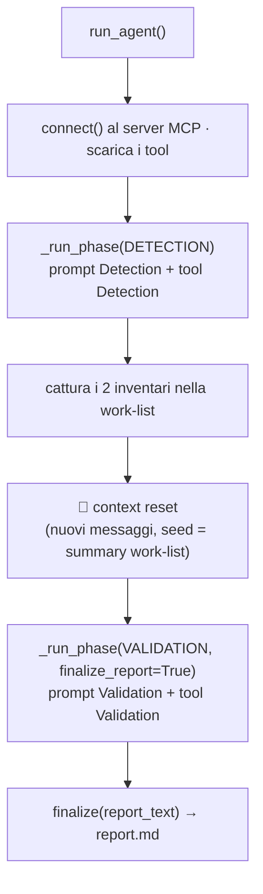

**Esposizione tool per fase — la mappa viene dal SERVER, non è hardcoded nell'agente.**
Il server è la fonte di verità dei tool, quindi è lui a dichiarare **quale tool va in
quale fase**, tramite il tool MCP **`list_phase_tools`**. L'agente, appena connesso, lo
chiama (`fetch_phase_tools`, [agent/phases.py](../agent/phases.py)) e poi **filtra** i
tool prima di passarli al modello:

```python
# lato SERVER (server/tools/meta.py): la verità sta qui
list_phase_tools() -> {
  "detection":  [list_python_files, read_file_snippet, create_codeql_database,
                 find_all_flows, find_sensitive_operations],
  "validation": [read_file_snippet, run_taint_query, run_api_misuse_query,
                 run_insecure_config_flag_query, run_custom_query,
                 cwe_knowledge, list_cwes, + tutti i check_*],
}

# lato AGENTE (orchestrator): niente nomi hardcoded
phase_tools = await fetch_phase_tools(session)     # chiede al server
det_tools   = filter_tools(mcp_tools, phase_tools["detection"])
```

Così, aggiungere o rinominare un tool sul server **non richiede modifiche all'agente**.
I `check_*` (scorciatoie di verifica) vengono aggiunti in automatico alla Validation. Se
il server non esponesse la mappa, l'agente **degrada** esponendo tutti i tool (non
duplica la lista). Effetto: in Detection il modello **non può** lanciare query mirate
(deve solo osservare i segnali), in Validation **non può** ri-enumerare i segnali (deve
verificarli).

**Il corpo di `_run_phase`** (invariato tra le fasi): per ogni step chiede al modello,
recupera le tool-call (anche se emesse come testo), **corregge il `db_path`**, evita le
ripetizioni (cache anti-loop + *nudge*), esegue sul server, **registra le statistiche**
(`RunStats`) e **cattura** i risultati strutturati nella work-list, poi salva il
checkpoint. La fase **termina** quando il modello smette di chiamare tool e scrive
testo: in Detection quel testo è un riassunto (ignorato), in **Validation è il report**.
Se la fase-report esaurisce i passi senza concludere, `_run_phase` forza una scrittura
finale del report (una `chat` senza tool).

---

<a id="9-fase-1--detection"></a>
## 9. FASE 1 — Detection in dettaglio (codice + tutti i segnali)

**Obiettivo**: dare al modello **il codice** e **tutti i segnali** su cui ragionare,
in forma compressa e **senza CWE**. Il modello non classifica: osserva e prepara il
lavoro per la Validation.

**Prompt**: `DETECTION_PROMPT` ([agent/prompts.py](../agent/prompts.py)).
**Tool**: `list_python_files`, `read_file_snippet`, `create_codeql_database`,
`find_all_flows`, `find_sensitive_operations`.

**Procedura guidata dal prompt:**
1. `list_python_files` → vedere tutti i file.
2. `read_file_snippet` su **ogni** file → capire dove entra l'input e quali operazioni
   sembrano pericolose.
3. `create_codeql_database` → costruire il DB.
4. `find_all_flows(db_path)` **una volta** → l'inventario dei flussi.
5. `find_sensitive_operations(db_path)` **una volta** → l'inventario delle operazioni
   sensibili (le classi *non-flow*).
6. Scrivere una **breve analisi** che elenca cosa la Validation deve verificare.
   **Vietato** affermare un CWE.

### 9.1 La query dei flussi: `find_all_flows` → `flow_inventory.ql.tmpl`
[server/query_templates/flow_inventory.ql.tmpl](../server/query_templates/flow_inventory.ql.tmpl)
è una query di **taint tracking** (`@kind path-problem`) volutamente **generica**:

```ql
predicate isSource(node) { node instanceof ThreatModelSource }   // input non fidato
predicate isSink(node)   { exists(call | node = call.getArg(_)) } // QUALSIASI arg di chiamata
// niente barrier, niente @tags external/cwe/... (nessun bias)
```

- **source = `ThreatModelSource`**: il modello CodeQL più ampio di "input non fidato"
  — remote (HTTP) **+ local + environment + command-line + file + database**. Questo è
  ciò che copre anche le **funzioni interne** raggiunte da input non-HTTP o di secondo
  ordine (non solo `RemoteFlowSource`).
- **sink = qualsiasi argomento di qualsiasi chiamata**: una nozione *strutturale* di
  "qui succede qualcosa", non una classe di vulnerabilità.
- **nessun tag CWE**: l'inventario dice *dove va il dato*, mai *che CWE è*.

Il tool `find_all_flows` ([server/tools/queries.py](../server/tools/queries.py)) esegue
la query (via `render_and_analyze`), poi **deduplica** i flussi per `(source, sink)`,
**tronca** a `max_flows` (default 200) e restituisce una forma compatta
`{source:{file,line}, sink:{file,line}, sink_hint, steps}`. Il SARIF completo resta su
disco (Claim Check).

### 9.2 La query delle operazioni sensibili: `find_sensitive_operations` → `sensitive_ops.ql.tmpl`
[server/query_templates/sensitive_ops.ql.tmpl](../server/query_templates/sensitive_ops.ql.tmpl)
è una query **point-detection** (`@kind problem`) che segnala operazioni pericolose
**a prescindere dal flusso**, ognuna con un `kind` (mai un CWE):

```ql
predicate sensitive(node, kind) {
  node instanceof SystemCommandExecution and kind = "command-exec" or
  node instanceof CodeExecution         and kind = "code-exec"    or
  node instanceof SqlExecution          and kind = "sql-exec"     or
  node instanceof FileSystemAccess      and kind = "filesystem"   or
  node instanceof Decoding              and kind = "decoding"     or
  node instanceof Cryptography::CryptographicOperation and kind = "crypto" or   // SEMANTICO
  exists(call | callNameIn(call, [{{WEAK_CALL_NAMES}}]) | node = call and kind = "weak-call") or  // per-nome (fallback)
  exists(call, p | p = [{{FLAG_PARAM_NAMES}}] and
                   call.getArgByName(p).asExpr() instanceof ImmutableLiteral
                 | node = call and kind = "config-flag")  // struttura (kwarg literal)
}
select node, kind
```

Qui è importante essere onesti su **cosa è semantico e cosa è "per nome"** (vedi anche
la nota in §11):

- **Semantico (CodeQL Concepts / modelli di libreria).** `command-exec`, `code-exec`,
  `sql-exec`, `filesystem`, `decoding` e **`crypto`** usano i *Concept*: CodeQL sa che
  quella chiamata *è* un'esecuzione di comando, una query SQL, un'operazione crypto…
  **risolvendo import e alias** (es. `crypto` = `Cryptography::CryptographicOperation`,
  che riconosce `hashlib`, `cryptography`, `Cryptodome`, anche `hashlib.new("md5")`).
  Questo un `grep`/regex **non** lo può fare. (Nota: `crypto` segnala *qualsiasi*
  operazione crittografica, debole o no — il giudizio "debole" spetta alla Validation,
  così l'inventario resta CWE-agnostico.)
- **Per nome — `weak-call` (fallback).** È un semplice match sul **nome** della chiamata
  (`random`, `randint`, `getrandbits`, …), quindi *sì*, è essenzialmente come una regex.
  Lo usiamo **solo** per ciò che CodeQL **non** modella come Concept — in pratica la
  **randomness insicura** (non esiste un Concept per essa). I nomi vengono dalla wiki
  (via `lookup_cwe`, CWE-330) uniti a pochi default. È una **rete**, con i limiti del
  match testuale (non segue alias/wrapper).
- **Struttura — `config-flag`.** Non è nomi né Concept: usa l'AST/data-flow per trovare
  una chiamata che passa un keyword-argument (`verify`, `shell`, `debug`, …) con un
  valore **letterale** (es. `verify=False`). Più di una regex (sa che è un *keyword
  argument* con un *letterale*), ma resta superficiale: coglie solo il letterale diretto.

Il tool `find_sensitive_operations` **deduplica** per `(kind, file, line)`,
**raggruppa per `kind`** (con i conteggi) e **tronca** a `max_ops`. Il `kind` finisce
nel campo `message` del finding e da lì viene estratto.

> **Perché due query?** `find_all_flows` cattura le classi *di flusso* (SQLi, command
> injection, path traversal, XSS, deserializzazione raggiunta da input).
> `find_sensitive_operations` cattura le classi *senza flusso* (crypto/hash/random
> deboli, config insicure) che **un flusso non mostrerebbe mai** — proprio il punto
> cieco che un modello piccolo perde da solo.

### 9.3 In parole elementari: cosa succede davvero (per chi non conosce CodeQL) E' per giuseppino ino ino che non sa niente

Dimentica la sintassi `.ql` di sopra. Ecco l'idea, senza gergo.

**Cos'è CodeQL.** È uno strumento che tratta il **codice come un database**. Prima
"scheda" tutto il progetto — funzioni, chiamate, variabili, come sono collegate — e lo
mette in un archivio interrogabile (il *database CodeQL*, creato da
`create_codeql_database`). Dopodiché, invece di *leggere* il codice, gli fai
**domande**. Una **query** `.ql` è una domanda scritta in un linguaggio apposito.


**Le due "domande" che poniamo in Detection.**

1. **"Dove arriva l'input non fidato?"** — è `find_all_flows`. Qui la domanda è di tipo
   *tracciamento* (**taint tracking**): segui un dato dall'inizio alla fine.
   - Una **sorgente** (*source*) = un punto da cui entra input di cui non ti fidi (una
     richiesta web, un file, una variabile d'ambiente…). Noi diciamo a CodeQL "considera
     sorgente **qualunque** ingresso non fidato" (`ThreatModelSource`).
   - Un **punto d'arrivo** (*sink*) = "il dato finisce come argomento di **una qualsiasi
     chiamata a funzione**". Non ci interessa *quale* funzione: vogliamo la lista di
     **tutti** i posti in cui quell'input va a finire.
   - CodeQL calcola tutti i **percorsi** dalla sorgente all'arrivo e ce li dà. È come
     chiedere "tutte le rotte dall'aeroporto a qualunque destinazione". A noi bastano gli
     **estremi** (da dove parte → dove arriva), non ogni curva della strada.

2. **"Quali operazioni pericolose ci sono, anche se nessun input le raggiunge?"** — è
   `find_sensitive_operations`. Qui **non** si segue nessun percorso: si cerca la
   *presenza* di certe operazioni. Tre modi, di "qualità" diversa:
   - **Concepts (il modo forte)**: la libreria di CodeQL sa già riconoscere "questa
     chiamata esegue un comando di sistema", "esegue codice", "fa una query SQL", "è
     un'operazione crittografica"… **risolvendo import e alias** (es. capisce che
     `hashlib.md5(...)` è crypto anche se importata con un altro nome). Le chiediamo
     "trovami tutte le operazioni di questi tipi". Un `grep` non ci riuscirebbe.
   - **per nome (il modo debole — di fatto una regex)**: `weak-call`. "trovami ogni
     chiamata che si chiama `random`, `randint`, …". Lo usiamo **solo** per ciò che
     CodeQL **non** modella (in pratica la **randomness**): non esistendo un Concept, ci
     si accontenta del nome. È fragile (non segue alias/wrapper) — ne siamo consapevoli,
     è una *rete di sicurezza*, non il metodo principale.
   - **flag di configurazione (per struttura)**: `config-flag`. "trovami ogni chiamata
     che passa un interruttore come `verify=`, `shell=`, `debug=` impostato a un valore
     fisso" (es. `verify=False`). Non è né nome né Concept: guarda la *forma* della
     chiamata (un keyword-argument con un valore letterale).

**Il trucco dei `{{...}}` (i template).** I file si chiamano `.ql.tmpl` perché sono
query **con dei buchi**: `{{WEAK_CALL_NAMES}}`, `{{FLAG_PARAM_NAMES}}`, i tag del CWE.
Prima di eseguire, il server **riempie i buchi** con i valori giusti (i nomi presi dalla
wiki, ecc.) e ottiene una query `.ql` vera e pronta. È come un modulo prestampato in cui
riempi gli spazi vuoti prima di consegnarlo.

**Come si esegue e cosa torna.** Il server lancia CodeQL sul database con quella query;
CodeQL produce un file **SARIF** (un rapporto tecnico in JSON, verboso). Il server lo
**traduce** in risultati puliti (`parse_sarif`): per ogni riscontro tiene `file`, `riga`,
il tipo (`kind`) o il percorso del dato. Poi i tool `find_*` **comprimono** (§3.1) e
mandano al modello solo l'essenziale.

**La differenza chiave tra le due domande, in una riga:**
- `find_all_flows` risponde a *"un dato **si muove** da qui a lì?"* (serve un percorso);
- `find_sensitive_operations` risponde a *"questa cosa pericolosa **esiste** nel
  codice?"* (basta la presenza, nessun movimento).

Ed entrambe, di proposito, **non dicono il CWE**: si limitano a mostrare *dove* e *cosa*.
La targhetta "questo è CWE-89" verrà messa dopo, in Validation, quando il modello
lancia la query di verifica che *timbra* la classe nell'evidenza (§10).

---

<a id="10-fase-2--validation"></a>
## 10. FASE 2 — Validation in dettaglio (verifica, CWE, report)

**Obiettivo**: **verificare** i due inventari con query mirate (risultati
*attendibili*), **associare il CWE** in modo deterministico, e **scrivere il report**.

**Prompt**: `VALIDATION_PROMPT` ([agent/prompts.py](../agent/prompts.py)). Il *seed* del
contesto contiene il **riassunto compatto** dei due inventari (da
`worklist.detection_summary()`) e il `db_path`.
**Tool**: `read_file_snippet`, `run_taint_query`, `run_api_misuse_query`,
`run_insecure_config_flag_query`, `run_custom_query`, `cwe_knowledge`, `list_cwes`.

**Procedura guidata dal prompt:**
1. Per ogni **flusso** sospetto: `read_file_snippet` attorno a source/sink →
   `cwe_knowledge(cwe)` per intuizione e nomi candidati → **verifica** con
   `run_taint_query(cwe, sink_names=…, source_names/sanitizer_names)`.
2. Per ogni **operazione sensibile**: verifica con `run_api_misuse_query`
   (crypto/hash/random) o `run_insecure_config_flag_query` (config-flag) o un `check_*`
   preconfezionato.
3. Se una query trova la prova → è un finding validato; se non trova nulla → si passa
   oltre (niente accanimento).
4. **Scrivere il REPORT** in Markdown (formato in §13). Smettere di chiamare tool.

### Come nasce un finding validato (catena deterministica)
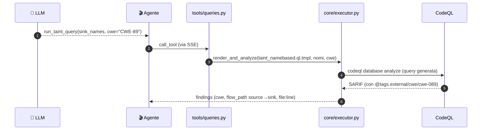

> **Regola d'oro (grounding):** il `cwe` di un finding **viene dai tag della query**
> CodeQL (che il tool *timbra* passando `cwe=`), non da un'opinione del modello. Il
> `VALIDATION_PROMPT` lo impone esplicitamente: se un flusso esiste ma non ha CWE, si
> riporta come *"taint flow (unclassified)"*, senza inventare un numero.

---

<a id="11-le-query-famiglia-per-famiglia"></a>
## 11. Le query, famiglia per famiglia e per fase

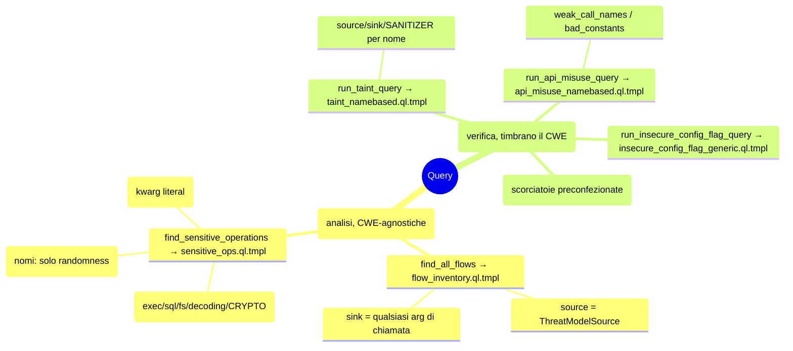

| Famiglia | Tool → Template | Tipo | Fase | Timbra CWE? |
|---|---|---|---|---|
| Inventario flussi | `find_all_flows` → `flow_inventory.ql.tmpl` | taint (path-problem) | **Detection** | ❌ (CWE-agnostica) |
| Inventario operazioni | `find_sensitive_operations` → `sensitive_ops.ql.tmpl` | point (problem) | **Detection** | ❌ (solo `kind`) |
| Taint parametrico | `run_taint_query` → `taint_namebased.ql.tmpl` | taint (source/sink/**sanitizer**) | **Validation** | ✅ |
| API-misuse | `run_api_misuse_query` → `api_misuse_namebased.ql.tmpl` | point | **Validation** | ✅ |
| Config-flag | `run_insecure_config_flag_query` → `insecure_config_flag_generic.ql.tmpl` | point | **Validation** | ✅ |
| Custom/preset | `run_custom_query`, `check_*` | vari | **Validation** | ✅ |

**La query-cardine della Validation** è il **taint parametrico**
([taint_namebased.ql.tmpl](../server/query_templates/taint_namebased.ql.tmpl)): ha tre
slot riempiti dai nomi che il modello fornisce — `{{SOURCE_NAMES}}`, `{{SINK_NAMES}}`,
`{{SANITIZER_NAMES}}` — più i segnaposto `{{CWE_ID_SUFFIX}}`/`{{CWE_TAG_LINE}}` che
*stampano* la classe nei metadati (`@id`, `@tags external/cwe/cwe-NNN`). È la stessa
famiglia usata dagli inventari, ma **affilata**: qui si aggiungono i **sanitizer** e
si timbra il CWE, così il finding porta la prova deterministica.

> **Dettaglio esecuzione (comune a tutte).** Il server riempie il template, salva la
> query con un nome basato sull'hash dentro `generated_queries/` (un vero *pack* CodeQL),
> esegue `codeql database analyze --format=sarifv2.1.0`, e traduce il SARIF con
> `parse_sarif` in finding puliti (`rule_id`, `cwe` dai tag, `flow_path` source→sink,
> file:line). Vedi il gemello [Server_MCP_Architettura.md](Server_MCP_Architettura.md).

---

<a id="12-lhandoff"></a>
## 12. L'handoff Detection → Validation: la work-list

Tra le due fasi passa **solo** la work-list ([agent/worklist.py](../agent/worklist.py)),
un manifest leggero con due liste:

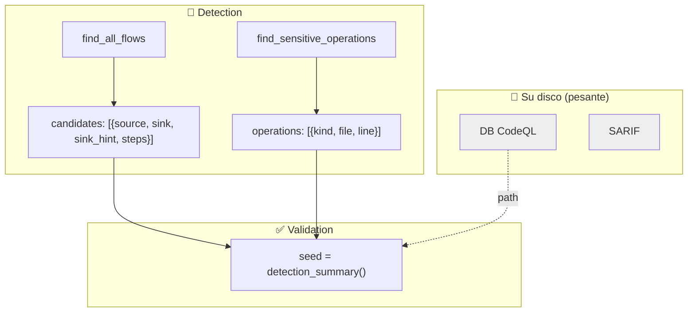

- L'orchestrator cattura i risultati dei due tool di Detection con un callback
  (`_capture_detection`): `find_all_flows` → `add_candidates`,
  `find_sensitive_operations` → `add_operations` (entrambi deduplicano).
- `detection_summary()` produce il testo compatto iniettato nel prompt di Validation:
  l'elenco dei flussi (source→sink file:line) **e** l'elenco delle operazioni
  raggruppate per `kind`.
- **Claim Check + context reset**: SARIF e DB restano su disco; la Validation parte con
  un contesto pulito, così il carico per fase resta controllato. La work-list viaggia
  anche dentro il **checkpoint** (per `--resume`).

---

<a id="13-il-report-prodotto"></a>
## 13. Il report prodotto

Il report **lo scrive l'LLM** alla fine della Validation (non è generato in modo
deterministico). L'agente vi antepone un'**intestazione YAML** auto-descrittiva
prodotta da `RunStats.header()` ([agent/report.py](../agent/report.py)):

```yaml
---
model: ...
repository: ...
duration_seconds: ...
steps_used: ...
tools_used: create_codeql_database:1, find_all_flows:1, run_taint_query:3, ...
cwes_found: CWE-89, CWE-327
total_findings: 4
generated_by: codeql-security-agent
---
```

Nel corpo (scritto dal modello secondo il `VALIDATION_PROMPT`), ogni finding ha:
**evidenza deterministica** (rule/query id + `flow_path` source→sink), **classificazione**
(CWE + gravità, dal finding), **perché conta + rimedio**. I finding sono raggruppati per
file, con una **tabella riassuntiva** finale (CWE, count, gravità) e un verdetto.

`RunStats` accumula durante il run i contatori (tool usati, CWE emersi, numero di
finding, ultimo `db_path`) leggendo il JSON di ogni risultato di tool; `finalize`
scrive `header() + corpo` su disco e cancella il checkpoint.

---

<a id="14-la-knowledge"></a>
## 14. La knowledge dei CWE (wiki oggi, knowledge graph domani)

In Validation il modello associa il CWE consultando `cwe_knowledge(cwe)`. Lato server,
l'accesso alla conoscenza passa da **un unico punto**, `lookup_cwe()`
([server/knowledge/store.py](../server/knowledge/store.py)), oggi implementato sulla
**wiki JSON** (`cwe_wiki.json`: nome, intuizione taint, nomi candidati di
sink/source/sanitizer, API deboli, rimedio). Anche `find_sensitive_operations` pesca i
nomi "deboli" da lì, sempre via `lookup_cwe`.

> **Perché una funzione unica?** È la **cucitura** per il futuro: domani un backend a
> **knowledge graph** può sostituire la wiki dietro la stessa firma, senza toccare i
> tool che la usano.

---

<a id="15-i-trucchi-di-robustezza"></a>
## 15. I trucchi di robustezza

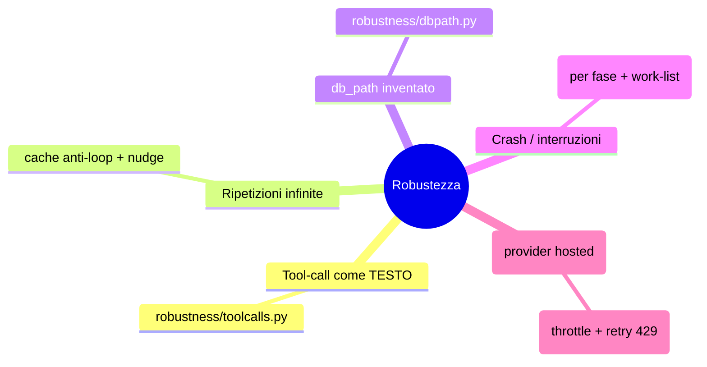

- **Tool-call emesse come testo**: recupera la chiamata da un blocco ```` ```json ````
  nel testo, solo se il `name` è un tool reale.
- **Cache anti-loop**: se la stessa chiamata (firma `nome+args`) è già stata fatta, non
  la riesegue e aggiunge un *nudge* ("non ripetere; fai altro o **scrivi il report**").
- **Fix del `db_path`**: il modello passa spesso un segnaposto; si usa l'ultimo
  `db_path` reale (in Validation viene *seminato* dalla work-list, così anche senza
  ricreare il DB il modello può interrogarlo).
- **Checkpoint per fase**: dopo ogni step salva `phase`, `completed_phases`, i messaggi,
  la cache e la **work-list**; con `--resume` riparte dalla fase giusta.

---

<a id="16-lavanzamento-grafico"></a>
## 16. L'avanzamento grafico (eventi + webview VSCode)

Oltre ai log testuali su stderr, l'agente può emettere **eventi strutturati** per una
**vista grafica** ([agent/progress.py](../agent/progress.py)). Ogni evento è una riga
JSON preceduta dal marcatore `@@SIBYL@@`, emessa **solo** se
`SIBYL_PROGRESS_EVENTS=1` (così la CLI resta pulita; l'estensione VSCode imposta la
variabile da sola).

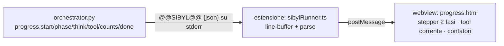

Gli eventi: `start` (repo/model), `phase` (start/done), `think` (il modello ragiona),
`tool` (running/ok/error/cached/nodb con durata), `counts` (flow candidati / finding /
CWE), `done`. La webview ([extension/views/progress.html](../extension/views/progress.html))
disegna lo **stepper a due fasi**, l'attività in corso con spinner, il log recente e i
contatori live. Il lato estensione è in
[extension/src/progressView.ts](../extension/src/progressView.ts) e
[extension/src/sibylRunner.ts](../extension/src/sibylRunner.ts).

---

<a id="17-configurazione-e-avvio"></a>
## 17. Configurazione e avvio

L'agente legge la config dal `.env` di progetto (condiviso col server). Avvio: **due
processi** (server in ascolto + agente).

```bash
# Terminale A — server MCP
MCP_TRANSPORT=sse python -m server

# Terminale B — agente (provider da .env o da --provider)
python -m agent <repo>
#   locale:   python -m agent <repo> --provider ollama --model qwen2.5-coder:14b
#   gemini:   python -m agent <repo> --provider gemini --model gemini-2.5-flash
#   openai:   python -m agent <repo> --provider openai --model llama-3.3-70b
```

Opzioni CLI ([agent/cli.py](../agent/cli.py)): `--provider`, `--model`, `--report`,
`--max-steps` (turni **per fase**), `--resume`. Variabili principali
([agent/config.py](../agent/config.py)): `AGENT_LLM_PROVIDER`, `AGENT_MODEL`/`OLLAMA_HOST`,
`GEMINI_API_KEY`/`GEMINI_MODEL`, `OPENAI_API_KEY`/`OPENAI_BASE_URL`/`OPENAI_MODEL`,
`MCP_SERVER_URL`. Durante il run l'agente stampa l'avanzamento live su stderr.

---

<a id="18-test"></a>
## 18. Test

I test dell'agente ([agent/tests/test_agent.py](../agent/tests/test_agent.py)) coprono i
**moduli puri**, senza LLM né server:

```bash
python -m pytest agent/tests/test_agent.py -q     # solo agente (veloce)
python -m pytest -m "not codeql and not llm" -q   # agente + server (veloci)
```

Coprono, tra l'altro: il filtraggio dei tool per fase (`filter_tools`), la work-list
(candidates + operations, dedup, riassunto, round-trip), il recupero di tool-call
testuali, il fix del `db_path`, il checkpoint, naming/intestazione del report, e la
traduzione dei messaggi per i provider OpenAI-compatibili. Le query nuove
(`flow_inventory.ql.tmpl`, `sensitive_ops.ql.tmpl`) hanno test **`codeql`** lato server
(compilazione + un caso reale in cui `find_sensitive_operations` trova un'operazione
crypto **senza flusso**).

> **In una frase:** l'agente è un client SSE pulito e modulare che fa **Detection**
> (dà al modello codice + tutti i segnali, compressi e CWE-agnostici) e **Validation**
> (il modello verifica con query mirate, associa il CWE deterministico e scrive il
> report) — un harness pensato per far rendere anche un LLM piccolo.
